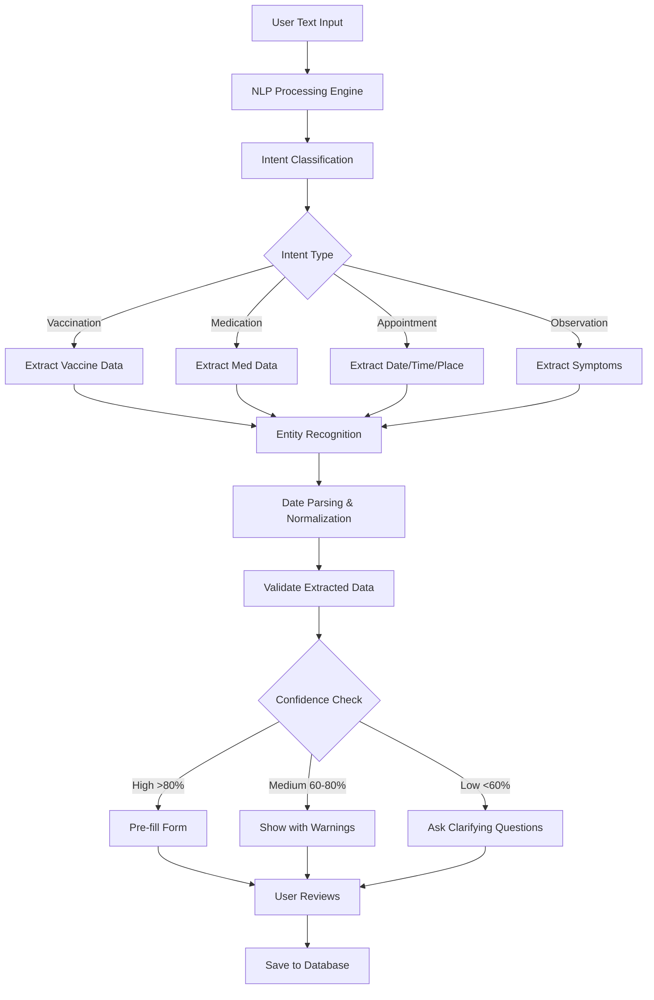

# Natural Language Data Entry (NLP)

## 🎯 Overview

Enable users to create health records, schedule appointments, and log information using natural language instead of filling out forms. Transform casual text like *"Max got his rabies shot today"* into structured database records.

---

## 📋 Use Cases & User Stories

### Primary Use Cases

#### 1. Text-Based Vaccination Entry
**User Input:** *"Bailey got her DHPP vaccine on Jan 5th at Sunset Veterinary, next dose due in 3 weeks"*

**AI Processing:**
- Extracts vaccine name: DHPP
- Date administered: January 5, 2026
- Clinic: Sunset Veterinary
- Next due: January 26, 2026 (calculated)
- Pre-fills vaccination form

**What happens:** Form opens with all fields populated, user just reviews and saves.

#### 2. Medication/Treatment Logging
**User Input:** *"Vet prescribed Apoquel 16mg twice daily for 2 weeks starting today for allergies"*

**Extracted:**
- Medication: Apoquel 16mg
- Frequency: Twice daily
- Duration: 14 days
- Start date: Today
- End date: Auto-calculated
- Category: Allergies/antihistamine

#### 3. Quick Health Observations
**User Input:** *"Max has been limping on his left front paw since yesterday, seems painful when touched"*

**AI Action:**
- Creates health note/observation record
- Tags: limping, pain, front_left_paw
- Suggests: Emergency vet visit needed?
- Offers to find nearby vets

#### 4. Appointment Scheduling via Text
**User Input:** *"Book a vet checkup for next Friday at 2pm at Happy Paws"*

**AI Response:**
- Identifies: Appointment intent
- Date: Next Friday (calculated date)
- Time: 2:00 PM
- Clinic: Happy Paws Veterinary
- Creates calendar event + sends reminder

### Secondary Use Cases

5. **Diet Changes:** *"Switched Max to Blue Buffalo chicken formula this morning"*
6. **Weight Updates:** *"Bella weighed 45 lbs at the vet today"*
7. **Grooming:** *"Took him to Pampered Paws for grooming, next visit in 6 weeks"*
8. **Emergency Logging:** *"Emergency vet visit tonight - ate chocolate"*

---

## 🏗 Technical Architecture

### NLP Processing Flow



### Technology Options

#### Option 1: GPT-4 with Custom Prompts (Recommended)
**Service:** OpenAI GPT-4 Turbo with structured outputs  
**Why:**
- Best entity extraction accuracy
- Understands medical/veterinary terminology
- Handles dates, dosages, frequencies naturally
- Can ask clarifying questions

**Cost:** ~$0.005 per entry

#### Option 2: Specialized NER Models
**Service:** spaCy + Custom medical NER model  
**Why:**
- Lower cost (run locally or on server)
- Very fast
- Good for simple extractions

**Limitations:** May struggle with complex sentences

#### Option 3: Hybrid Approach
- Use lightweight local model for intent classification
- GPT-4 for complex extraction and validation
- Best cost/performance balance

**🎯 Recommendation: Option 1 (GPT-4)** for initial launch, then optimize with hybrid approach.

---

## 💾 Database Schema

### New Tables

```sql
-- NLP Processing Log (for analytics and improvement)
CREATE TABLE nlp_entries (
  id UUID PRIMARY KEY DEFAULT uuid_generate_v4(),
  user_id UUID REFERENCES auth.users(id) NOT NULL,
  pet_id UUID REFERENCES pets(id),
  input_text TEXT NOT NULL,
  detected_intent VARCHAR(50), -- 'vaccination', 'medication', 'appointment', etc.
  confidence_score DECIMAL(5,2), -- 0.00 to 100.00
  extracted_entities JSONB,
  created_record_type VARCHAR(50), -- Which table was populated
  created_record_id UUID, -- ID of created record
  user_edited BOOLEAN DEFAULT FALSE, -- Did user change AI suggestions?
  processing_time_ms INTEGER,
  model_used VARCHAR(50),
  created_at TIMESTAMP WITH TIME ZONE DEFAULT NOW()
);

CREATE INDEX idx_nlp_entries_user ON nlp_entries(user_id, created_at DESC);
CREATE INDEX idx_nlp_entries_intent ON nlp_entries(detected_intent);
```

---

## 🔧 Implementation Approach

### Phase 1: Backend NLP Engine (Week 1)

#### 1.1 Create Supabase Edge Function

`/supabase/functions/nlp-parser/index.ts`:

```typescript
import { serve } from 'https://deno.land/std@0.168.0/http/server.ts'
import OpenAI from 'https://esm.sh/openai@4.20.1'

const openai = new OpenAI({
  apiKey: Deno.env.get('OPENAI_API_KEY')!,
})

const NLP_SYSTEM_PROMPT = `You are a veterinary data extraction expert.

TASK: Extract structured data from natural language pet health entries.

ENTITIES TO EXTRACT:
- Intent: vaccination, medication, appointment, health_observation, diet_change, weight_update
- Pet name (if mentioned)
- Vaccine name (e.g., Rabies, DHPP, Bordetella)
- Medication name and dosage
- Dates (convert to ISO format YYYY-MM-DD)
- Times
- Locations/clinics
- Symptoms or observations
- Quantities and units

DATE PARSING RULES:
- "today" = current date
- "yesterday" = current date - 1 day
- "next Friday" = calculate next occurrence
- Relative: "in 3 weeks", "2 months ago"

RETURN JSON SCHEMA:
{
  "intent": "vaccination" | "medication" | "appointment" | "observation",
  "confidence": 0-100,
  "entities": {
    "pet_name": "Max",
    "vaccine_name": "Rabies",
    "date_administered": "2026-01-03",
    "next_due_date": "2029-01-03",
    "clinic_name": "Happy Paws Veterinary",
    // ... other fields based on intent
  },
  "missing_fields": ["administering_vet"], // Fields we couldn't extract
  "ambiguities": [] // Unclear parts that need clarification
}

DOSAGE PARSING:
"twice daily" = frequency: "BID"
"once a day" = frequency: "SID"
"every 8 hours" = frequency: "Q8H"

Be conservative - if unsure, mark field as missing rather than guessing.
`

serve(async (req) => {
  try {
    const { text, petId, currentDate } = await req.json()
    
    const completion = await openai.chat.completions.create({
      model: 'gpt-4-turbo-preview',
      messages: [
        { role: 'system', content: NLP_SYSTEM_PROMPT },
        { 
          role: 'user', 
          content: `Current date: ${currentDate}\nPet ID context: ${petId}\n\nExtract data from: "${text}"`
        }
      ],
      response_format: { type: 'json_object' },
      temperature: 0.1,
      max_tokens: 500
    })
    
    const result = JSON.parse(completion.choices[0].message.content)
    
    return new Response(JSON.stringify(result), {
      headers: { 'Content-Type': 'application/json' }
    })
    
  } catch (error) {
    return new Response(JSON.stringify({ error: error.message }), {
      status: 500,
      headers: { 'Content-Type': 'application/json' }
    })
  }
})
```

### Phase 2: Frontend Integration (Week 2)

#### 2.1 Create Quick Entry Component

`/components/features/QuickEntryBox.tsx`:

```typescript
import { useState } from 'react';
import { View, TextInput, TouchableOpacity, Text } from 'react-native';
import { supabase } from '@/lib/supabase';

export function QuickEntryBox({ petId }: { petId: string }) {
  const [text, setText] = useState('');
  const [processing, setProcessing] = useState(false);
  const [result, setResult] = useState(null);
  
  const handleQuickEntry = async () => {
    if (!text.trim()) return;
    
    setProcessing(true);
    
    try {
      // 1. Parse with NLP
      const { data } = await supabase.functions.invoke('nlp-parser', {
        body: {
          text,
          petId,
          currentDate: new Date().toISOString()
        }
      });
      
      setResult(data);
      
      // 2. Based on intent, open appropriate form with pre-filled data
      if (data.intent === 'vaccination' && data.confidence > 70) {
        navigateToVaccinationForm(data.entities);
      } else if (data.intent === 'medication') {
        navigateToMedicationForm(data.entities);
      }
      // ... handle other intents
      
      // 3. Log the NLP processing
      await supabase.from('nlp_entries').insert({
        pet_id: petId,
        input_text: text,
        detected_intent: data.intent,
        confidence_score: data.confidence,
        extracted_entities: data.entities
      });
      
    } catch (error) {
      console.error('NLP parsing error:', error);
    } finally {
      setProcessing(false);
    }
  };
  
  return (
    <View style={{ padding: 16, backgroundColor: '#F5F5F5', borderRadius: 12 }}>
      <Text style={{ fontSize: 16, fontWeight: '600', marginBottom: 8 }}>
        ✨ Quick Entry
      </Text>
      <Text style={{ color: '#666', marginBottom: 12 }}>
        Type in plain English, e.g., "Max got his rabies shot today"
      </Text>
      
      <TextInput
        value={text}
        onChangeText={setText}
        placeholder="Describe what happened..."
        multiline
        style={{
          backgroundColor: '#FFF',
          padding: 12,
          borderRadius: 8,
          minHeight: 80,
          marginBottom: 8
        }}
      />
      
      <TouchableOpacity
        onPress={handleQuickEntry}
        disabled={processing}
        style={{
          backgroundColor: '#007AFF',
          padding: 12,
          borderRadius: 8,
          alignItems: 'center'
        }}
      >
        <Text style={{ color: '#FFF', fontWeight: '600' }}>
          {processing ? 'Processing...' : '🐾 Create Entry'}
        </Text>
      </TouchableOpacity>
      
      {result && result.confidence < 70 && (
        <View style={{ marginTop: 8, padding: 8, backgroundColor: '#FFF3CD', borderRadius: 4 }}>
          <Text style={{ fontSize: 12 }}>
            ⚠️ Low confidence ({result.confidence}%). Please review carefully.
          </Text>
        </View>
      )}
    </View>
  );
}
```

#### 2.2 Integration Points

Add Quick Entry widget to:
1. **Pet Profile Overview** - Prominent position at top
2. **Add Record Flow** - Alternative to manual forms
3. **AI Chat Interface** - Seamless integration

---

## 📊 Cost Analysis

### Per-Entry Cost (GPT-4)
- Average input: 50 tokens (user text + prompt)
- Average output: 150 tokens (structured JSON)
- Total: ~200 tokens = **$0.004 per entry**

### Monthly Projections

| Users | Entries/month | Cost    |
|-------|---------------|---------|
| 100   | 1,000         | $4      |
| 1,000 | 10,000        | $40     |
| 10,000| 100,000       | $400    |

Much cheaper than OCR! Very cost-effective feature.

---

## ✅ Success Metrics

1. **Adoption**: >30% of users try NLP entry within first 2 weeks
2. **Accuracy**: >85% of entries require no manual correction
3. **User Preference**: >50% of entries use NLP vs. manual forms
4. **Time Savings**: Reduce entry time from 2 minutes to 20 seconds
5. **Completion Rate**: >90% of NLP-initiated entries are saved

---

## 🚀 Implementation Timeline

**Week 1:** NLP Engine
- Edge function development
- Prompt engineering
- Date/entity parsing

**Week 2:** Frontend Integration
- Quick entry widget
- Form pre-filling
- Error handling

**Week 3:** Polish & Training
- User feedback integration
- Improve prompts based on logs
- Add example suggestions

**Total:** 3 weeks for full implementation

---

## 🎯 Advanced Features (Future)

1. **Voice Input**: Speak instead of type using speech-to-text
2. **Batch Entries**: "Max and Bella both got vaccinated today"
3. **Smart Suggestions**: Autocomplete based on history
4. **Scheduled Reminders**: "Remind me to give Max his pill tomorrow at 8am"
5. **Multi-language Support**: Spanish, French, etc.

---

This NLP capability will make Pawzly the easiest pet health app to use, eliminating the friction of form-filling and making record-keeping effortless.
