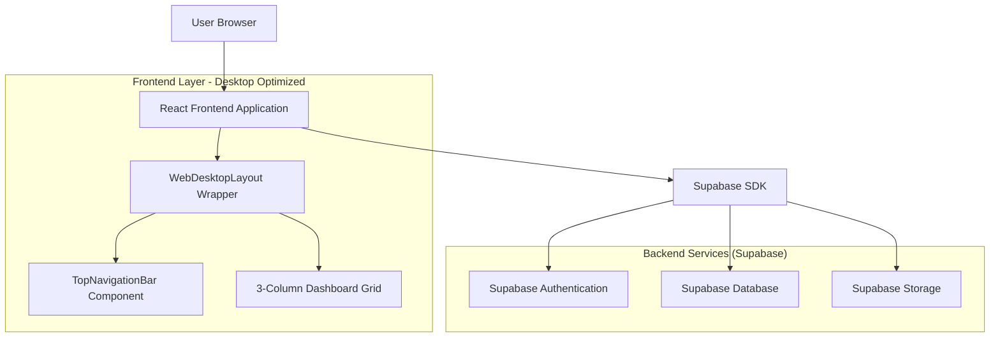
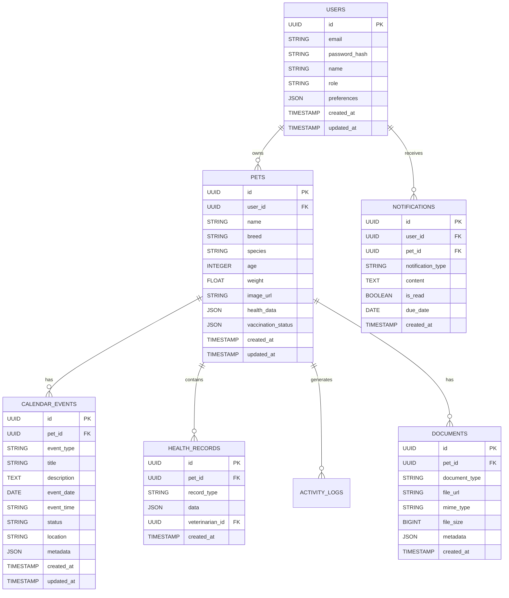

## 1. Architecture Design



## 2. Technology Description
- **Frontend**: React@18 + tailwindcss@3 + vite + expo-web
- **Initialization Tool**: vite-init
- **Backend**: Supabase (Authentication, Database, Storage)
- **State Management**: React Context API + useReducer with desktop-specific state management
- **Layout System**: CSS Grid + Flexbox for 3-column desktop layout
- **Navigation**: Custom TopNavigationBar component replacing FloatingTabBar.web.tsx
- **Image Processing**: Browser-based image compression and cropping with desktop-optimized dimensions
- **Calendar**: FullCalendar library with custom pet-themed styling and desktop view optimizations

## 3. Route Definitions

| Route | Purpose | Desktop Layout |
|-------|---------|----------------|
| / | Root redirect to dashboard | - |
| /login | Authentication with split-screen | Left: branded imagery, Right: login form |
| /signup | Registration with split-screen | Left: branded imagery, Right: registration form |
| /forgot-password | Password recovery | Split-screen layout with form validation |
| /onboarding | User onboarding flow | Multi-step wizard with desktop optimization |
| /dashboard | Main 3-column dashboard | Grid layout: Pet selector / Health cards / Events sidebar |
| /pets | Pet management interface | Enhanced for desktop with grid layouts |
| /pets/:id | Individual pet profile | Two-column desktop form layout |
| /pets/:id/edit | Pet profile editor | Desktop-optimized editing interface |
| /calendar | Multi-pet calendar view | Full-width calendar with desktop sidebar |
| /calendar/add-event | Event creation | Desktop modal with enhanced form |
| /profile | User profile management | Desktop settings layout with tabs |

## 4. Component Architecture

### 4.1 Core Components
- **WebDesktopLayout**: New wrapper component in `app/_layout.web.tsx` providing consistent desktop container
- **TopNavigationBar**: Replaces `FloatingTabBar.web.tsx` with horizontal navigation structure
- **DashboardGrid**: 3-column CSS Grid layout for dashboard organization
- **SplitScreenAuth**: Split-screen layout component for authentication pages
- **DesktopCard**: Enhanced card component with hover states and desktop optimizations

### 4.2 Dashboard Components (Refactored)
- **QuickActionsPanel**: Horizontal arrangement with desktop-optimized spacing
- **HealthSummaryCard**: Grid-based layout with hover effects
- **PetSelector**: Enhanced for desktop with larger target areas
- **UpcomingEvents**: Sidebar layout optimized for desktop viewing

## 5. API Definitions

### 5.1 Pet Profile Management
```
GET /api/pets
```
Response:
| Param Name | Param Type | Description |
|------------|-------------|-------------|
| id | string | Pet unique identifier |
| name | string | Pet name |
| breed | string | Pet breed |
| species | string | Pet species (dog/cat) |
| age | number | Pet age in years |
| weight | number | Pet weight in kg |
| image_url | string | Profile image URL |
| health_data | object | Health information including allergies, behavior, food |
| vaccination_status | object | Vaccination records and upcoming dates |
| created_at | timestamp | Creation timestamp |
| updated_at | timestamp | Last update timestamp |

```
PUT /api/pets/:id
```
Request:
| Param Name | Param Type | isRequired | Description |
|------------|-------------|-------------|-------------|
| name | string | false | Pet name |
| breed | string | false | Pet breed |
| species | string | false | Pet species |
| age | number | false | Pet age |
| weight | number | false | Pet weight |
| health_data | object | false | Health information object |
| image_file | file | false | New profile image (desktop-optimized) |

### 5.2 Calendar Events
```
GET /api/calendar/events
```
Response:
| Param Name | Param Type | Description |
|------------|-------------|-------------|
| id | string | Event unique identifier |
| pet_id | string | Associated pet ID |
| pet_name | string | Pet name for display |
| event_type | string | Type: vaccination, treatment, checkup, medication |
| title | string | Event title |
| description | string | Event details |
| event_date | date | Scheduled date |
| event_time | string | Scheduled time (desktop feature) |
| status | string | Status: upcoming, completed, overdue |
| location | string | Event location (desktop feature) |
| created_at | timestamp | Creation timestamp |

## 6. Desktop Theme Extensions

### 6.1 Extended Theme Constants
Updated `/constants/theme.ts` with desktop-specific values:

```typescript
export const desktopTheme = {
  spacing: {
    ...spacing,
    desktop: {
      xs: 8,
      s: 12,
      m: 20,
      l: 32,
      xl: 48,
      xxl: 64,
      grid: 24,
      panel: 300,
      sidebar: 320,
    }
  },
  typography: {
    ...typography,
    desktop: {
      header: { fontSize: 28, fontWeight: '700' as const },
      cardTitle: { fontSize: 20, fontWeight: '600' as const },
      smallText: { fontSize: 13, fontWeight: '400' as const },
      miniText: { fontSize: 11, fontWeight: '400' as const },
    }
  },
  layout: {
    breakpoints: {
      desktop: 1440,
      tablet: 1024,
      mobile: 768,
    },
    maxWidths: {
      content: 1200,
      form: 480,
      modal: 600,
    }
  }
};
```

### 6.2 Desktop Layout Specifications
- **Grid System**: 12-column CSS Grid with 24px gutters
- **Panel Widths**: Sidebar 320px, Content flexible, Right panel 300px minimum
- **Breakpoints**: 1440px (desktop), 1024px (tablet), 768px (mobile)
- **Content Max-Width**: 1200px for optimal readability
- **Form Width**: 480px maximum for authentication forms

## 7. Data Model

### 7.1 Enhanced Database Schema


### 7.2 Desktop-Optimized Table Structures

**Enhanced Users Table**
```sql
CREATE TABLE users (
  id UUID PRIMARY KEY DEFAULT gen_random_uuid(),
  email VARCHAR(255) UNIQUE NOT NULL,
  password_hash VARCHAR(255) NOT NULL,
  name VARCHAR(100) NOT NULL,
  role VARCHAR(20) DEFAULT 'user' CHECK (role IN ('user', 'premium', 'admin')),
  preferences JSONB DEFAULT '{"theme": "light", "notifications": true, "desktop_layout": "3-column"}',
  created_at TIMESTAMP WITH TIME ZONE DEFAULT NOW(),
  updated_at TIMESTAMP WITH TIME ZONE DEFAULT NOW()
);

-- Desktop-specific indexes
CREATE INDEX idx_users_role ON users(role);
CREATE INDEX idx_users_preferences ON users USING GIN (preferences);
```

**Enhanced Calendar Events Table**
```sql
CREATE TABLE calendar_events (
  id UUID PRIMARY KEY DEFAULT gen_random_uuid(),
  pet_id UUID REFERENCES pets(id) ON DELETE CASCADE,
  event_type VARCHAR(50) NOT NULL CHECK (event_type IN ('vaccination', 'treatment', 'checkup', 'medication', 'grooming', 'feeding')),
  title VARCHAR(200) NOT NULL,
  description TEXT,
  event_date DATE NOT NULL,
  event_time VARCHAR(10),
  status VARCHAR(20) DEFAULT 'upcoming' CHECK (status IN ('upcoming', 'completed', 'overdue', 'cancelled')),
  location VARCHAR(255),
  metadata JSONB DEFAULT '{}',
  created_at TIMESTAMP WITH TIME ZONE DEFAULT NOW(),
  updated_at TIMESTAMP WITH TIME ZONE DEFAULT NOW()
);

-- Desktop-specific indexes
CREATE INDEX idx_calendar_events_date_time ON calendar_events(event_date, event_time);
CREATE INDEX idx_calendar_events_location ON calendar_events(location);
```

## 8. Performance Optimization

### 8.1 Desktop Performance Strategies
- **Code Splitting**: Route-based splitting with desktop-specific chunks
- **Lazy Loading**: Components loaded on-demand for desktop viewport
- **Virtual Scrolling**: Implemented for long pet lists and calendar events
- **Image Optimization**: Desktop-appropriate image sizes with WebP support
- **CSS Optimization**: Critical CSS extraction and desktop-specific style sheets

### 8.2 Real-time Subscriptions
```javascript
// Desktop-optimized real-time updates
const desktopSubscription = supabase
  .channel('desktop-updates')
  .on('postgres_changes', 
    { event: '*', schema: 'public', table: 'calendar_events' },
    payload => handleDesktopCalendarUpdate(payload)
  )
  .on('postgres_changes',
    { event: '*', schema: 'public', table: 'pets' },
    payload => handleDesktopPetUpdate(payload)
  )
  .subscribe();
```

## 9. Security Considerations

### 9.1 Desktop-Specific Security
- **Session Management**: Enhanced session handling for desktop environments
- **CSRF Protection**: Implementation for desktop form submissions
- **Input Validation**: Desktop-optimized form validation with real-time feedback
- **Rate Limiting**: API rate limiting appropriate for desktop usage patterns

### 9.2 Row Level Security Policies
Enhanced RLS policies for desktop access patterns:
```sql
-- Desktop session policy
CREATE POLICY "Desktop users can access their data" ON users FOR SELECT 
USING (auth.jwt() ->> 'role' = 'authenticated');

-- Enhanced pet access with desktop metadata
CREATE POLICY "Desktop users can manage their pets" ON pets FOR ALL 
USING (auth.uid() = user_id) 
WITH CHECK (auth.uid() = user_id);
```