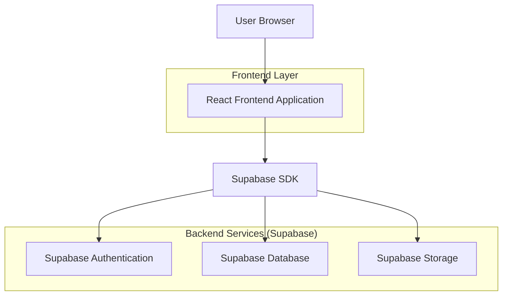
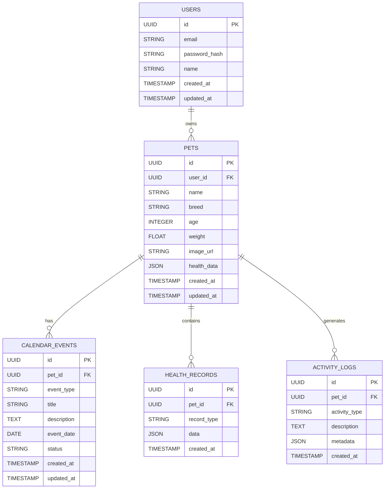

## 1. Architecture Design



## 2. Technology Description
- **Frontend**: React@18 + tailwindcss@3 + vite
- **Initialization Tool**: vite-init
- **Backend**: Supabase (Authentication, Database, Storage)
- **State Management**: React Context API + useReducer
- **Image Processing**: Browser-based image compression and cropping
- **Calendar**: FullCalendar library with custom pet-themed styling

## 3. Route Definitions
| Route | Purpose |
|-------|---------|
| / | Dashboard with inline pet details panel |
| /dashboard | Main dashboard showing health cards and recent activity |
| /pets | Pet management and selection interface |
| /pets/:id | Individual pet profile with full editing capabilities |
| /pets/:id/edit | Dedicated pet profile editor |
| /calendar | Multi-pet calendar view with events |
| /calendar/events/:id | Individual event details and management |
| /profile | User profile and settings |

## 4. API Definitions

### 4.1 Pet Profile Management
```
GET /api/pets
```
Response:
| Param Name | Param Type | Description |
|------------|-------------|-------------|
| id | string | Pet unique identifier |
| name | string | Pet name |
| breed | string | Pet breed |
| age | number | Pet age in years |
| weight | number | Pet weight in kg |
| image_url | string | Profile image URL |
| health_data | object | Health information including allergies, behavior, food |
| created_at | timestamp | Creation timestamp |
| updated_at | timestamp | Last update timestamp |

```
PUT /api/pets/:id
```
Request:
| Param Name | Param Type | isRequired | Description |
|------------|-------------|-------------|-------------|
| name | string | false | Pet name |
| breed | string | false | Pet breed |
| age | number | false | Pet age |
| weight | number | false | Pet weight |
| health_data | object | false | Health information object |
| image_file | file | false | New profile image |

### 4.2 Calendar Events
```
GET /api/calendar/events
```
Response:
| Param Name | Param Type | Description |
|------------|-------------|-------------|
| id | string | Event unique identifier |
| pet_id | string | Associated pet ID |
| pet_name | string | Pet name for display |
| event_type | string | Type: vaccination, treatment, checkup |
| title | string | Event title |
| description | string | Event details |
| event_date | date | Scheduled date |
| status | string | Status: upcoming, completed, overdue |
| created_at | timestamp | Creation timestamp |

## 5. Data Model

### 5.1 Database Schema


### 5.2 Data Definition Language

**Pets Table**
```sql
CREATE TABLE pets (
  id UUID PRIMARY KEY DEFAULT gen_random_uuid(),
  user_id UUID REFERENCES auth.users(id) ON DELETE CASCADE,
  name VARCHAR(100) NOT NULL,
  breed VARCHAR(100),
  age INTEGER,
  weight DECIMAL(5,2),
  image_url TEXT,
  health_data JSONB DEFAULT '{}',
  created_at TIMESTAMP WITH TIME ZONE DEFAULT NOW(),
  updated_at TIMESTAMP WITH TIME ZONE DEFAULT NOW()
);

-- Indexes
CREATE INDEX idx_pets_user_id ON pets(user_id);
CREATE INDEX idx_pets_created_at ON pets(created_at DESC);

-- Row Level Security
ALTER TABLE pets ENABLE ROW LEVEL SECURITY;
CREATE POLICY "Users can view their own pets" ON pets FOR SELECT USING (auth.uid() = user_id);
CREATE POLICY "Users can insert their own pets" ON pets FOR INSERT WITH CHECK (auth.uid() = user_id);
CREATE POLICY "Users can update their own pets" ON pets FOR UPDATE USING (auth.uid() = user_id);
CREATE POLICY "Users can delete their own pets" ON pets FOR DELETE USING (auth.uid() = user_id);
```

**Calendar Events Table**
```sql
CREATE TABLE calendar_events (
  id UUID PRIMARY KEY DEFAULT gen_random_uuid(),
  pet_id UUID REFERENCES pets(id) ON DELETE CASCADE,
  event_type VARCHAR(50) NOT NULL CHECK (event_type IN ('vaccination', 'treatment', 'checkup', 'medication')),
  title VARCHAR(200) NOT NULL,
  description TEXT,
  event_date DATE NOT NULL,
  status VARCHAR(20) DEFAULT 'upcoming' CHECK (status IN ('upcoming', 'completed', 'overdue')),
  created_at TIMESTAMP WITH TIME ZONE DEFAULT NOW(),
  updated_at TIMESTAMP WITH TIME ZONE DEFAULT NOW()
);

-- Indexes
CREATE INDEX idx_calendar_events_pet_id ON calendar_events(pet_id);
CREATE INDEX idx_calendar_events_event_date ON calendar_events(event_date);
CREATE INDEX idx_calendar_events_status ON calendar_events(status);

-- Row Level Security
ALTER TABLE calendar_events ENABLE ROW LEVEL SECURITY;
CREATE POLICY "Users can view their pets' events" ON calendar_events FOR SELECT USING (
  EXISTS (
    SELECT 1 FROM pets WHERE pets.id = calendar_events.pet_id AND pets.user_id = auth.uid()
  )
);
```

**Activity Logs Table**
```sql
CREATE TABLE activity_logs (
  id UUID PRIMARY KEY DEFAULT gen_random_uuid(),
  pet_id UUID REFERENCES pets(id) ON DELETE CASCADE,
  activity_type VARCHAR(50) NOT NULL,
  description TEXT,
  metadata JSONB DEFAULT '{}',
  created_at TIMESTAMP WITH TIME ZONE DEFAULT NOW()
);

-- Indexes
CREATE INDEX idx_activity_logs_pet_id ON activity_logs(pet_id);
CREATE INDEX idx_activity_logs_created_at ON activity_logs(created_at DESC);

-- Row Level Security
ALTER TABLE activity_logs ENABLE ROW LEVEL SECURITY;
CREATE POLICY "Users can view their pets' activity" ON activity_logs FOR SELECT USING (
  EXISTS (
    SELECT 1 FROM pets WHERE pets.id = activity_logs.pet_id AND pets.user_id = auth.uid()
  )
);
```

### 5.3 Supabase Storage Configuration
```sql
-- Create storage bucket for pet images
INSERT INTO storage.buckets (id, name, public, file_size_limit, allowed_mime_types)
VALUES ('pet-images', 'pet-images', true, 5242880, ARRAY['image/jpeg', 'image/png', 'image/webp']);

-- Storage policies for pet images
CREATE POLICY "Users can upload pet images" ON storage.objects FOR INSERT 
WITH CHECK (bucket_id = 'pet-images' AND auth.role() = 'authenticated');

CREATE POLICY "Users can update their pet images" ON storage.objects FOR UPDATE 
USING (bucket_id = 'pet-images' AND auth.role() = 'authenticated');

CREATE POLICY "Pet images are publicly accessible" ON storage.objects FOR SELECT 
USING (bucket_id = 'pet-images');
```

### 5.4 Real-time Subscriptions
```javascript
// Real-time updates for pet activities
const subscription = supabase
  .channel('pet-activities')
  .on('postgres_changes', 
    { event: 'INSERT', schema: 'public', table: 'activity_logs' },
    payload => handleNewActivity(payload.new)
  )
  .subscribe();

// Real-time updates for calendar events
const calendarSubscription = supabase
  .channel('calendar-events')
  .on('postgres_changes',
    { event: '*', schema: 'public', table: 'calendar_events' },
    payload => handleCalendarUpdate(payload)
  )
  .subscribe();
```