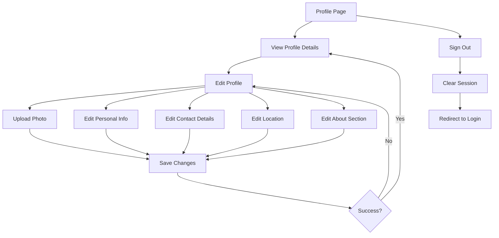

## 1. Product Overview
Fix signout button functionality and enhance user profile page with comprehensive user details editing capabilities. This update addresses critical user experience issues and provides a complete profile management system.

The profile page improvements will allow users to fully customize their personal information, upload profile photos, and manage all aspects of their account in a unified, intuitive interface.

## 2. Core Features

### 2.1 User Roles
| Role | Registration Method | Core Permissions |
|------|---------------------|------------------|
| Standard User | Email/Password or OAuth | Full profile editing, photo upload, account management |
| Guest User | Limited access | View-only profile, cannot edit details |

### 2.2 Feature Module
Our profile enhancement requirements consist of the following main components:
1. **Profile Display Page**: Enhanced user card with complete profile information, improved photo handling, and comprehensive user details display.
2. **Profile Edit Page**: Advanced editing interface with all user fields, photo upload functionality, and real-time validation.
3. **Settings Management**: Account preferences, notification settings, and privacy controls integrated into the profile experience.

### 2.3 Page Details
| Page Name | Module Name | Feature description |
|-----------|-------------|---------------------|
| Profile Display | User Info Card | Display user photo, name, email, phone, bio, gender, date of birth, location (address, country), website with proper formatting and fallback avatars. |
| Profile Display | Photo Management | Show current profile photo with camera overlay button for quick editing, handle photo loading states and error cases gracefully. |
| Profile Display | Quick Actions | Provide navigation to edit profile, co-owners management, notification settings, and appearance settings with clear visual hierarchy. |
| Profile Display | Sign Out Button | Fix current signout button functionality to properly clear authentication state and redirect to login page with proper error handling. |
| Profile Edit | Photo Upload | Implement drag-and-drop or click-to-upload photo functionality with image preview, cropping capabilities, and progress indicators. |
| Profile Edit | Personal Information | Edit first name, last name, date of birth, gender with proper form validation and real-time feedback. |
| Profile Edit | Contact Details | Edit phone number with proper formatting, email (read-only), website URL with validation. |
| Profile Edit | Location Settings | Edit country selection, address with autocomplete functionality, and location coordinates storage. |
| Profile Edit | About Section | Edit bio with character limit, language selection, and rich text formatting options. |
| Profile Edit | Save Functionality | Implement comprehensive profile saving with error handling, success feedback, and optimistic updates. |
| Settings/Account | Account Management | Change password functionality, account deletion requests, and security settings with proper confirmation dialogs. |
| Settings/Account | Notification Preferences | Toggle email notifications, push notifications, health reminders, and event reminders with immediate effect. |
| Settings/Account | Privacy Controls | Display privacy information, data encryption status, and account security details. |

## 3. Core Process
**User Profile Management Flow:**
1. User navigates to profile page from main navigation
2. Profile page displays current user information with photo, name, and key details
3. User can click "Edit Profile" to access comprehensive editing interface
4. Editing page provides organized sections for personal info, contact details, location, and about section
5. Photo can be uploaded via drag-and-drop or click-to-upload with preview
6. All changes are validated in real-time with helpful error messages
7. User saves changes with immediate feedback and automatic navigation back to profile
8. Sign out button properly clears session and redirects to login

**Settings Management Flow:**
1. User accesses settings from profile page or dedicated settings page
2. Tabbed interface provides access to Account, Notifications, and Privacy sections
3. Account section allows profile edits and password changes
4. Notifications section provides granular control over all notification types
5. Privacy section displays security information and account deletion option
6. All changes are saved immediately with confirmation feedback

## 4. User Interface Design

### 4.1 Design Style
- **Primary Colors**: Indigo (#6366F1) for primary actions, slate gray for text (#1F2937)
- **Secondary Colors**: Light gray (#F3F4F6) for backgrounds, white for cards
- **Button Style**: Rounded corners (12px radius), prominent primary actions with hover states
- **Typography**: System fonts with clear hierarchy - 28px titles, 16px body text, 14px secondary text
- **Layout Style**: Card-based design with subtle shadows, generous spacing (24px sections, 16px elements)
- **Icons**: Ionicons for consistency, colored to match action type (blue for primary, red for destructive)

### 4.2 Page Design Overview
| Page Name | Module Name | UI Elements |
|-----------|-------------|-------------|
| Profile Display | User Card | Circular avatar (100px) with camera overlay button, user name in large title font, email in secondary color, location with map icon, country with globe emoji. Card has white background, 16px padding, 12px border radius, subtle shadow. |
| Profile Display | Action Menu | White cards with 12px radius, menu items with arrow indicators, consistent 16px padding, section headers in bold primary color, proper touch target sizes (44px minimum). |
| Profile Display | Sign Out | Red destructive button with white text, full width on mobile, centered text, proper spacing from other elements, confirmation dialog with clear messaging. |
| Profile Edit | Form Sections | Grouped inputs with section headers, proper input spacing (20px between groups), clear labels above inputs, helper text for complex fields, real-time validation feedback. |
| Profile Edit | Photo Upload | Square upload area with dashed border, drag-and-drop zone, upload progress indicator, preview thumbnail, remove/replace options. |
| Settings | Tab Navigation | Horizontal tabs on desktop, vertical sidebar on mobile, active tab highlighting with primary color, icon and text combination, smooth transitions. |

### 4.3 Responsiveness
- **Desktop-First Design**: Optimized for 1024px+ screens with sidebar navigation
- **Mobile Adaptation**: Responsive grid that collapses to single column below 768px
- **Touch Optimization**: Minimum 44px touch targets, appropriate spacing for finger navigation
- **Tablet Support**: Intermediate breakpoints at 768px and 1024px for optimal tablet experience

### 4.4 Accessibility
- **Keyboard Navigation**: Full keyboard accessibility with proper tab order
- **Screen Reader Support**: Proper ARIA labels and semantic HTML structure
- **Color Contrast**: WCAG 2.1 AA compliance for all text and interactive elements
- **Focus Indicators**: Clear focus states for all interactive elements
- **Error Handling**: Clear error messages with proper association to form fields