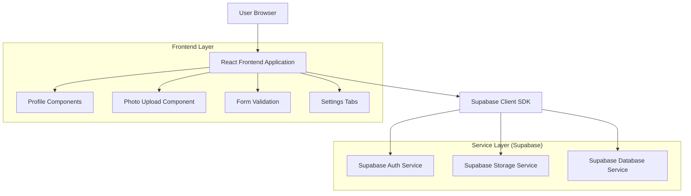
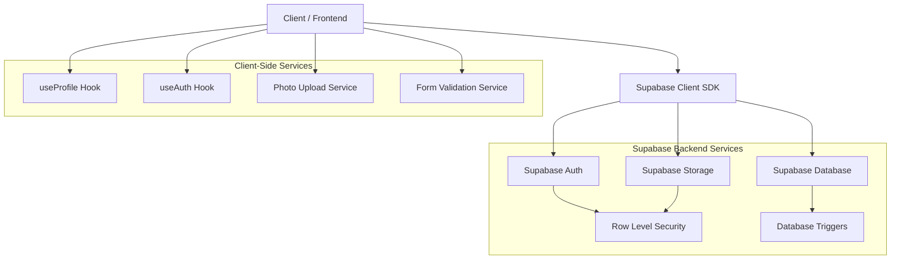
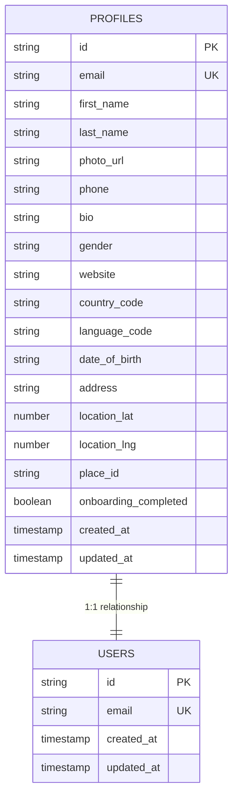

## 1. Architecture Design



## 2. Technology Description
- **Frontend**: React@18 + React Native + Expo Router
- **Backend**: Supabase (PostgreSQL, Auth, Storage)
- **State Management**: React Context + Custom Hooks
- **File Upload**: Supabase Storage with client-side image processing
- **Form Validation**: React Hook Form + Zod schemas
- **UI Components**: Custom component library with design system

## 3. Route Definitions
| Route | Purpose |
|-------|---------|
| /(tabs)/profile | Mobile profile display page with user information and quick actions |
| /(tabs)/profile/edit | Mobile profile editing interface with comprehensive form fields |
| /(tabs)/profile/settings/appearance | Mobile appearance settings for theme and display preferences |
| /(tabs)/profile/co-owners | Mobile co-owner management interface |
| /(tabs)/profile/notifications | Mobile notification preferences |
| /web/settings | Web settings page with tabbed interface for account, notifications, and privacy |
| /web/settings/index | Web account settings with profile editing capabilities |

## 4. API Definitions

### 4.1 Profile Management APIs

**Update User Profile**
```
PUT /api/profiles/{user_id}
```

Request:
| Param Name | Param Type | isRequired | Description |
|------------|-------------|-------------|-------------|
| first_name | string | false | User's first name |
| last_name | string | false | User's last name |
| phone | string | false | Phone number with international format |
| bio | string | false | User biography/description |
| gender | string | false | Gender identity (male/female/other/prefer_not_to_say) |
| website | string | false | Personal website URL |
| country_code | string | false | ISO 3166-1 alpha-2 country code |
| language_code | string | false | ISO 639-1 language code |
| date_of_birth | string | false | Date of birth in ISO 8601 format |
| photo_url | string | false | Profile photo URL from Supabase Storage |
| address | string | false | Full address string |
| location_lat | number | false | Latitude coordinate |
| location_lng | number | false | Longitude coordinate |
| place_id | string | false | Google Places API place ID |

Response:
```json
{
  "success": true,
  "data": {
    "id": "user_uuid",
    "email": "user@example.com",
    "first_name": "John",
    "last_name": "Doe",
    "phone": "+1234567890",
    "bio": "Pet lover and owner",
    "gender": "male",
    "website": "https://example.com",
    "country_code": "US",
    "language_code": "en",
    "date_of_birth": "1990-01-01",
    "photo_url": "https://storage.supabase.com/avatars/user.jpg",
    "address": "123 Main St, City, State",
    "location_lat": 40.7128,
    "location_lng": -74.0060,
    "place_id": "ChIJOwg_06VPwokRYv534QaPC8g",
    "updated_at": "2024-01-01T00:00:00Z"
  }
}
```

### 4.2 Photo Upload APIs

**Upload Profile Photo**
```
POST /api/upload/avatar
```

Request:
| Param Name | Param Type | isRequired | Description |
|------------|-------------|-------------|-------------|
| file | File | true | Image file (JPEG, PNG, max 5MB) |
| user_id | string | true | User UUID |
| existing_url | string | false | Existing photo URL to replace |

Response:
```json
{
  "success": true,
  "data": {
    "url": "https://storage.supabase.com/avatars/user_uuid_timestamp.jpg",
    "public_url": "https://project_id.supabase.co/storage/v1/object/public/avatars/user_uuid_timestamp.jpg"
  }
}
```

### 4.3 Authentication APIs

**Sign Out User**
```
POST /api/auth/signout
```

Response:
```json
{
  "success": true,
  "message": "Successfully signed out"
}
```

## 5. Server Architecture Diagram



## 6. Data Model

### 6.1 Enhanced Profiles Table



### 6.2 Data Definition Language

**Enhanced Profiles Table**
```sql
-- Update existing profiles table with new fields
ALTER TABLE profiles 
ADD COLUMN IF NOT EXISTS phone VARCHAR(20),
ADD COLUMN IF NOT EXISTS bio TEXT,
ADD COLUMN IF NOT EXISTS gender VARCHAR(20),
ADD COLUMN IF NOT EXISTS website VARCHAR(255),
ADD COLUMN IF NOT EXISTS country_code VARCHAR(2),
ADD COLUMN IF NOT EXISTS language_code VARCHAR(2),
ADD COLUMN IF NOT EXISTS address TEXT,
ADD COLUMN IF NOT EXISTS location_lat DECIMAL(10, 8),
ADD COLUMN IF NOT EXISTS location_lng DECIMAL(11, 8),
ADD COLUMN IF NOT EXISTS place_id VARCHAR(255);

-- Create indexes for better query performance
CREATE INDEX IF NOT EXISTS idx_profiles_country_code ON profiles(country_code);
CREATE INDEX IF NOT EXISTS idx_profiles_language_code ON profiles(language_code);
CREATE INDEX IF NOT EXISTS idx_profiles_location ON profiles(location_lat, location_lng);

-- Set up Row Level Security (RLS) policies
ALTER TABLE profiles ENABLE ROW LEVEL SECURITY;

-- Allow users to read their own profile
CREATE POLICY "Users can view own profile" ON profiles
    FOR SELECT USING (auth.uid() = id);

-- Allow users to update their own profile
CREATE POLICY "Users can update own profile" ON profiles
    FOR UPDATE USING (auth.uid() = id);

-- Allow users to insert their own profile
CREATE POLICY "Users can insert own profile" ON profiles
    FOR INSERT WITH CHECK (auth.uid() = id);
```

**Storage Bucket Configuration**
```sql
-- Create storage bucket for user avatars if not exists
INSERT INTO storage.buckets (id, name, public, file_size_limit, allowed_mime_types)
VALUES ('avatars', 'avatars', true, 5242880, ARRAY['image/jpeg', 'image/png', 'image/webp'])
ON CONFLICT (id) DO NOTHING;

-- Set up storage policies for avatar uploads
CREATE POLICY "Avatar uploads are publicly accessible" ON storage.objects
    FOR SELECT USING (bucket_id = 'avatars');

CREATE POLICY "Users can upload own avatar" ON storage.objects
    FOR INSERT WITH CHECK (
        bucket_id = 'avatars' 
        AND (storage.foldername(name))[1] = auth.uid()::text
    );

CREATE POLICY "Users can update own avatar" ON storage.objects
    FOR UPDATE USING (
        bucket_id = 'avatars' 
        AND (storage.foldername(name))[1] = auth.uid()::text
    );

CREATE POLICY "Users can delete own avatar" ON storage.objects
    FOR DELETE USING (
        bucket_id = 'avatars' 
        AND (storage.foldername(name))[1] = auth.uid()::text
    );
```

### 6.3 TypeScript Type Definitions

**Enhanced Profile Types**
```typescript
export interface Profile {
  id: string;
  email: string;
  first_name: string | null;
  last_name: string | null;
  photo_url: string | null;
  phone: string | null;
  bio: string | null;
  gender: 'male' | 'female' | 'other' | 'prefer_not_to_say' | null;
  website: string | null;
  country_code: string | null;
  language_code: string | null;
  date_of_birth: string | null;
  address: string | null;
  location_lat: number | null;
  location_lng: number | null;
  place_id: string | null;
  onboarding_completed: boolean;
  created_at: string;
  updated_at: string;
}

export interface ProfileUpdate {
  first_name?: string | null;
  last_name?: string | null;
  photo_url?: string | null;
  phone?: string | null;
  bio?: string | null;
  gender?: 'male' | 'female' | 'other' | 'prefer_not_to_say' | null;
  website?: string | null;
  country_code?: string | null;
  language_code?: string | null;
  date_of_birth?: string | null;
  address?: string | null;
  location_lat?: number | null;
  location_lng?: number | null;
  place_id?: string | null;
}

export interface PhotoUploadResponse {
  success: boolean;
  data: {
    url: string;
    public_url: string;
  };
  error?: string;
}

export interface SignOutResponse {
  success: boolean;
  message: string;
}
```

## 7. Implementation Considerations

### 7.1 Performance Optimizations
- **Image Optimization**: Client-side image compression before upload (max 1920x1920, 80% quality)
- **Lazy Loading**: Profile photos loaded with progressive enhancement
- **Form Debouncing**: Debounced validation for real-time form feedback
- **Optimistic Updates**: Immediate UI updates with rollback on error

### 7.2 Security Measures
- **Input Validation**: Server-side validation for all user inputs using Zod schemas
- **File Type Validation**: Strict MIME type checking for uploaded images
- **Size Limits**: 5MB file size limit for profile photos
- **Rate Limiting**: Implement rate limiting for profile updates (max 10 per hour)
- **XSS Protection**: Sanitize all user-generated content before display

### 7.3 Error Handling
- **Network Errors**: Graceful handling of offline scenarios with retry mechanisms
- **Validation Errors**: Clear user-friendly error messages for all validation failures
- **Upload Errors**: Specific error handling for photo upload failures (size, type, network)
- **Authentication Errors**: Proper handling of expired sessions and re-authentication flows

### 7.4 Testing Strategy
- **Unit Tests**: Test all form validation logic and utility functions
- **Integration Tests**: Test profile update flows and photo upload processes
- **E2E Tests**: Test complete user journeys from profile viewing to editing
- **Accessibility Tests**: Ensure WCAG 2.1 AA compliance for all interactive elements