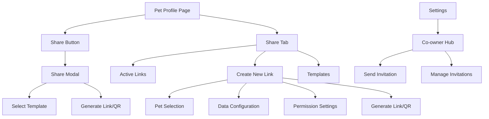

## 1. Product Overview
Enhance existing co-owner and pet profile sharing capabilities with a comprehensive sharing system that allows pet owners to securely share pet information with co-owners, caregivers, and service providers. This feature provides granular control over shared data, reusable sharing templates, and multiple sharing methods including links and QR codes.

The system targets pet owners who need to share pet care responsibilities with family members, friends, veterinarians, pet sitters, and other service providers while maintaining control over sensitive information.

## 2. Core Features

### 2.1 User Roles
| Role | Registration Method | Core Permissions |
|------|---------------------|------------------|
| Pet Owner | Email/Social registration | Full pet profile management, sharing control, co-owner invitations |
| Co-owner | Invitation acceptance | Shared pet management based on granted permissions |
| Share Recipient | Link/QR code access | View-only or limited editing based on sharing settings |

### 2.2 Feature Module
Our pet sharing system consists of the following main pages and components:

1. **Co-owner Management Hub**: Centralized management for co-owner invitations, sent/received invitations, and pet assignment.
2. **Share Profile Modal**: Quick sharing interface accessible from pet profiles with link/QR generation and template selection.
3. **Pet Profile Share Tab**: Dedicated sharing management page with Active Links, Templates, and New Link creation sections.
4. **Create New Link Page**: Comprehensive form for creating custom sharing links with granular permissions.
5. **Templates Management Page**: Interface for managing and creating sharing templates.

### 2.3 Page Details

| Page Name | Module Name | Feature description |
|-----------|-------------|---------------------|
| Co-owner Management Hub | Invite New Co-owner | Send email invitations to potential co-owners with pet selection toggles and permission settings. |
| Co-owner Management Hub | Sent Invitations | View and manage all sent invitations with status tracking (Pending/Accepted/Revoked) and recipient details. |
| Co-owner Management Hub | Received Invitations | Accept or decline incoming co-owner invitations with pet details and inviter information. |
| Share Profile Modal | Template Selection | Choose from predefined sharing templates (Full Access, Minimal Info, Vet Emergency) with radio button selection. |
| Share Profile Modal | Link Generation | Generate shareable links and QR codes based on selected template with copy functionality. |
| Pet Profile Share Tab | Active Links | Display all active sharing links with creation date, expiration, recipient info, permissions, and management actions. |
| Pet Profile Share Tab | Templates Section | Browse and select from system and user-created templates for quick sharing setup. |
| Pet Profile Share Tab | Create New Link | Multi-step form for custom link creation with pet selection, data inclusion options, and permission settings. |
| Create New Link | Pet Selection | Select multiple pets to share with visual chips and pre-selection from profile context. |
| Create New Link | Data Inclusion | Choose specific data categories (Identity, Vaccines, Medical, Documents, Emergency Contacts) with tile selection. |
| Create New Link | Permissions | Configure recipient permissions (View Only, Add Photos, Edit Health Logs) with toggle switches. |
| Create New Link | Profile Card | Generate downloadable pet profile card with image and embedded QR code. |
| Templates Management | Default Templates | Access system-provided templates with predefined settings and use-them functionality. |
| Templates Management | My Templates | Create, edit, and delete custom templates with tag-based organization. |

## 3. Core Process

### Pet Owner Flow - Co-owner Management
1. Navigate to Settings → Co-owner Management Hub
2. Send new invitation: Enter email → Select pets → Set permissions → Send
3. Manage sent invitations: View status → Revoke/Edit permissions → View all
4. Handle received invitations: Review details → Accept/Decline

### Pet Owner Flow - Profile Sharing
1. Quick Share: Click Share button on pet profile → Select template → Generate link/QR
2. Detailed Share: Go to pet profile Share tab → Create New Link → Configure settings → Generate
3. Manage Active Links: View all links → Copy/Edit/Revoke → Monitor expiration
4. Template Management: Browse templates → Use/Edit/Create custom templates

### Share Recipient Flow
1. Receive link/QR code → Access shared profile → View based on permissions
2. Limited editing: Add photos or health logs if permitted
3. No account required for view-only access

## 4. User Interface Design

### 4.1 Design System Alignment
All UI components must strictly adhere to the project's design system defined in `constants/designSystem.ts` and `constants/Colors.ts`.

*   **Primary Color**: **Blue (`#607AFB`)** (mapped to `designSystem.colors.primary[500]`).
    *   *Note*: Do NOT use the Green color from the initial mockups for primary actions. Use the system's Primary Blue.
*   **Secondary Color**: **Pet Palette** (e.g., `#FF6B6B` for paw accents) or **Neutral** Grays.
*   **Backgrounds**:
    *   Primary Background: `#F5F6F8` (`colors.background.primary`).
    *   Card Background: `#FFFFFF` (`colors.background.secondary`).
*   **Theme Support**: All components must support both **Light** and **Dark** modes using `useColorScheme` and tokens from `constants/Colors.ts`.

### 4.2 Component Specifications
Implementation must use existing UI components from `components/ui/` to ensure consistency.

#### **Buttons**
*   **Component**: `components/ui/Button.tsx`
*   **Primary Action** (e.g., "Send Invitation", "Generate Link"):
    *   `variant="filled"`
    *   `size="md"` (48px height) or `lg` (56px) for main CTAs.
    *   Color: Defaults to `neutral.900` (dark) or `neutral.50` (light) in the component, but specifically for Brand Actions, use a wrapper or style override to apply `colors.primary[500]` (`#607AFB`).
*   **Secondary Action** (e.g., "Cancel", "Edit"):
    *   `variant="outline"`
    *   `size="md"`
    *   Text Color: `colors.primary[500]`.
*   **Destructive Action** (e.g., "Revoke Access"):
    *   `variant="ghost"` or `outline`
    *   Text Color: `colors.status.error[500]` (`#EF4444`).

#### **Inputs & Forms**
*   **Component**: `components/ui/Input.tsx` / `components/ui/FormField.tsx`
*   **Styling**:
    *   Height: `48px` (`designSystem.components.input.height`).
    *   Border Radius: `12px` (`designSystem.components.input.borderRadius`).
    *   Background: `colors.background.tertiary` (`#F5F5F5`).
    *   Border: `colors.border.primary` (`#E5E7EB`).
*   **Typography**:
    *   Labels: `designSystem.typography.label.medium` (`textSecondary`).
    *   Input Text: `designSystem.typography.body.large` (`textPrimary`).

#### **Modals**
*   **Component**: `components/ui/FormModal.tsx` (or `Modal` primitive with standard styles)
*   **Structure**:
    *   Backdrop: `colors.overlay.strong` (60% opacity).
    *   Container: White (`#FFFFFF`), Rounded `xl` (`20px`) or `2xl` (`24px`).
    *   Header: Left-aligned Title (`headline.small`), Right-aligned Close Icon.
    *   Padding: `24px` (`spacing[6]`).

#### **Cards (Share Links, Templates)**
*   **Style**:
    *   Background: `#FFFFFF`.
    *   Border Radius: `16px` (`designSystem.borderRadius.lg`).
    *   Shadow: `designSystem.shadows.sm` (Elevation 1).
    *   Padding: `16px` (`spacing[4]`).
*   **Status Pills**:
    *   **Active**: `bg-success-100` text `success-700`.
    *   **Pending**: `bg-warning-100` text `warning-700`.
    *   **Expired/Revoked**: `bg-error-100` text `error-700`.

### 4.3 Page Design Overview

| Page Name | Module Name | UI Elements & Styles |
|-----------|-------------|----------------------|
| **Co-owner Hub** | Invite Panel | **Card**: White/Navy (theme dependent). **Input**: Email field. **Toggles**: Pet selection list. **Actions**: "Send Invitation" (Primary Blue). |
| **Co-owner Hub** | Sent Invitations | **List**: Avatar (Circle), Name (Body Bold), Status Pill. **Actions**: Kebab menu (Ghost). |
| **Share Modal** | Template Selection | **Radio Cards**: Custom Pressable. Selected state: Border `primary[500]` (Blue), Background `primary[50]`. |
| **Share Tab** | Active Links | **Grid**: Cards with Recipient Name, Permissions (Chips), Expiry Date (Caption). **Actions**: Copy (Icon), Revoke (Text Error). |
| **Create New Link** | Form Sections | **Stepper/List**: Numbered headers (`headline.small`). **Selection Tiles**: Grid layout, Checkmark icon on selection. |

### 4.4 Responsiveness
*   **Mobile**: Single column layouts. Full-width buttons. Bottom Sheet for "Share Modal".
*   **Desktop/Web**:
    *   **Modals**: Centered dialogs.
    *   **Grid**: 2 or 3 column grid for "Active Links" and "Templates".
    *   **Navigation**: Sidebar navigation for Settings/Hub access.

## 5. Technical Requirements

### 5.1 Database Schema Updates

**Enhanced Co-owners Table**
- Add invitation status tracking (pending/accepted/revoked)
- Add permission levels and pet assignments
- Add invitation expiration dates

**New Sharing Links Table**
- Unique shareable links with expiration
- Granular permission settings (JSON structure)
- Pet and data inclusion configurations
- Access logs and usage tracking

**New Sharing Templates Table**
- System and user-created templates
- Predefined permission sets
- Tag-based categorization
- Template sharing and cloning

### 5.2 Integration Points

**Settings Integration**
- Add Co-owner Management to main settings menu
- Desktop menu integration for quick access
- Notification system for new invitations

**Profile Page Integration**
- Share button in pet profile header
- Dedicated Share tab with full management
- Contextual pre-selection when accessing from specific profiles

### 5.3 Security Requirements

**Link Security**
- Unique, non-guessable URL tokens
- Optional password protection
- IP-based access restrictions
- Rate limiting for link generation

**Permission Enforcement**
- Server-side validation of all sharing permissions
- Data filtering based on sharing configuration
- Audit logs for all sharing activities

### 5.4 Performance Requirements

**QR Code Generation**
- Real-time generation with error correction
- Multiple format support (PNG, SVG)
- Optimized for mobile scanning

**Template System**
- Fast template loading and application
- Caching for frequently used templates
- Bulk operations for multiple pet sharing

## 6. Implementation Priority

### Phase 1: Core Co-owner Management (Week 1-2)
- Settings integration and invitation system
- Basic sent/received invitation management
- Pet assignment for co-owners

### Phase 2: Basic Profile Sharing (Week 3-4)
- Share modal with template selection
- Link and QR code generation
- Basic permission system

### Phase 3: Advanced Sharing Features (Week 5-6)
- Detailed Share tab with Active Links management
- Custom link creation with granular permissions
- Profile card generation and download

### Phase 4: Template System (Week 7-8)
- Template creation and management
- Default template set for new users
- Template sharing and cloning features

## 7. Success Metrics

**User Engagement**
- Number of sharing links created per user
- Template usage rates
- Co-owner invitation acceptance rates

**Security Metrics**
- Unauthorized access attempts blocked
- Link expiration compliance
- Permission enforcement accuracy

**User Satisfaction**
- Sharing setup completion rates
- Template application efficiency
- Co-owner collaboration effectiveness
