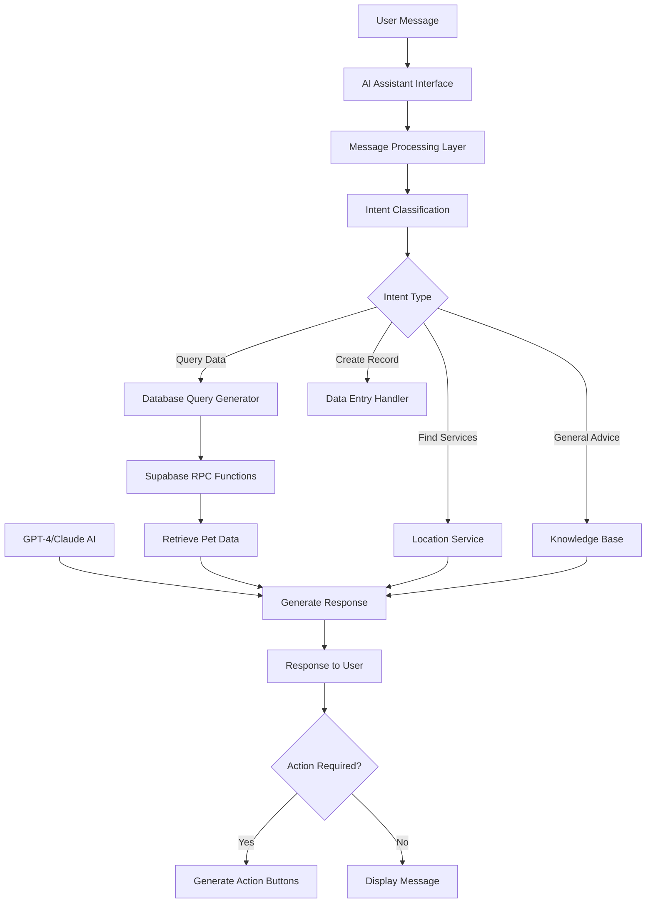

# AI Pet Health Assistant (Conversational AI)

## 🎯 Overview

Implement an intelligent conversational AI assistant that can answer questions, provide advice, help find information, recommend services, and interact naturally with pet owners about their pet's health and care.

---

## üìã Use Cases & User Stories

### Primary Use Cases

#### 1. Health Record Queries
**User:** *"When was Max's last rabies vaccination?"*  
**AI:** "Max received his rabies vaccination on January 15, 2024 at Happy Paws Veterinary. It's valid until January 15, 2027. Would you like me to set a reminder for his next shot?"

**User:** *"What medications is Bella currently taking?"*  
**AI:** "Bella is currently on 2 active medications:
1. Apoquel 16mg - twice daily for allergies (started Dec 1, 2024)
2. Heartgard Plus - once monthly for heartworm prevention (started Jan 2024)

Her next Heartgard dose is due in 3 days (January 15th). Would you like me to remind you?"

#### 2. Natural Language Data Entry
**User:** *"Max got his DHPP vaccine today at Riverview Animal Hospital"*  
**AI:** "I'll add that vaccination record for Max. I found Riverview Animal Hospital at 123 Main St. Is this correct? [Yes/No]

I've pre-filled the form with:
- Vaccine: DHPP (Distemper, Hepatitis, Parvovirus, Parainfluenza)
- Date: January 3, 2026
- Clinic: Riverview Animal Hospital
- Due for next dose: April 3, 2026 (3 months typical for DHPP)

Please review and confirm or edit any details."

#### 3. Finding Nearby Services
**User:** *"I need an emergency vet near me, Bella is limping badly"*  
**AI:** "I'm sorry to hear Bella is hurt. Here are the 3 nearest 24/7 emergency veterinary clinics to your location (San Francisco):

üè• SAGE Veterinary Emergency (1.2 mi)
   üìç 909 Railroad Ave
   üìû (415) 456-7890
   ⭐ 4.8/5 - Open Now
   [Get Directions] [Call Now]

üè• VCA San Francisco Emergency (2.1 mi)
   üìç 1616 Divisadero St
   ⭐ 4.5/5 - Open Now
   [Get Directions] [Call Now]

Would you like me to log this incident in Bella's health record?"

#### 4. Health Advice & Recommendations
**User:** *"Max has been scratching a lot lately, what could it be?"*  
**AI:** "Based on Max's records, I see he has a history of environmental allergies (noted on March 2024). Increased scratching could be related to:

1. **Seasonal allergies** - Spring allergens are common
2. **Food sensitivity** - You recently changed his food brand
3. **Fleas** - His last flea prevention was 6 weeks ago

**Recommendations:**
- Check for fleas and reapply prevention (Frontline Plus is due)
- Monitor for other symptoms (redness, hot spots, ear issues)
- Schedule a vet visit if it continues for more than 3 days

Would you like me to:
- Schedule a vet appointment?
- Set a reminder to check his condition in 3 days?
- Log this observation in his health notes?"

#### 5. Vaccination & Medication Reminders Intelligence
**User:** *"What's coming up for Max?"*  
**AI:** "Here's what's scheduled for Max in the next 30 days:

üìÖ **This Week:**
- Jan 5: Heartgard Plus (heartworm prevention)
- Jan 7: Follow-up vet visit at Happy Paws (post-surgery check)

üìÖ **This Month:**
- Jan 20: Grooming appointment at Pampered Paws
- Jan 28: Rabies booster due (currently 2 days overdue!)

⚠️ **Action Needed:** 
Max's rabies vaccine is overdue. Would you like me to help you schedule an appointment?"

### Secondary Use Cases

6. **Travel Planning** - "We're traveling to Hawaii, what vaccines does Max need?"
7. **Breed-Specific Advice** - "What health issues should I watch for in German Shepherds?"
8. **Diet Recommendations** - "Is Max's current food appropriate for his age and breed?"
9. **Symptom Checker** - "Max is vomiting and seems lethargic, should I go to the ER?"
10. **Document Search** - "Find all of Bella's lab results from 2024"

---

## üèó Technical Architecture

### High-Level System Design



### Technology Stack

#### Option 1: GPT-4 with Function Calling (Recommended)
**Service:** OpenAI GPT-4 Turbo  
**Why:**
- Native function calling for database queries
- Excellent context understanding
- Handles complex multi-turn conversations
- Can process structured data

**Cost:** ~$0.01 per conversation turn (1000 tokens avg)

#### Option 2: Anthropic Claude 3
**Service:** Claude 3 Opus or Sonnet  
**Why:**
- Longer context window (200K tokens)
- Better at following instructions
- More nuanced responses
- Potentially better for medical advice

**Cost:** ~$0.015 per turn (similar token usage)

#### Option 3: Hybrid Approach
- GPT-4 for intent classification & function calling
- Claude for generating thoughtful health advice
- Local Llama 3 for simple queries (cost optimization)

**🎯 Recommendation: Option 1 (GPT-4 with Function Calling)** for best developer experience and reliability.

---

## üíæ Database Schema Extensions

### New Tables

```sql
-- AI Conversation History
CREATE TABLE ai_conversations (
  id UUID PRIMARY KEY DEFAULT uuid_generate_v4(),
  user_id UUID REFERENCES auth.users(id) ON DELETE CASCADE NOT NULL,
  pet_id UUID REFERENCES pets(id) ON DELETE SET NULL, -- Can be null for general questions
  created_at TIMESTAMP WITH TIME ZONE DEFAULT NOW(),
  updated_at TIMESTAMP WITH TIME ZONE DEFAULT NOW()
);

CREATE TABLE ai_messages (
  id UUID PRIMARY KEY DEFAULT uuid_generate_v4(),
  conversation_id UUID REFERENCES ai_conversations(id) ON DELETE CASCADE NOT NULL,
  role VARCHAR(20) NOT NULL, -- 'user', 'assistant', 'system'
  content TEXT NOT NULL,
  function_call JSONB, -- If AI made a function call
  function_response JSONB, -- Response from function
  tokens_used INTEGER,
  model_used VARCHAR(50), -- e.g., 'gpt-4-turbo-preview'
  created_at TIMESTAMP WITH TIME ZONE DEFAULT NOW()
);

-- AI Assistant Actions (for tracking)
CREATE TABLE ai_actions (
  id UUID PRIMARY KEY DEFAULT uuid_generate_v4(),
  conversation_id UUID REFERENCES ai_conversations(id),
  action_type VARCHAR(50) NOT NULL, -- 'create_vaccination', 'find_vet', 'set_reminder'
  action_data JSONB NOT NULL,
  user_confirmed BOOLEAN DEFAULT FALSE,
  executed_at TIMESTAMP WITH TIME ZONE,
  created_at TIMESTAMP WITH TIME ZONE DEFAULT NOW()
);

-- AI Knowledge Base (optional - for caching vet-approved content)
CREATE TABLE ai_knowledge_base (
  id UUID PRIMARY KEY DEFAULT uuid_generate_v4(),
  topic VARCHAR(100) NOT NULL,
  content TEXT NOT NULL,
  source VARCHAR(255), -- e.g., 'AVMA', 'WebMD Pets'
  vet_approved BOOLEAN DEFAULT FALSE,
  species VARCHAR(20), -- 'dog', 'cat', 'all'
  tags JSONB,
  created_at TIMESTAMP WITH TIME ZONE DEFAULT NOW(),
  updated_at TIMESTAMP WITH TIME ZONE DEFAULT NOW()
);

-- Indexes
CREATE INDEX idx_ai_messages_conversation ON ai_messages(conversation_id, created_at);
CREATE INDEX idx_ai_conversations_user ON ai_conversations(user_id, created_at DESC);
CREATE INDEX idx_ai_knowledge_topic ON ai_knowledge_base(topic);
```

### Enhancing Existing Tables

```sql
-- Add AI interaction tracking to existing tables
ALTER TABLE vaccinations ADD COLUMN created_by_ai BOOLEAN DEFAULT FALSE;
ALTER TABLE treatments ADD COLUMN created_by_ai BOOLEAN DEFAULT FALSE;
ALTER TABLE notifications ADD COLUMN created_by_ai BOOLEAN DEFAULT FALSE;

-- Track user satisfaction with AI
CREATE TABLE ai_feedback (
  id UUID PRIMARY KEY DEFAULT uuid_generate_v4(),
  message_id UUID REFERENCES ai_messages(id),
  user_id UUID REFERENCES auth.users(id) NOT NULL,
  rating INTEGER CHECK (rating BETWEEN 1 AND 5),
  feedback_text TEXT,
  created_at TIMESTAMP WITH TIME ZONE DEFAULT NOW()
);
```

---

## üîß Implementation Approach

### Phase 1: Core AI Engine (Week 1-2)

#### 1.1 Create Supabase Edge Function for AI Assistant

`/supabase/functions/ai-assistant/index.ts`:

```typescript
import { serve } from 'https://deno.land/std@0.168.0/http/server.ts'
import { createClient } from 'https://esm.sh/@supabase/supabase-js@2'
import OpenAI from 'https://esm.sh/openai@4.20.1'

const openai = new OpenAI({
  apiKey: Deno.env.get('OPENAI_API_KEY')!,
})

// Define available functions for the AI
const FUNCTIONS = [
  {
    name: 'get_pet_vaccinations',
    description: 'Get vaccination history for a specific pet',
    parameters: {
      type: 'object',
      properties: {
        pet_id: { type: 'string', description: 'UUID of the pet' },
        limit: { type: 'number', description: 'Number of records to return' }
      },
      required: ['pet_id']
    }
  },
  {
    name: 'get_active_medications',
    description: 'Get currently active medications/treatments for a pet',
    parameters: {
      type: 'object',
      properties: {
        pet_id: { type: 'string' }
      },
      required: ['pet_id']
    }
  },
  {
    name: 'search_nearby_vets',
    description: 'Find veterinary clinics near user location',
    parameters: {
      type: 'object',
      properties: {
        latitude: { type: 'number' },
        longitude: { type: 'number' },
        service_type: { 
          type: 'string', 
          enum: ['emergency', 'general', 'specialist'],
          description: 'Type of veterinary service'
        },
        radius_miles: { type: 'number', default: 10 }
      },
      required: ['latitude', 'longitude']
    }
  },
  {
    name: 'create_vaccination_draft',
    description: 'Create a draft vaccination record for user to review',
    parameters: {
      type: 'object',
      properties: {
        pet_id: { type: 'string' },
        vaccine_name: { type: 'string' },
        date_administered: { type: 'string' },
        clinic_name: { type: 'string' },
        next_due_date: { type: 'string' }
      },
      required: ['pet_id', 'vaccine_name', 'date_administered']
    }
  },
  {
    name: 'get_upcoming_tasks',
    description: 'Get upcoming vaccinations, medications, and appointments',
    parameters: {
      type: 'object',
      properties: {
        pet_id: { type: 'string' },
        days_ahead: { type: 'number', default: 30 }
      },
      required: ['pet_id']
    }
  }
]

// Function implementations
async function executeFunctions(functionName: string, args: any, supabase: any) {
  switch (functionName) {
    case 'get_pet_vaccinations':
      const { data: vaccinations } = await supabase
        .from('vaccinations')
        .select('*')
        .eq('pet_id', args.pet_id)
        .order('date', { ascending: false })
        .limit(args.limit || 10)
      return vaccinations

    case 'get_active_medications':
      const { data: meds } = await supabase
        .from('treatments')
        .select('*')
        .eq('pet_id', args.pet_id)
        .eq('is_active', true)
      return meds

    case 'search_nearby_vets':
      // Call Google Places API
      const placesUrl = `https://maps.googleapis.com/maps/api/place/nearbysearch/json?location=${args.latitude},${args.longitude}&radius=${args.radius_miles * 1609}&type=veterinary_care&key=${Deno.env.get('GOOGLE_PLACES_API_KEY')}`
      const response = await fetch(placesUrl)
      const places = await response.json()
      return places.results.slice(0, 5)

    case 'get_upcoming_tasks':
      const cutoffDate = new Date()
      cutoffDate.setDate(cutoffDate.getDate() + args.days_ahead)
      
      const { data: upcoming } = await supabase.rpc('get_upcoming_pet_tasks', {
        p_pet_id: args.pet_id,
        p_end_date: cutoffDate.toISOString()
      })
      return upcoming

    default:
      throw new Error(`Unknown function: ${functionName}`)
  }
}

serve(async (req) => {
  try {
    const { conversationId, message, userId, petId } = await req.json()
    
    const supabase = createClient(
      Deno.env.get('SUPABASE_URL')!,
      Deno.env.get('SUPABASE_SERVICE_ROLE_KEY')!
    )
    
    // 1. Get conversation history
    const { data: history } = await supabase
      .from('ai_messages')
      .select('*')
      .eq('conversation_id', conversationId)
      .order('created_at', { ascending: true })
      .limit(20) // Last 20 messages
    
    const messages = [
      {
        role: 'system',
        content: `You are PawAI, an intelligent pet health assistant for the Pawzly app.

CAPABILITIES:
- Answer questions about pet health records (vaccinations, medications, vet visits)
- Help users find nearby veterinary services
- Provide general pet health advice (but always recommend consulting a vet for serious issues)
- Create draft records based on natural language input
- Set reminders and track upcoming tasks

PERSONALITY:
- Friendly, caring, and professional
- Empathetic to pet owners' concerns
- Clear and concise in explanations
- Proactive in offering helpful suggestions

IMPORTANT GUIDELINES:
- Never provide specific medical diagnoses - always recommend consulting a veterinarian
- For emergencies, immediately suggest nearby emergency vets
- When creating records, always ask for user confirmation
- Be aware of the pet's history when giving advice
- Use the available functions to access real-time data

CURRENT CONTEXT:
- User ID: ${userId}
${petId ? `- Active Pet: ${petId}` : '- No specific pet selected'}
`
      },
      ...history.map(h => ({
        role: h.role,
        content: h.content
      })),
      {
        role: 'user',
        content: message
      }
    ]
    
    // 2. Call OpenAI with function calling
    const completion = await openai.chat.completions.create({
      model: 'gpt-4-turbo-preview',
      messages,
      functions: FUNCTIONS,
      function_call: 'auto',
      temperature: 0.7,
      max_tokens: 800
    })
    
    const assistantMessage = completion.choices[0].message
    
    // 3. Handle function calls
    if (assistantMessage.function_call) {
      const functionName = assistantMessage.function_call.name
      const functionArgs = JSON.parse(assistantMessage.function_call.arguments)
      
      const functionResult = await executeFunctions(functionName, functionArgs, supabase)
      
      // Call AI again with function result
      messages.push(assistantMessage)
      messages.push({
        role: 'function',
        name: functionName,
        content: JSON.stringify(functionResult)
      })
      
      const secondCompletion = await openai.chat.completions.create({
        model: 'gpt-4-turbo-preview',
        messages,
        temperature: 0.7,
        max_tokens: 800
      })
      
      const finalResponse = secondCompletion.choices[0].message.content
      
      // Save to database
      await supabase.from('ai_messages').insert([
        {
          conversation_id: conversationId,
          role: 'user',
          content: message,
          model_used: 'gpt-4-turbo-preview'
        },
        {
          conversation_id: conversationId,
          role: 'assistant',
          content: finalResponse,
          function_call: { name: functionName, arguments: functionArgs },
          function_response: functionResult,
          tokens_used: secondCompletion.usage?.total_tokens
        }
      ])
      
      return new Response(JSON.stringify({ 
        message: finalResponse,
        functionCalled: functionName,
        data: functionResult
      }), {
        headers: { 'Content-Type': 'application/json' }
      })
    }
    
    // 4. Regular response (no function call)
    await supabase.from('ai_messages').insert([
      {
        conversation_id: conversationId,
        role: 'user',
        content: message
      },
      {
        conversation_id: conversationId,
        role: 'assistant',
        content: assistantMessage.content,
        tokens_used: completion.usage?.total_tokens
      }
    ])
    
    return new Response(JSON.stringify({ message: assistantMessage.content }), {
      headers: { 'Content-Type': 'application/json' }
    })
    
  } catch (error) {
    console.error('AI Assistant error:', error)
    return new Response(JSON.stringify({ error: error.message }), {
      status: 500,
      headers: { 'Content-Type': 'application/json' }
    })
  }
})
```

#### 1.2 Create Supabase RPC for Complex Queries

`/supabase/migrations/20260103000000_ai_assistant_rpcs.sql`:

```sql
-- Get upcoming tasks across all record types
CREATE OR REPLACE FUNCTION get_upcoming_pet_tasks(
  p_pet_id UUID,
  p_end_date TIMESTAMP WITH TIME ZONE
)
RETURNS TABLE (
  task_type TEXT,
  task_name TEXT,
  due_date TIMESTAMP WITH TIME ZONE,
  status TEXT,
  record_id UUID
) AS $$
BEGIN
  RETURN QUERY
  
  -- Vaccinations due
  SELECT 
    'vaccination'::TEXT as task_type,
    vaccine_name as task_name,
    next_due_date::TIMESTAMP WITH TIME ZONE as due_date,
    CASE 
      WHEN next_due_date < CURRENT_DATE THEN 'overdue'
      WHEN next_due_date <= CURRENT_DATE + INTERVAL '7 days' THEN 'due_soon'
      ELSE 'upcoming'
    END as status,
    id as record_id
  FROM vaccinations
  WHERE pet_id = p_pet_id
    AND next_due_date IS NOT NULL
    AND next_due_date <= p_end_date
  
  UNION ALL
  
  -- Active medications ending soon
  SELECT
    'medication'::TEXT,
    treatment_name,
    end_date::TIMESTAMP WITH TIME ZONE,
    'medication_ending'::TEXT,
    id
  FROM treatments
  WHERE pet_id = p_pet_id
    AND is_active = TRUE
    AND end_date IS NOT NULL
    AND end_date <= p_end_date
  
  ORDER BY due_date ASC;
END;
$$ LANGUAGE plpgsql SECURITY DEFINER;
```

### Phase 2: Frontend Integration (Week 3)

#### 2.1 Create AI Chat Interface Component

`/components/features/AIChatAssistant.tsx`:

```typescript
import { useState, useEffect, useRef } from 'react';
import { View, FlatList, TextInput, TouchableOpacity } from 'react-native';
import { supabase } from '@/lib/supabase';

interface Message {
  id: string;
  role: 'user' | 'assistant';
  content: string;
  timestamp: Date;
}

export function AIChatAssistant({ petId }: { petId?: string }) {
  const [messages, setMessages] = useState<Message[]>([]);
  const [input, setInput] = useState('');
  const [loading, setLoading] = useState(false);
  const [conversationId, setConversationId] = useState<string | null>(null);
  
  useEffect(() => {
    initializeConversation();
  }, [petId]);
  
  const initializeConversation = async () => {
    const { data } = await supabase
      .from('ai_conversations')
      .insert({ pet_id: petId })
      .select()
      .single();
    
    setConversationId(data.id);
    
    // Add welcome message
    setMessages([{
      id: 'welcome',
      role: 'assistant',
      content: petId 
        ? "Hi! I'm PawAI, your pet health assistant. Ask me anything about your pet's health records, or say things like 'schedule a vet visit' or 'when is the next vaccination due?'"
        : "Hi! I'm Paw AI. Which pet would you like to talk about?",
      timestamp: new Date()
    }]);
  };
  
  const sendMessage = async () => {
    if (!input.trim() || !conversationId) return;
    
    const userMessage: Message = {
      id: Date.now().toString(),
      role: 'user',
      content: input,
      timestamp: new Date()
    };
    
    setMessages(prev => [...prev, userMessage]);
    setInput('');
    setLoading(true);
    
    try {
      const { data } = await supabase.functions.invoke('ai-assistant', {
        body: {
          conversationId,
          message: input,
          petId
        }
      });
      
      const assistantMessage: Message = {
        id: (Date.now() + 1).toString(),
        role: 'assistant',
        content: data.message,
        timestamp: new Date()
      };
      
      setMessages(prev => [...prev, assistantMessage]);
    } catch (error) {
      console.error('AI error:', error);
    } finally {
      setLoading(false);
    }
  };
  
  return (
    <View style={{ flex: 1 }}>
      <FlatList
        data={messages}
        keyExtractor={(item) => item.id}
        renderItem={({ item }) => (
          <View style={{
            alignSelf: item.role === 'user' ? 'flex-end' : 'flex-start',
            backgroundColor: item.role === 'user' ? '#007AFF' : '#E9E9EB',
            padding: 12,
            borderRadius: 16,
            margin: 8,
            maxWidth: '80%'
          }}>
            <Text style={{
              color: item.role === 'user' ? '#FFF' : '#000'
            }}>
              {item.content}
            </Text>
          </View>
        )}
      />
      
      {loading && (
        <Text style={{ textAlign: 'center', color: '#888' }}>
          PawAI is thinking...
        </Text>
      )}
      
      <View style={{ flexDirection: 'row', padding: 8 }}>
        <TextInput
          value={input}
          onChangeText={setInput}
          placeholder="Ask about your pet's health..."
          style={{ flex: 1, borderWidth: 1, borderRadius: 20, padding: 12 }}
          onSubmitEditing={sendMessage}
        />
        <TouchableOpacity onPress={sendMessage} disabled={loading}>
          <Text style={{ fontSize: 24, padding: 8 }}>üêæ</Text>
        </TouchableOpacity>
      </View>
    </View>
  );
}
```

### Phase 3: Advanced Features (Week 4-6)

- Voice input integration (speech-to-text)
- Proactive suggestions based on pet health trends
- Multi-pet context handling
- Export conversation as PDF
- AI-generated health summaries

---

## üìä Cost Analysis

### Per-Conversation Cost
- Average conversation: 3-5 turns
- Average tokens per turn: 1000 (input + output)
- GPT-4 Turbo cost: $0.01 per 1K input tokens, $0.03 per 1K output tokens
- **Estimated cost per conversation: $0.06 - $0.15**

### Monthly Cost Projections

| Active Users | Conversations/month | Total Cost |
|--------------|---------------------|------------|
| 100          | 500                 | $30-75     |
| 1,000        | 5,000               | $300-750   |
| 10,000       | 50,000              | $3,000-7,500 |

### Cost Optimization Strategies
- Use GPT-3.5 Turbo for simple queries (70% cost reduction)
- Implement smart caching for common questions
- Local intent classification to avoid unnecessary API calls
- Free tier: 10 messages/day, paid: unlimited

---

## ‚úÖ Success Metrics

1. **Engagement**: >40% of users try AI assistant within first week
2. **Accuracy**: >90% of factual queries answered correctly
3. **User Satisfaction**: >4.5/5 average rating
4. **Efficiency**: 50% reduction in time to find information
5. **Retention**: Users with AI usage have 30% higher retention

---

## üöÄ Implementation Timeline

**Week 1-2:** Core AI Engine
- Edge function development
- Function calling implementation
- Database schema

**Week 3:** UI Development
- Chat interface
- Message rendering
- Voice input (optional)

**Week 4:** Testing & Refinement
- Beta testing with select users
- Prompt optimization
- Error handling

**Week 5-6:** Advanced Features
- Proactive suggestions
- Multi-turn conversation improvements
- Knowledge base expansion

**Total:** 6 weeks for full implementation

---

## üîê Privacy & Compliance

- All conversations encrypted in transit and at rest
- User data never used for model training (OpenAI data retention policy)
- GDPR/CCPA compliant - users can request data deletion
- Clear disclaimers: "AI is not a substitute for professional veterinary care"
- Audit logs for all AI actions

---

This AI Assistant will transform Pawzly into an intelligent, proactive pet care companion that anticipates needs and makes pet health management effortless.
