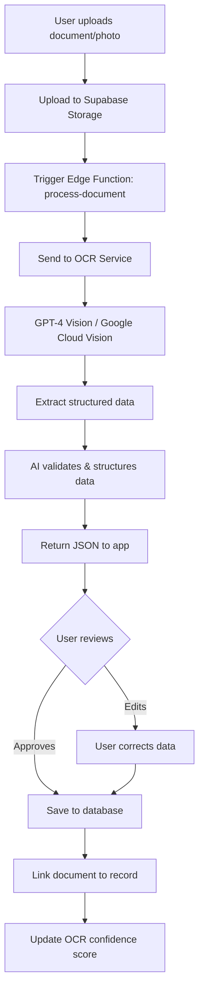

# AI OCR Document Recognition & Intelligent Data Extraction

## 🎯 Overview

Implement optical character recognition (OCR) and AI-powered data extraction to automatically read veterinary documents, vaccination certificates, lab results, and prescriptions, then intelligently populate the Pawzly database.

---

## 📋 Use Cases & User Stories

### Primary Use Cases

#### 1. Vaccination Certificate Upload
**User Story:** *"As a pet owner, I want to take a photo of my dog's rabies vaccination certificate and have all the details automatically filled in, so I don't have to manually type everything."*

**Flow:**
1. User navigates to Add Vaccination screen
2. Taps "Scan Certificate" button
3. Takes photo or selects from gallery
4. AI extracts: vaccine name, date administered, next due date, vet clinic, batch number
5. User reviews pre-filled form (with confidence indicators)
6. User corrects any errors if needed
7. Saves to database with linked document reference

#### 2. Lab Results & Medical Reports
**User Story:** *"I just received blood work results from the vet. I want to upload the PDF and have it automatically extract the key values into my pet's health records."*

**Extracted Data:**
- Test date, lab name
- All test values (CBC, chemistry panel, thyroid, etc.)
- Reference ranges
- Abnormal flags
- Veterinarian notes

#### 3. Prescription & Medication Labels
**User Story:** *"My vet prescribed medication. I'll take a photo of the label and let the app create the medication schedule automatically."*

**Extracted Data:**
- Medication name and dosage
- Frequency (e.g., "twice daily")
- Duration (e.g., "10 days")
- Start date
- Special instructions

#### 4. Vet Visit Summary Reports
**User Story:** *"After each vet visit, I get a summary sheet. I want to upload it and have the app create the visit record with all diagnoses and recommendations."*

**Extracted Data:**
- Visit date and clinic
- Chief complaint / reason for visit
- Diagnosis or assessment
- Treatment provided
- Follow-up instructions
- Next appointment date

### Secondary Use Cases

5. **Microchip registration documents** → Auto-populate microchip number
6. **Pedigree/registration papers** → Extract breed, registration ID, lineage
7. **Insurance claim forms** → Pre-fill claim details
8. **Grooming/boarding receipts** → Track service history

---

## 🏗 Technical Architecture

### High-Level Flow



### Technology Stack Options

#### Option 1: GPT-4 Vision (Recommended)
**Service:** OpenAI GPT-4 Vision API  
**Pros:**
- Best accuracy for complex documents
- Can understand context and relationships
- Handles handwritten notes
- Single API for OCR + data extraction + validation

**Cons:**
- Higher cost per image ($0.01-0.03 per image depending on resolution)
- Requires OpenAI API key

**Cost Estimate:** ~$0.02 per document

#### Option 2: Google Cloud Vision + GPT-3.5
**Service:** Google Cloud Vision OCR + GPT-3.5 Turbo for structuring  
**Pros:**
- Excellent OCR accuracy
- Lower cost ($1.50 per 1000 images for OCR)
- Fast processing

**Cons:**
- Two-step process (OCR → Structure)
- Less context awareness

**Cost Estimate:** ~$0.005 per document OCR + $0.002 GPT = $0.007 total

#### Option 3: AWS Textract + Claude
**Service:** AWS Textract + Anthropic Claude  
**Pros:**
- Excellent for forms and tables
- Preserves document layout
- HIPAA compliant options

**Cost Estimate:** ~$0.015 per document

**🎯 Recommendation: Option 1 (GPT-4 Vision)** for best user experience, with Option 2 as cost-effective alternative.

---

## 💾 Database Schema Extensions

The `documents` table **already has OCR fields** implemented! We just need to start using them:

### Existing Fields (Already Created)
```sql
-- These fields already exist in the documents table:
ocr_data JSONB                 -- Structured extracted data
ocr_confidence_score INTEGER   -- 0-100 confidence score
manual_details JSONB           -- User corrections
linked_records JSONB           -- Links to vaccination_id, treatment_id, etc.
tags JSONB                     -- Auto-generated tags
```

### New Fields to Add

```sql
-- Add to documents table
ALTER TABLE documents ADD COLUMN IF NOT EXISTS processing_status VARCHAR(20) DEFAULT 'pending';
-- Values: 'pending', 'processing', 'completed', 'failed', 'manual_review'

ALTER TABLE documents ADD COLUMN IF NOT EXISTS ai_model_used VARCHAR(50);
-- e.g., 'gpt-4-vision-preview', 'google-vision-api'

ALTER TABLE documents ADD COLUMN IF NOT EXISTS processing_error TEXT;
-- Store error message if OCR fails

ALTER TABLE documents ADD COLUMN IF NOT EXISTS extracted_entities JSONB;
-- Structured entities: {"dates": [...], "organizations": [...], "medications": [...]}

COMMENT ON COLUMN documents.processing_status IS 'OCR processing status';
COMMENT ON COLUMN documents.ai_model_used IS 'AI model used for extraction';
COMMENT ON COLUMN documents.extracted_entities IS 'Named entities extracted by AI';
```

### OCR Data Structure (JSONB Schema)

```typescript
interface OCRData {
  document_type: 'vaccination_certificate' | 'lab_results' | 'prescription' | 'vet_visit' | 'other';
  confidence: number; // Overall confidence 0-100
  
  // For vaccination certificates
  vaccination?: {
    vaccine_name: string;
    date_administered: string; // ISO date
    next_due_date?: string;
    veterinarian: string;
    clinic_name: string;
    clinic_location?: string;
    batch_number?: string;
    manufacturer?: string;
    pet_name?: string;
    pet_species?: string;
  };
  
  // For prescriptions
  prescription?: {
    medication_name: string;
    dosage: string;
    frequency: string;
    duration?: string;
    start_date?: string;
    instructions?: string;
    prescribing_vet: string;
    clinic: string;
  };
  
  // For lab results
  lab_results?: {
    test_date: string;
    lab_name: string;
    tests: Array<{
      name: string;
      value: string;
      unit?: string;
      reference_range?: string;
      abnormal?: boolean;
    }>;
  };
  
  // For vet visits
  vet_visit?: {
    visit_date: string;
    clinic_name: string;
    veterinarian: string;
    chief_complaint?: string;
    diagnosis?: string;
    treatment?: string;
    follow_up?: string;
    next_appointment?: string;
  };
  
  raw_text?: string; // Full OCR text for reference
  extraction_timestamp: string;
}
```

---

## 🔧 Implementation Approach

### Phase 1: Infrastructure Setup (Week 1)

#### 1.1 Create Supabase Edge Function

Create `/supabase/functions/process-document-ocr/index.ts`:

```typescript
import { serve } from 'https://deno.land/std@0.168.0/http/server.ts'
import { createClient } from 'https://esm.sh/@supabase/supabase-js@2'

serve(async (req) => {
  try {
    const { documentId, storageUrl } = await req.json()
    
    // 1. Download image from Supabase Storage
    const imageResponse = await fetch(storageUrl)
    const imageBuffer = await imageResponse.arrayBuffer()
    const base64Image = btoa(String.fromCharCode(...new Uint8Array(imageBuffer)))
    
    // 2. Call OpenAI GPT-4 Vision
    const openaiResponse = await fetch('https://api.openai.com/v1/chat/completions', {
      method: 'POST',
      headers: {
        'Authorization': `Bearer ${Deno.env.get('OPENAI_API_KEY')}`,
        'Content-Type': 'application/json',
      },
      body: JSON.stringify({
        model: 'gpt-4-vision-preview',
        messages: [
          {
            role: 'system',
            content: `You are an expert at extracting structured data from veterinary documents.
Extract all relevant information and return as JSON.`
          },
          {
            role: 'user',
            content: [
              {
                type: 'text',
                text: `Extract all information from this veterinary document. 
Identify if it's a vaccination certificate, prescription, lab results, or vet visit summary.
Return structured JSON with all extractable fields.`
              },
              {
                type: 'image_url',
                image_url: {
                  url: `data:image/jpeg;base64,${base64Image}`
                }
              }
            ]
          }
        ],
        max_tokens: 1000,
        temperature: 0.1 // Low temperature for factual extraction
      })
    })
    
    const aiResult = await openaiResponse.json()
    const extractedData = JSON.parse(aiResult.choices[0].message.content)
    
    // 3. Update document record with OCR data
    const supabase = createClient(
      Deno.env.get('SUPABASE_URL')!,
      Deno.env.get('SUPABASE_SERVICE_ROLE_KEY')!
    )
    
    await supabase
      .from('documents')
      .update({
        ocr_data: extractedData,
        ocr_confidence_score: extractedData.confidence || 85,
        processing_status: 'completed',
        ai_model_used: 'gpt-4-vision-preview',
        extracted_entities: extractNamedEntities(extractedData)
      })
      .eq('id', documentId)
    
    return new Response(JSON.stringify({ success: true, data: extractedData }), {
      headers: { 'Content-Type': 'application/json' },
    })
  } catch (error) {
    return new Response(JSON.stringify({ error: error.message }), {
      status: 500,
      headers: { 'Content-Type': 'application/json' },
    })
  }
})
```

#### 1.2 Deploy Edge Function

```bash
supabase functions deploy process-document-ocr --no-verify-jwt
supabase secrets set OPENAI_API_KEY=sk-your-key-here
```

### Phase 2: Frontend Integration (Week 2)

#### 2.1 Create OCR Hook

Create `/hooks/useDocumentOCR.ts`:

```typescript
import { useState } from 'react';
import { supabase } from '@/lib/supabase';

export function useDocumentOCR() {
  const [processing, setProcessing] = useState(false);
  const [error, setError] = useState<string | null>(null);
  
  const processDocument = async (documentId: string, storageUrl: string) => {
    setProcessing(true);
    setError(null);
    
    try {
      const { data, error: fnError } = await supabase.functions.invoke(
        'process-document-ocr',
        {
          body: { documentId, storageUrl }
        }
      );
      
      if (fnError) throw fnError;
      
      return data;
    } catch (err) {
      setError(err.message);
      throw err;
    } finally {
      setProcessing(false);
    }
  };
  
  return { processDocument, processing, error };
}
```

#### 2.2 Update Vaccination Form with OCR

Modify `/components/forms/VaccinationForm.tsx`:

```typescript
import { useDocumentOCR } from '@/hooks/useDocumentOCR';
import * as ImagePicker from 'expo-image-picker';

export function VaccinationForm({ petId }: { petId: string }) {
  const [formData, setFormData] = useState({});
  const { processDocument, processing } = useDocumentOCR();
  
  const handleScanCertificate = async () => {
    // 1. Pick image
    const result = await ImagePicker.launchCameraAsync({
      mediaTypes: ImagePicker.MediaTypeOptions.Images,
      quality: 0.8,
    });
    
    if (result.canceled) return;
    
    // 2. Upload to Supabase Storage
    const file = result.assets[0];
    const fileName = `vaccination_${Date.now()}.jpg`;
    const { data: uploadData, error: uploadError } = await supabase.storage
      .from('documents')
      .upload(`${petId}/${fileName}`, file.uri);
    
    if (uploadError) throw uploadError;
    
    // 3. Create document record
    const { data: doc } = await supabase
      .from('documents')
      .insert({
        pet_id: petId,
        type: 'vaccination_certificate',
        file_url: uploadData.path,
        processing_status: 'processing'
      })
      .select()
      .single();
    
    // 4. Process with OCR
    const storageUrl = supabase.storage
      .from('documents')
      .getPublicUrl(uploadData.path).data.publicUrl;
    
    const ocrResult = await processDocument(doc.id, storageUrl);
    
    // 5. Pre-fill form with extracted data
    if (ocrResult.data.vaccination) {
      setFormData({
        vaccine_name: ocrResult.data.vaccination.vaccine_name,
        date: ocrResult.data.vaccination.date_administered,
        next_due_date: ocrResult.data.vaccination.next_due_date,
        administering_vet: ocrResult.data.vaccination.veterinarian,
        // ... more fields
        certificate_document_id: doc.id
      });
    }
  };
  
  return (
    <View>
      <Button onPress={handleScanCertificate} disabled={processing}>
        {processing ? 'Scanning...' : '📸 Scan Certificate'}
      </Button>
      
      {/* Show confidence indicators */}
      {formData.vaccine_name && (
        <Badge>
          AI-filled (85% confidence)
        </Badge>
      )}
      
      {/* Form fields pre-filled with OCR data */}
      <Input value={formData.vaccine_name} onChange={...} />
      {/* ... rest of form */}
    </View>
  );
}
```

### Phase 3: Advanced Features (Week 3-4)

#### 3.1 Batch Processing
- Process multiple documents at once
- Queue system for background processing
- Progress indicators

#### 3.2 Manual Review Queue
- Flag low-confidence extractions for user review
- Side-by-side view: original document + extracted data
- Quick edit interface

#### 3.3 Learning System
- Track user corrections to improve prompts
- Store manual_details when user edits OCR results
- Generate feedback loop for model improvement

---

## 📊 Cost Analysis

### Per-Document Cost (GPT-4 Vision)
- Image processing: ~$0.02 per document
- Storage (Supabase): ~$0.001 per document
- **Total: ~$0.021 per document**

### Monthly Cost Estimates

| Users | Docs/month | Total Cost |
|-------|------------|------------|
| 100   | 500        | $10.50     |
| 1,000 | 5,000      | $105       |
| 10,000| 50,000     | $1,050     |

### Alternative: Google Vision (Cost-Optimized)
- **~$0.007 per document** (70% cost reduction)
- Suitable if budget is priority over accuracy

---

## ✅ Success Metrics

1. **Accuracy**: >90% field extraction accuracy
2. **User Satisfaction**: <10% manual correction rate
3. **Adoption**: >60% of users use OCR within first month
4. **Time Savings**: Reduce data entry time from 3 mins to 30 seconds
5. **Document Processing**: >95% success rate (no errors)

---

## 🚀 Implementation Timeline

**Week 1:** Infrastructure  
- Set up Edge Function
- Integrate OpenAI API
- Add database fields

**Week 2:** Frontend Integration  
- Vaccination form OCR
- Prescription form OCR
- Document upload flow

**Week 3:** Polish & Testing  
- Confidence indicators
- Error handling
- User review interface

**Week 4:** Additional Document Types  
- Lab results
- Vet visit reports
- Testing & optimization

**Total:** 4 weeks for full implementation

---

## 🔐 Security & Privacy

- All documents stored in Supabase Storage with RLS policies
- OCR processing via secure Edge Functions
- No third-party data retention (can use OpenAI with data retention disabled)
- User data never used for model training
- Compliance: Can be HIPAA-compliant with AWS Textract option

---

## 📚 API Integration Examples

### GPT-4 Vision Prompt Engineering

```typescript
const EXTRACTION_PROMPT = `
You are a veterinary document data extraction expert.

TASK: Extract structured data from this veterinary document image.

INSTRUCTIONS:
1. Identify the document type (vaccination certificate, prescription, lab results, vet visit)
2. Extract ALL visible information accurately
3. For dates, use ISO format (YYYY-MM-DD)
4. Return ONLY valid JSON, no additional text
5. Include a confidence score (0-100) for overall extraction
6. Mark individual fields with low confidence (<70%)

REQUIRED OUTPUT SCHEMA:
{
  "document_type": "vaccination_certificate" | "prescription" | "lab_results" | "vet_visit",
  "confidence": 85,
  "vaccination": {
    "vaccine_name": "Rabies",
    "date_administered": "2024-01-15",
    "next_due_date": "2027-01-15",
    "veterinarian": "Dr. Jane Smith",
    "clinic_name": "Happy Paws Veterinary",
    "batch_number": "AB12345",
    "pet_name": "Max",
    "field_confidence": {
      "vaccine_name": 95,
      "date_administered": 90
    }
  }
}

If you cannot extract a field with confidence, omit it or set to null.
`;
```

---

This OCR implementation will dramatically improve the user experience by eliminating tedious manual data entry and ensuring accurate record-keeping.
