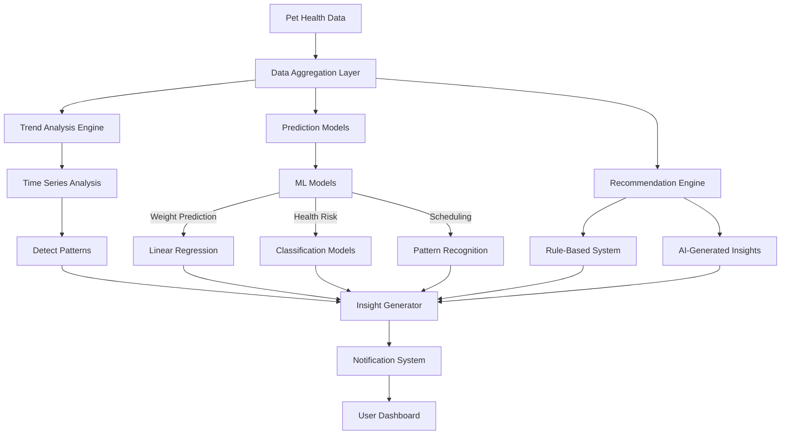

# Predictive Health Insights & Smart Recommendations

## 🎯 Overview

Use AI and machine learning to analyze pet health data over time, predict potential health issues, provide personalized recommendations, and proactively suggest actions to keep pets healthy.

---

## 📋 Use Cases & User Stories

### Primary Use Cases

#### 1. Vaccination Overdue Predictions
**AI Insight:** "Based on Max's vaccination history and typical vet schedules, his Bordetella vaccine will be due in 2 weeks. I've noticed you usually book appointments 3-4 weeks in advance. Would you like to schedule now?"

**How it works:**
- Analyzes past vaccination patterns
- Learns user scheduling behavior
- Predicts optimal booking time
- Proactively reminds before it's overdue

#### 2. Weight Trend Analysis
**AI Insight:** "⚠️ Bella has gained 3.2 lbs over the past 2 months (8% increase). This is above the healthy range for her breed and age. Consider:
- Reducing daily food by 10%
- Increasing walk time by 15 minutes
- Schedule a vet checkup to rule out thyroid issues"

**Data Used:**
- Historical weight entries
- Breed-specific healthy weight ranges
- Age and activity level
- Recent diet changes

#### 3. Medication Refill Predictions
**AI Insight:** "Max takes Apoquel twice daily. Based on your refill history and current supply, you'll run out in approximately 5 days. Your vet clinic (Happy Paws) is open tomorrow 9am-5pm. Would you like me to remind you to call for a refill?"

**How it works:**
- Tracks medication usage rate
- Predicts depletion date
- Checks clinic hours
- Suggests optimal time to reorder

#### 4. Seasonal Health Alerts
**AI Insight:** "Spring allergy season is starting in your area (San Francisco). Last year, Max showed allergy symptoms in late March. Consider starting his allergy medication now to prevent flare-ups."

**Data Sources:**
- Historical health observations by season
- Location-based weather data
- Past treatment effectiveness

#### 5. Breed-Specific Health Monitoring
**AI Insight:** "German Shepherds like Max are prone to hip dysplasia, especially after age 7. Max turns 7 next month. Recommend scheduling a hip X-ray screening during his annual checkup."

**Knowledge Base:**
- Breed-specific health risks
- Age-related conditions
- Preventive care recommendations
- Vet consensus best practices

### Secondary Use Cases

6. **Vet Visit Frequency Analysis**: "It's been 14 months since Max's last checkup (recommended: annually)"
7. **Service Recommendations**: "Based on Max's thick coat, professional grooming every 6-8 weeks is recommended"
8. **Cost Predictions**: "Your estimated annual vet costs: $850 based on Max's current health"
9. **Insurance Optimization**: "Max's recent treatments would be covered by PetPlan (estimated savings: $420/year)"
10. **Activity Tracking**: "Max's activity level has decreased 20% over 3 months - consider wellness check"

---

## 🏗 Technical Architecture

### System Components



### Technology Stack

#### Option 1: Hybrid Rule-Based + AI
**Components:**
- PostgreSQL for time-series queries
- Simple statistical models (moving averages, linear regression)
- GPT-4 for insight generation and natural language explanations
- Scheduled daily analysis jobs

**Pros:**
- Reliable and explainable
- Lower infrastructure cost
- Easier to debug

#### Option 2: Full ML Pipeline
**Components:**
- Python ML models (scikit-learn, TensorFlow)
- Supabase Edge Functions for inference
- Training pipeline with historical data
- A/B testing framework

**Pros:**
- More sophisticated predictions
- Continuously improving
- Personalized to individual pets

#### Option 3: Cloud ML Services
**Services:**
- Google Cloud AutoML or AWS SageMaker
- Pre-trained health prediction models
- Managed infrastructure

**Pros:**
- Production-ready ML
- Scalable
- Less maintenance

**🎯 Recommendation: Option 1 (Hybrid)** for MVP, then evolve to Option 2 as data grows.

---

## 💾 Database Schema

### New Tables

```sql
-- AI-Generated Insights
CREATE TABLE health_insights (
  id UUID PRIMARY KEY DEFAULT uuid_generate_v4(),
  pet_id UUID REFERENCES pets(id) ON DELETE CASCADE NOT NULL,
  insight_type VARCHAR(50) NOT NULL, 
  -- Types: 'weight_trend', 'vaccination_reminder', 'health_risk', 'recommendation'
  
  severity VARCHAR(20) NOT NULL, 
  -- 'info', 'low', 'medium', 'high', 'urgent'
  
  title TEXT NOT NULL,
  description TEXT NOT NULL,
  
  data_sources JSONB, 
  -- Which data was used: {"weight_entries": [...], "vaccinations": [...]}
  
  confidence_score DECIMAL(5,2),
  
  recommendations JSONB,
  -- Suggested actions: [{"action": "schedule_vet", "priority": "high"}]
  
  dismissed BOOLEAN DEFAULT FALSE,
  dismissed_at TIMESTAMP WITH TIME ZONE,
  
  expires_at TIMESTAMP WITH TIME ZONE,
  -- Some insights become irrelevant over time
  
  created_at TIMESTAMP WITH TIME ZONE DEFAULT NOW()
);

-- Predictions (for ML models)
CREATE TABLE health_predictions (
  id UUID PRIMARY KEY DEFAULT uuid_generate_v4(),
  pet_id UUID REFERENCES pets(id) NOT NULL,
  prediction_type VARCHAR(50) NOT NULL,
  -- 'next_vet_visit', 'medication_refill', 'weight_at_date'
  
  predicted_date DATE,
  predicted_value DECIMAL(10,2), -- For numeric predictions
  
  confidence DECIMAL(5,2),
  model_version VARCHAR(20),
  
  features_used JSONB, -- Model inputs
  
  actual_value DECIMAL(10,2), -- For later validation
  actual_date DATE,
  prediction_accuracy DECIMAL(5,2), -- Calculated post-fact
  
  created_at TIMESTAMP WITH TIME ZONE DEFAULT NOW()
);

-- User Insight Interactions
CREATE TABLE insight_interactions (
  id UUID PRIMARY KEY DEFAULT uuid_generate_v4(),
  insight_id UUID REFERENCES health_insights(id) NOT NULL,
  user_id UUID REFERENCES auth.users(id) NOT NULL,
  action VARCHAR(50) NOT NULL, 
  -- 'viewed', 'dismissed', 'acted_on', 'scheduled_appointment'
  
  feedback_rating INTEGER CHECK (feedback_rating BETWEEN 1 AND 5),
  feedback_text TEXT,
  
  created_at TIMESTAMP WITH TIME ZONE DEFAULT NOW()
);

-- Indexes
CREATE INDEX idx_health_insights_pet ON health_insights(pet_id, created_at DESC);
CREATE INDEX idx_health_insights_active ON health_insights(pet_id) 
  WHERE dismissed = FALSE AND (expires_at IS NULL OR expires_at > NOW());
CREATE INDEX idx_predictions_pet ON health_predictions(pet_id, prediction_type);
```

---

## 🔧 Implementation Approach

### Phase 1: Basic Analytics & Rules Engine (Week 1-2)

#### 1.1 Create Daily Insight Generator

`/supabase/functions/generate-insights/index.ts`:

```typescript
import { serve } from 'https://deno.land/std@0.168.0/http/server.ts'
import { createClient } from 'https://esm.sh/@supabase/supabase-js@2'

serve(async (req) => {
  const supabase = createClient(
    Deno.env.get('SUPABASE_URL')!,
    Deno.env.get('SUPABASE_SERVICE_ROLE_KEY')!
  )
  
  // Get all active pets
  const { data: pets } = await supabase
    .from('pets')
    .select('*, vaccinations(*), weight_entries(*), treatments(*)')
  
  for (const pet of pets) {
    const insights = [];
    
    // Check 1: Overdue Vaccinations
    const overdueVaccines = pet.vaccinations.filter(v => 
      v.next_due_date && new Date(v.next_due_date) < new Date()
    );
    
    if (overdueVaccines.length > 0) {
      insights.push({
        pet_id: pet.id,
        insight_type: 'vaccination_overdue',
        severity: 'high',
        title: `${overdueVaccines.length} vaccination(s) overdue`,
        description: `${pet.name}'s ${overdueVaccines.map(v => v.vaccine_name).join(', ')} ${overdueVaccines.length > 1 ? 'are' : 'is'} overdue. Schedule an appointment soon.`,
        recommendations: [{
          action: 'schedule_vet_appointment',
          priority: 'high'
        }]
      });
    }
    
    // Check 2: Weight Trend
    if (pet.weight_entries.length >= 3) {
      const recentWeights = pet.weight_entries
        .sort((a, b) => new Date(b.date) - new Date(a.date))
        .slice(0, 5);
      
      const weightChange = calculateWeightTrend(recentWeights);
      
      if (Math.abs(weightChange.percentChange) > 5) {
        insights.push({
          pet_id: pet.id,
          insight_type: 'weight_trend',
          severity: weightChange.percentChange > 10 ? 'medium' : 'low',
          title: `Weight ${weightChange.direction} detected`,
          description: `${pet.name} has ${weightChange.direction === 'increase' ? 'gained' : 'lost'} ${Math.abs(weightChange.amount)} lbs (${Math.abs(weightChange.percentChange)}%) over the past ${weightChange.period} months.`,
          data_sources: { weight_entries: recentWeights.map(w => w.id) },
          recommendations: generateWeightRecommendations(weightChange)
        });
      }
    }
    
    // Check 3: Medication Refill Predictions
    const activeMeds = pet.treatments.filter(t => t.is_active);
    for (const med of activeMeds) {
      const daysRemaining = calculateMedicationDaysRemaining(med);
      
      if (daysRemaining <= 7 && daysRemaining > 0) {
        insights.push({
          pet_id: pet.id,
          insight_type: 'medication_refill',
          severity: daysRemaining <= 3 ? 'medium' : 'low',
          title: `${med.treatment_name} running low`,
          description: `${pet.name}'s ${med.treatment_name} will run out in approximately ${daysRemaining} days. Consider ordering a refill.`,
          recommendations: [{
            action: 'order_medication_refill',
            priority: daysRemaining <= 3 ? 'high' : 'medium'
          }]
        });
      }
    }
    
    // Insert all insights
    if (insights.length > 0) {
      await supabase.from('health_insights').insert(insights);
    }
  }
  
  return new Response(JSON.stringify({ processed: pets.length }), {
    headers: { 'Content-Type': 'application/json' }
  });
});

function calculateWeightTrend(weights) {
  const latest = weights[0].weight;
  const oldest = weights[weights.length - 1].weight;
  const amount = latest - oldest;
  const percentChange = (amount / oldest) * 100;
  
  const monthsDiff = (new Date(weights[0].date) - new Date(weights[weights.length - 1].date)) 
    / (1000 * 60 * 60 * 24 * 30);
  
  return {
    amount: parseFloat(amount.toFixed(1)),
    percentChange: parseFloat(percentChange.toFixed(1)),
    direction: amount > 0 ? 'increase' : 'decrease',
    period: Math.round(monthsDiff)
  };
}
```

#### 1.2 Schedule Daily Job

Using Supabase pg_cron:

```sql
SELECT cron.schedule(
  'generate-daily-insights',
  '0 8 * * *', -- Run at 8am daily
  $$
  SELECT net.http_post(
    url := 'https://[your-project].supabase.co/functions/v1/generate-insights',
    headers := '{"Content-Type": "application/json", "Authorization": "Bearer [anon-key]"}'::jsonb
  ) AS request_id;
  $$
);
```

### Phase 2: AI-Enhanced Recommendations (Week 3)

Use GPT-4 to generate personalized, context-aware recommendations:

```typescript
// In generate-insights function
const aiRecommendation = await openai.chat.completions.create({
  model: 'gpt-4-turbo-preview',
  messages: [
    {
      role: 'system',
      content: `You are a veterinary health advisor. Generate personalized recommendations based on pet health data.`
    },
    {
      role: 'user',
      content: `Pet: ${pet.name} (${pet.species}, ${pet.breed}, ${calculateAge(pet.date_of_birth)} years old)

Weight trend: Gained 3 lbs (8%) over 2 months
Current weight: 45 lbs
Breed typical weight: 38-42 lbs
Activity level: Moderate
Current food: Blue Buffalo Chicken

Provide 3 specific, actionable recommendations.`
    }
  ],
  temperature: 0.7,
  max_tokens: 300
});
```

### Phase 3: ML Predictions (Week 4-6)

Implement simple ML models for:
- Next vet visit date prediction
- Weight trend forecasting
- Health risk scoring

---

## 📊 Cost Analysis

### Computation Costs
- Daily batch processing: Minimal (runs in Supabase Edge Function)
- AI-enhanced insights (GPT-4): ~$0.02 per pet per day
- ML model inference: Negligible (if using simple models)

### Monthly Cost Estimates

| Active Pets | Daily AI Insights | Monthly Cost |
|-------------|-------------------|--------------|
| 100         | 100 × $0.02      | $60          |
| 1,000       | 1,000 × $0.02    | $600         |
| 10,000      | 10,000 × $0.02   | $6,000       |

### Cost Optimization
- Generate AI insights only for critical findings
- Use rule-based for simple insights (free)
- Batch process during off-peak hours

---

## ✅ Success Metrics

1. **Engagement**: >70% of users view insights within 24 hours
2. **Usefulness**: >4.0/5 average rating on insights
3. **Action Rate**: >40% of high-priority insights lead to action
4. **Prediction Accuracy**: >80% for medication refills, >70% for vet visits
5. **Health Outcomes**: Reduce overdue vaccinations by 50%

---

## 🚀 Implementation Timeline

**Week 1-2:** Rules Engine
- Basic analytics (overdue, trends)
- Database schema
- Scheduled jobs

**Week 3:** AI Enhancement
- GPT-4 recommendations
- Natural language insights
- Context-aware suggestions

**Week 4-5:** ML Models
- Weight prediction
- Risk scoring
- Schedule prediction

**Week 6:** Dashboard & UI
- Insights feed
- Actionable notifications
- Trend visualizations

**Total:** 6 weeks for full implementation

---

## 🎯 Future Advanced Features

1. **Predictive Health Risks**: ML model to predict conditions based on historical data
2. **Comparative Analytics**: "Max's weight is in the 75th percentile for his breed"
3. **Community Insights**: "Dogs in your area are experiencing seasonal allergies"
4. **Genetic Predictions**: Integration with DNA testing results
5. **Lifespan Estimates**: Actuarial predictions based on health history

---

This predictive system will transform Waggli from a passive record-keeper into an intelligent health partner that actively helps pet owners make better decisions.
