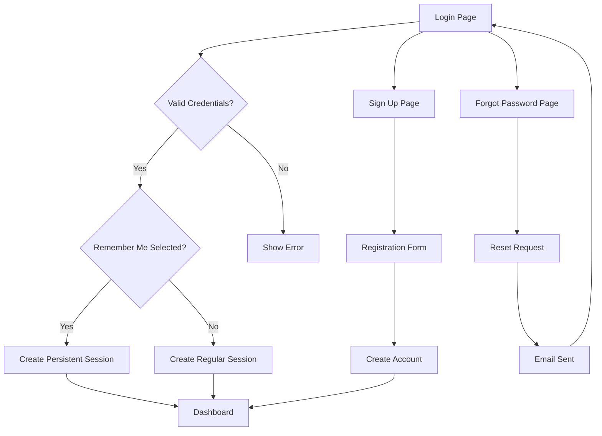

## 1. Product Overview
Redesign authentication pages (login, sign-up, forgot-password) with pixel-perfect implementation based on provided designs. Add persistent "Remember Me" functionality that maintains user sessions without requiring re-authentication. Incorporate the Waggli logo from `/public/logo.png` across all auth pages.

## 2. Core Features

### 2.1 User Roles
| Role | Registration Method | Core Permissions |
|------|---------------------|------------------|
| Normal User | Email registration | Can browse and use basic functions |
| Premium User | Email registration + subscription | Full access to premium features |

### 2.2 Feature Module
Authentication system consists of the following main pages:
1. **Login page**: User authentication with email/password, social login options, remember me functionality
2. **Sign-up page**: Account creation with email/password confirmation, social sign-up options
3. **Forgot password page**: Password reset via email link

### 2.3 Page Details
| Page Name | Module Name | Feature description |
|-----------|-------------|---------------------|
| Login page | Logo header | Display Waggli logo from `/public/logo.png` in top-left corner with brand name |
| Login page | Hero section | Split-screen layout with pet imagery on right side, gradient overlay |
| Login page | Email input | Email field with icon prefix, validation, placeholder text |
| Login page | Password input | Password field with show/hide toggle, lock icon prefix |
| Login page | Remember me | Checkbox to persist user session across browser sessions |
| Login page | Login button | Primary CTA with hover states, loading states |
| Login page | Social login | Apple and Google OAuth buttons with brand icons |
| Login page | Forgot password | Link to password reset flow |
| Login page | Sign-up link | Navigation to registration page |
| Sign-up page | Logo header | Waggli logo positioning consistent with login |
| Sign-up page | Hero section | Pet imagery background with gradient overlay |
| Sign-up page | Email input | Email validation with real-time feedback |
| Sign-up page | Password input | Password creation with strength indicator |
| Sign-up page | Confirm password | Password confirmation field with match validation |
| Sign-up page | Sign-up button | Primary CTA with form validation |
| Sign-up page | Social sign-up | Apple and Google registration options |
| Sign-up page | Login link | Navigation back to login page |
| Forgot password | Logo header | Consistent Waggli branding |
| Forgot password | Hero section | Pet imagery with gradient overlay |
| Forgot password | Email input | Email field for password reset request |
| Forgot password | Reset button | Submit button for password reset email |
| Forgot password | Login link | Return to login page |

## 3. Core Process
### User Authentication Flow
1. User lands on login page with Waggli branding and pet imagery
2. User enters email/password credentials
3. Optional: User selects "Remember Me" for persistent session
4. User clicks login button with loading state feedback
5. System validates credentials and creates session
6. If "Remember Me" selected, session persists across browser restarts
7. User is redirected to dashboard upon successful authentication

### User Registration Flow
1. User clicks "Sign Up" from login page
2. User fills email, password, and password confirmation
3. System validates email format and password requirements
4. User clicks sign-up button with loading state
5. Account is created and user is logged in automatically
6. User is redirected to onboarding or dashboard

### Password Reset Flow
1. User clicks "Forgot Password" from login page
2. User enters email address for password reset
3. System sends reset link to email address
4. User receives email with secure reset link
5. User clicks link and sets new password
6. User is redirected to login page with success message

## 4. User Interface Design

### 4.1 Design Style
- **Primary colors**: Blue (#3B82F6) for primary actions and branding
- **Secondary colors**: Dark gray (#1F2328-#2A2E33) for text, Light gray (#F3F4F6) for backgrounds
- **Button style**: Rounded corners (12px default), shadow effects, hover states
- **Typography**: Plus Jakarta Sans/Inter font family, clean sans-serif
- **Layout**: Split-screen design with pet imagery on right side
- **Icons**: Material Icons for consistency, paw print icon for logo
- **Logo**: Waggli logo from `/public/logo.png` with circular emblem and stylized dog silhouette

### 4.2 Page Design Overview
| Page Name | Module Name | UI Elements |
|-----------|-------------|-------------|
| Login page | Logo header | 32px circular icon with paw print, "waggli" text in bold geometric sans-serif, positioned top-left |
| Login page | Form container | White/dark card with rounded corners (24px), shadow effects, max-width 400px |
| Login page | Input fields | Rounded inputs (12px), icon prefixes, focus ring in primary blue, placeholder text |
| Login page | Remember me | Checkbox with label, positioned below password field |
| Login page | CTAs | Full-width buttons with hover animations, loading states, arrow icons |
| Sign-up page | Form layout | Consistent with login but includes password confirmation field |
| Sign-up page | Password strength | Visual indicator for password requirements |
| Forgot password | Minimal form | Single email input with reset button, return to login link |

### 4.3 Responsiveness
- **Desktop-first**: Optimized for desktop screens (1920x1080)
- **Mobile adaptive**: Responsive grid system for tablets and phones
- **Touch optimization**: Large touch targets (minimum 44px) for mobile devices
- **Breakpoint strategy**: Desktop (1200px+), Tablet (768px-1199px), Mobile (<768px)

### 4.4 Remember Me Functionality
- **Session persistence**: Stores authentication token in secure HTTP-only cookies
- **Expiration**: 30-day default expiration for remembered sessions
- **Security**: Token rotation on sensitive actions, device fingerprinting
- **Cross-browser**: Consistent behavior across Chrome, Firefox, Safari, Edge
- **Logout**: Clear persistent session when user explicitly logs out