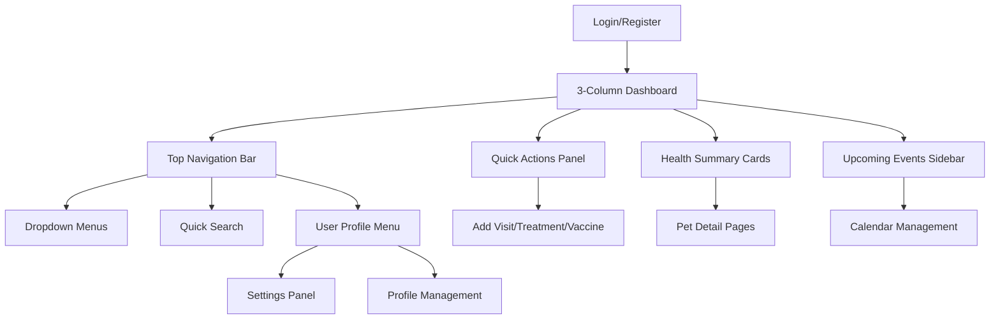

## 1. Product Overview
Complete desktop-first redesign of the Waggli pet management web application to optimize user experience for desktop environments (1920x1080 and above). The redesign transforms the mobile-first navigation into a professional desktop interface with horizontal top navigation, 3-column dashboard layout, and split-screen authentication pages while maintaining all existing pet management functionality and user data compatibility.

Target users are desktop power users who require efficient mouse-based interactions, keyboard shortcuts, and multi-panel window management for improved productivity in managing their pets' health and activities.

## 2. Core Features

### 2.1 User Roles
| Role | Registration Method | Core Permissions |
|------|---------------------|------------------|
| Standard User | Email registration | Access to main dashboard, pet management, calendar, profile management |
| Premium User | Upgrade from standard | Advanced features, priority support, enhanced customization options |
| Admin User | Admin panel assignment | Full system access, user management, configuration settings |

### 2.2 Feature Module
The desktop-first web application consists of the following essential pages:

1. **Authentication Pages**: Split-screen layout (image left, form right) with desktop-optimized forms for login, registration, password recovery, and onboarding
2. **Main Dashboard**: 3-column CSS Grid/Flex layout with enhanced desktop spacing, quick actions panel, health summary cards, and upcoming events
3. **Top Navigation Bar**: Horizontal header navigation replacing FloatingTabBar.web.tsx with dropdown menus, persistent visibility, and keyboard shortcuts
4. **Pet Management**: Enhanced pet profiles with desktop-optimized forms, health passport, and multi-panel editing interfaces
5. **Calendar System**: Multi-pet calendar view with desktop-optimized event management and scheduling
6. **Settings Panel**: Comprehensive settings interface with tabbed navigation and advanced configuration options

### 2.3 Page Details
| Page Name | Module Name | Feature description |
|-----------|-------------|---------------------|
| Login Page | Split-Screen Layout | Left side displays branded pet imagery, right side contains authentication form with 480px width card layout, gradient background, and smooth animations |
| Login Page | Desktop Form | Large input fields (48px height), prominent submit button with hover states, password visibility toggle, remember me checkbox, social login integration |
| Registration Page | Multi-Step Wizard | Split-screen layout with progressive form steps, inline validation, password strength indicator, email verification flow |
| Main Dashboard | Top Navigation Bar | Fixed horizontal header (64px height) with logo, navigation menus, user avatar dropdown, notification badges, and search functionality |
| Main Dashboard | 3-Column Layout | CSS Grid/Flex implementation with: Column 1 - Pet selector and quick stats, Column 2 - Health summary cards and activity feed, Column 3 - Upcoming events and reminders |
| Main Dashboard | Quick Actions Panel | Horizontal arrangement of action buttons (Add Visit, Treatment, Vaccine, Weight, Event) with 60px icon cards and desktop-optimized spacing |
| Main Dashboard | Health Summary Cards | Grid-based card layout displaying pet health metrics, vaccination status, weight trends, and medical visit history with hover effects |
| Pet Profile | Enhanced Layout | Two-column desktop form with large avatar display (120px), organized form sections, inline editing, and comprehensive health passport |
| Calendar | Desktop View | Full-width calendar with sidebar event list, multi-pet color coding, drag-and-drop event scheduling, and desktop-optimized date picker |

## 3. Core Process

### Standard User Flow
1. User accesses split-screen authentication page with branded imagery
2. Successful login redirects to 3-column dashboard with top navigation
3. User navigates through horizontal menu with dropdown sub-navigation
4. Quick actions toolbar provides one-click access to common pet management tasks
5. Multi-panel workspace allows simultaneous viewing of pet health data and calendar
6. Keyboard shortcuts enable power user efficiency across all desktop interactions

### Desktop Navigation Flow

## 4. User Interface Design

### 4.1 Design Style
- **Primary Colors**: Professional blue (#0A84FF) for primary actions, white (#FFFFFF) backgrounds, gray (#6B7280) for secondary elements
- **Secondary Colors**: Success green (#10B981), warning orange (#FF9500), error red (#EF4444), info blue (#0A84FF)
- **Button Style**: Rounded corners (12px radius), consistent 48px height for mouse precision, hover state animations with smooth transitions
- **Typography**: SpaceMono font family, extended with desktop-specific sizes: Title (34px), Subtitle (22px), Body (17px), Caption (15px), plus desktop additions: Header (28px), Card Title (20px), Small Text (13px)
- **Layout Style**: CSS Grid-based 3-column system, Flexbox for component alignment, 24px base grid spacing with desktop-specific increments
- **Icon Style**: MaterialCommunityIcons library, 24px default size for desktop, consistent stroke width, hover state color transitions

### 4.2 Page Design Overview
| Page Name | Module Name | UI Elements |
|-----------|-------------|-------------|
| Authentication | Split-Screen Layout | 50/50 width split, left side full-height pet imagery with overlay, right side centered form card (480px max-width), smooth transition animations |
| Dashboard | Top Navigation | Fixed header with logo (180px width), horizontal menu items (80px min-width), user avatar dropdown, notification bell with badge counter, search bar (200px width) |
| Dashboard | 3-Column Grid | Column widths: 300px / 1fr / 320px, 24px gutters, responsive breakpoints at 1440px and 1024px, vertical spacing 32px |
| Dashboard | Quick Actions | Horizontal button array with 60px icon cards, 12px spacing between items, hover effects with scale(1.05) transform, keyboard shortcut indicators |
| Dashboard | Health Cards | Grid layout (2-3 columns based on screen size), card height 180px, hover elevation increase, progress bars with smooth animations |
| Pet Profile | Form Layout | Two-column form with 70/30 split for main content/sidebar, large avatar circle (120px diameter), organized section cards with 16px internal padding |

### 4.3 Desktop-Specific Theme Extensions
Extended theme constants in `/constants/theme.ts` with desktop-specific values:
- **Desktop Spacing**: Base unit 24px, with increments: xs(8px), s(12px), m(20px), l(32px), xl(48px), xxl(64px)
- **Desktop Typography**: Additional sizes for desktop optimization: header(28px), cardTitle(20px), smallText(13px), miniText(11px)
- **Desktop Layout**: Grid breakpoints, panel minimum widths, sidebar fixed dimensions, content max-widths for optimal readability

### 4.4 Responsiveness
- **Desktop-First Approach**: Primary design target 1920x1080 resolution with support for larger screens up to 2560x1440
- **Multi-Monitor Support**: Optimized for dual-monitor setups with proper window management and panel persistence
- **Mouse Interaction**: All interactive elements designed for precise mouse targeting (minimum 48px touch targets), hover states on all buttons and links
- **Keyboard Navigation**: Full keyboard accessibility with visible focus indicators, Tab key navigation order, and comprehensive shortcut system
- **Window Resizing**: Graceful adaptation from 1024px minimum width to 4K displays with proper content reflow and panel rearrangement

### 4.5 Component Architecture Changes
- **Navigation**: Replace `FloatingTabBar.web.tsx` with new `TopNavigationBar` component featuring horizontal menu structure
- **Layout**: Introduce `WebDesktopLayout` wrapper component in `app/_layout.web.tsx` to provide consistent desktop container
- **Dashboard**: Refactor `components/dashboard` to use CSS Grid/Flex for 3-column desktop layout with responsive behavior
- **Authentication**: Update `app/(auth)` pages to implement split-screen layout with image left, form right arrangement
- **Theme System**: Extend `constants/theme.ts` with desktop-specific spacing, typography, and layout constants

### 4.6 Performance Optimization
- **Lazy Loading**: Implement route-based code splitting for faster initial page loads
- **Virtual Scrolling**: Use virtual scrolling for long lists of pets, events, and health records
- **Image Optimization**: Serve appropriately sized images for desktop displays with WebP format support
- **CSS Optimization**: Minimize CSS-in-JS runtime overhead with static style extraction for production builds