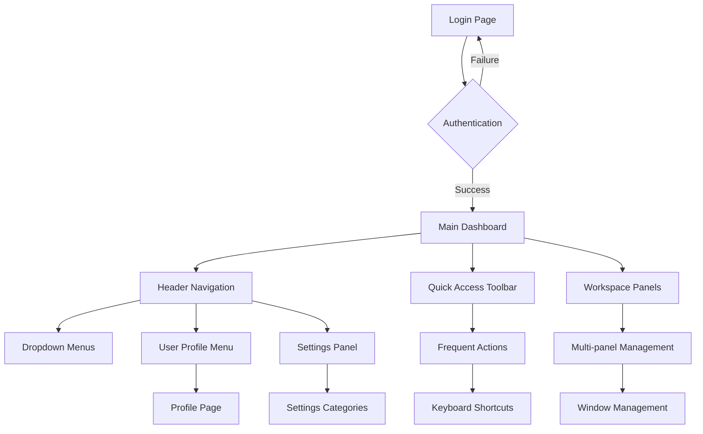

## 1. Product Overview
Complete desktop-first redesign of the web application to optimize user experience for desktop environments (1920x1080 and above). The redesign focuses on professional desktop interactions, enhanced navigation systems, and unified design consistency while maintaining all existing functionality and user data compatibility.

Target users are desktop power users who require efficient mouse-based interactions, keyboard shortcuts, and multi-panel window management for improved productivity.

## 2. Core Features

### 2.1 User Roles
| Role | Registration Method | Core Permissions |
|------|---------------------|------------------|
| Standard User | Email registration | Access to main dashboard, basic navigation, profile management |
| Premium User | Upgrade from standard | Advanced features, priority support, enhanced customization options |
| Admin User | Admin panel assignment | Full system access, user management, configuration settings |

### 2.2 Feature Module
The desktop-first web application consists of the following essential pages:

1. **Authentication Pages**: Login page, registration page, password recovery page with unified desktop-optimized design
2. **Main Dashboard**: Primary workspace with enhanced desktop layout, multi-panel support, and quick access toolbar
3. **Navigation System**: Horizontal header navigation with dropdown menus, persistent visibility, and keyboard shortcuts
4. **User Profile**: Enhanced profile management with desktop-optimized forms and settings panels
5. **Settings Panel**: Comprehensive settings interface with tabbed navigation and advanced configuration options

### 2.3 Page Details
| Page Name | Module Name | Feature description |
|-----------|-------------|---------------------|
| Login Page | Authentication Form | Clean form layout with email/password fields, remember me checkbox, social login options, and responsive design for desktop screens |
| Login Page | Visual Elements | Professional branding area, clear call-to-action buttons, error messaging system, and password visibility toggle |
| Registration Page | Registration Form | Multi-step form with validation, email verification flow, password strength indicator, and terms acceptance |
| Registration Page | User Onboarding | Guided setup process, profile completion steps, and tutorial introduction for new users |
| Password Recovery | Recovery Flow | Email input field, security questions, password reset link generation, and confirmation messaging |
| Main Dashboard | Header Navigation | Horizontal navigation bar with dropdown menus, user avatar menu, notifications panel, and quick search |
| Main Dashboard | Workspace Area | Multi-panel layout system, resizable panels, drag-and-drop functionality, and window management |
| Main Dashboard | Quick Access Toolbar | Customizable toolbar with frequently used functions, keyboard shortcut display, and one-click actions |
| Main Dashboard | Content Panels | Primary content areas with optimized spacing, hover states, right-click context menus, and keyboard navigation |
| User Profile | Profile Information | Avatar upload, personal information editing, account settings, and activity history |
| User Profile | Preferences | Theme customization, notification settings, privacy controls, and data export options |
| Settings Panel | General Settings | Application preferences, display options, language selection, and regional settings |
| Settings Panel | Advanced Settings | Performance optimization, keyboard shortcuts configuration, integration settings, and system information |

## 3. Core Process

### Standard User Flow
1. User accesses login page with desktop-optimized authentication form
2. Successful login redirects to main dashboard with horizontal navigation
3. User navigates through dropdown menus and quick access toolbar
4. Multi-panel workspace allows simultaneous task management
5. Keyboard shortcuts enable power user efficiency
6. Profile and settings accessible through persistent navigation elements

### Premium User Flow
1. Enhanced registration with guided onboarding process
2. Access to advanced dashboard features and customization options
3. Priority access to new features and enhanced support
4. Advanced settings panel with additional configuration options

### Admin User Flow
1. Administrative login with enhanced security measures
2. Access to user management and system configuration
3. Full navigation access with additional admin-specific menu items
4. System-wide settings and monitoring capabilities

## 4. User Interface Design

### 4.1 Design Style
- **Primary Colors**: Professional blue (#2563EB) for primary actions, gray (#6B7280) for secondary elements
- **Secondary Colors**: Success green (#10B981), warning amber (#F59E0B), error red (#EF4444)
- **Button Style**: Rounded corners (8px radius), consistent 44px height for mouse precision, hover state animations
- **Typography**: Inter font family, 16px base size for desktop viewing, proper line height (1.5) for readability
- **Layout Style**: Card-based design system, consistent 24px grid spacing, responsive breakpoints for desktop resolutions
- **Icon Style**: Feather Icons library, 20px default size, consistent stroke width (2px), hover state color transitions

### 4.2 Page Design Overview
| Page Name | Module Name | UI Elements |
|-----------|-------------|-------------|
| Login Page | Authentication Form | Centered card layout (480px width), subtle shadow effects, gradient background, large input fields (48px height), prominent submit button with hover animation |
| Main Dashboard | Header Navigation | Fixed position horizontal bar (64px height), dropdown menus with smooth transitions, notification badges, search bar with autocomplete, user avatar with status indicator |
| Main Dashboard | Workspace Panels | Resizable panel dividers, drag handles with visual feedback, tabbed interface for multiple views, scrollable content areas with custom scrollbars |
| Main Dashboard | Quick Access Toolbar | Floating toolbar (48px height), customizable button arrangement, keyboard shortcut hints on hover, collapsible sections for organization |
| User Profile | Profile Card | Two-column layout (70/30 split), large avatar display (120px), form fields with inline validation, action buttons grouped logically |
| Settings Panel | Settings Categories | Vertical tab navigation (200px width), grouped settings cards, toggle switches with smooth animations, save/cancel button placement at bottom right |

### 4.3 Responsiveness
- **Desktop-First Approach**: Primary design target is 1920x1080 resolution with support for larger screens up to 2560x1440
- **Multi-Monitor Support**: Optimized for dual-monitor setups with proper window management
- **Mouse Interaction**: All interactive elements designed for precise mouse targeting (minimum 44px touch targets)
- **Keyboard Navigation**: Full keyboard accessibility with visible focus indicators and shortcut documentation
- **Window Resizing**: Graceful adaptation from 1024px minimum width to 4K displays with proper content reflow

### 4.4 Desktop Optimization Features
- **Hover States**: Enhanced visual feedback for all interactive elements with smooth transitions
- **Right-Click Menus**: Context-sensitive menus for quick actions and advanced options
- **Keyboard Shortcuts**: Comprehensive shortcut system with customizable key bindings
- **Multi-Window Support**: Ability to open multiple panels in separate browser windows
- **Performance Optimization**: Lazy loading for large datasets, virtual scrolling for long lists
- **Drag and Drop**: Intuitive drag-and-drop functionality for file uploads and content organization