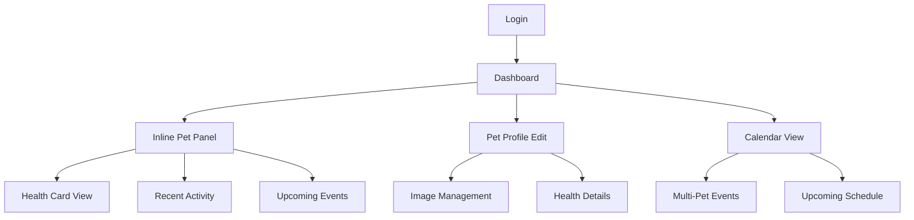

## 1. Product Overview
Enhanced pet management system allowing comprehensive pet profile management with detailed health information, calendar-based vaccination/treatment tracking, and an improved dashboard with inline pet details display. Pet owners can now manage all aspects of their pets' health and activities in one centralized platform.

The system solves the problem of scattered pet information by providing a unified platform for tracking pet health, scheduling care activities, and monitoring recent updates across multiple pets.

## 2. Core Features

### 2.1 User Roles
| Role | Registration Method | Core Permissions |
|------|---------------------|------------------|
| Pet Owner | Email registration | Full pet profile management, calendar events, dashboard customization |
| Premium User | Subscription upgrade | Advanced analytics, unlimited pets, priority notifications |

### 2.2 Feature Module
The enhanced pet management system consists of the following main pages:
1. **Dashboard**: Inline pet details panel, health card display, recent activity feed, upcoming events preview
2. **Pet Profile**: Full profile editing, image management, detailed health information sections
3. **Calendar**: Multi-pet event view, vaccination/treatment scheduling, upcoming events filter
4. **Pet Management**: Pet selection, profile switching, multi-pet overview

### 2.3 Page Details
| Page Name | Module Name | Feature description |
|-----------|-------------|---------------------|
| Dashboard | Pet Details Panel | Display expanded pet information inline without page redirect including health card, recent activities, and upcoming events |
| Dashboard | Health Card | Show pet's current health status, vital information, and key metrics in card format |
| Dashboard | Recent Activity | Display chronological list of recent profile updates, health changes, and system activities |
| Dashboard | Upcoming Events | Show next 3-5 upcoming vaccination/treatment events with pet names and dates |
| Pet Profile | Profile Editor | Enable full profile editing including name, breed, age, weight, image upload/replacement |
| Pet Profile | Health Information | Manage detailed health data including allergies, behavioral notes, dietary requirements, medical conditions |
| Pet Profile | Image Management | Upload, replace, crop pet profile images with preview functionality |
| Pet Profile | Save/Update | Validate and save all profile changes with confirmation feedback |
| Calendar | Multi-Pet Calendar | Display events for all pets with color-coding and pet name labels |
| Calendar | Event Types | Show vaccinations, treatments, check-ups, medication schedules with different visual indicators |
| Calendar | Upcoming View | Filter and display only future events sorted by date |
| Calendar | Event Details | View detailed information for each calendar event including pet name, event type, due date |
| Pet Management | Pet Selector | Switch between multiple pets with quick selection interface |
| Pet Management | Pet Overview | Grid/list view of all pets with key information at a glance |

## 3. Core Process
**Pet Owner Flow:**
1. User logs in and lands on Dashboard
2. Dashboard displays inline pet details panel showing health card, recent activities, and upcoming events
3. User can click on any pet to view expanded details without leaving dashboard
4. User navigates to Pet Profile page to edit comprehensive pet information
5. User can update profile image, modify all details including allergies, behavior, food preferences
6. User accesses Calendar to view and manage all pet-related events
7. Calendar shows upcoming vaccinations and treatments across all pets with clear pet identification
8. User can add new events or modify existing ones for any pet

## 4. User Interface Design

### 4.1 Design Style
- **Primary Colors**: Soft blue (#4A90E2) for primary actions, warm green (#7ED321) for health indicators
- **Secondary Colors**: Light gray (#F5F5F5) for backgrounds, white for cards and panels
- **Button Style**: Rounded corners with subtle shadows, primary buttons in blue, secondary in outline style
- **Font**: Clean sans-serif (Inter or similar), 14px for body text, 16px for headers, 12px for captions
- **Layout Style**: Card-based layout with clear visual hierarchy, responsive grid system
- **Icons**: Rounded line icons for health categories, filled icons for navigation

### 4.2 Page Design Overview
| Page Name | Module Name | UI Elements |
|-----------|-------------|-------------|
| Dashboard | Pet Details Panel | Expandable card with smooth animation, 3-column layout on desktop, stacked on mobile |
| Dashboard | Health Card | Circular progress indicators for health metrics, color-coded status badges |
| Dashboard | Recent Activity | Timeline-style feed with icons and timestamps, scrollable container |
| Dashboard | Upcoming Events | Horizontal card slider with pet avatars and event type icons |
| Pet Profile | Profile Editor | Form sections with collapsible panels, image upload with crop functionality |
| Pet Profile | Health Information | Tabbed interface for different health categories, rich text editor for notes |
| Calendar | Multi-Pet Calendar | Monthly view with color-coded events, pet filter sidebar, mini calendar widget |
| Calendar | Event Details | Modal popup with event information, edit/delete actions, pet avatar display |

### 4.3 Responsiveness
- **Desktop-first approach** with responsive breakpoints at 768px and 1024px
- **Touch interaction optimization** for mobile devices with larger tap targets
- **Adaptive layouts** that maintain functionality across all screen sizes
- **Mobile navigation** with bottom tab bar for primary actions

### 4.4 Icon and Visual Guidelines
- **Health categories**: Custom pet-themed icons for allergies (warning), behavior (paw), food (bowl)
- **Calendar events**: Distinctive icons for vaccination (syringe), treatment (medical kit), check-up (stethoscope)
- **Pet status**: Color-coded badges (green for healthy, yellow for attention, red for urgent)
- **Activity indicators**: Animated dots for recent updates, checkmarks for completed tasks