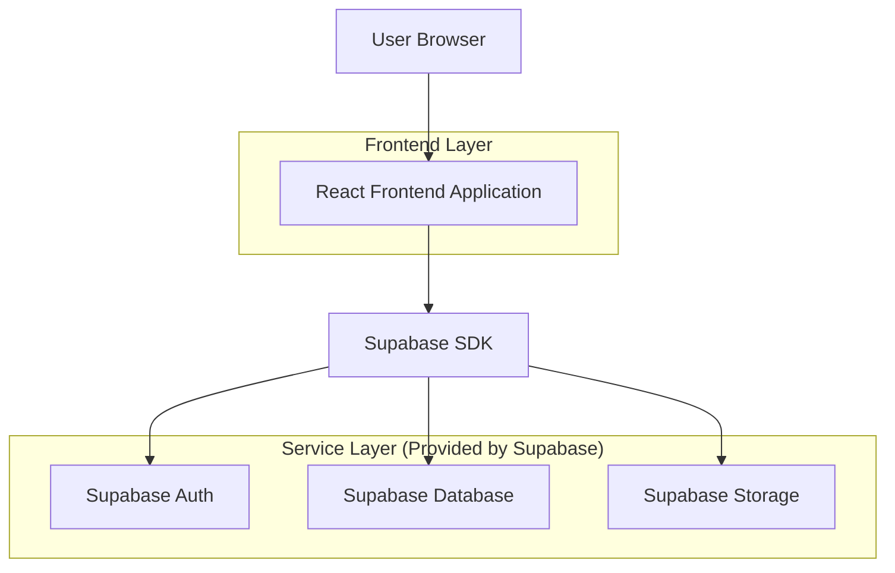
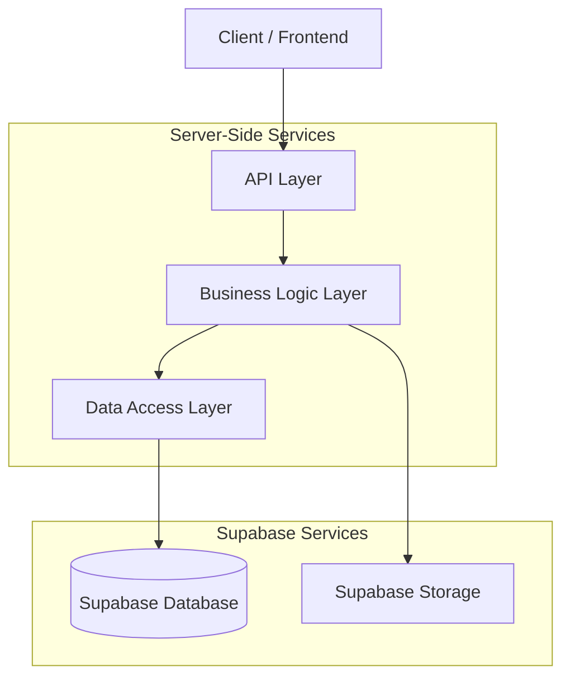
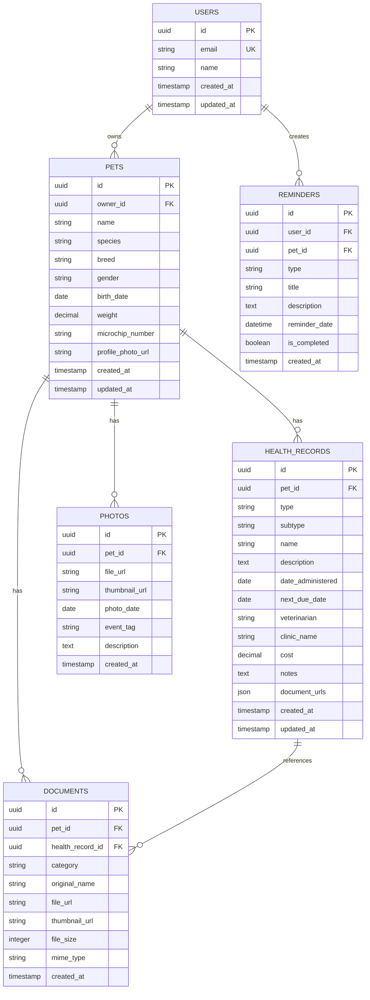

## 1. Architecture design



## 2. Technology Description
- Frontend: React@18 + tailwindcss@3 + vite
- Initialization Tool: vite-init
- Backend: Supabase (PostgreSQL, Auth, Storage)
- Key Dependencies: 
  - @supabase/supabase-js@2
  - react-hook-form@7
  - date-fns@2
  - react-dropzone@14
  - react-image-gallery@1
  - lucide-react@0

## 3. Route definitions
| Route | Purpose |
|-------|---------|
| /pets | Pet list overview, quick access to all pets |
| /pets/:id | Pet Profile Dashboard, main pet information view |
| /pets/:id/health | Health Passport, complete medical history |
| /pets/:id/health/wizard | Health Wizard, guided health record creation |
| /pets/:id/documents | Document Gallery, uploaded files and certificates |
| /pets/:id/photos | Photo Memories, pet photo gallery |
| /pets/:id/calendar | Medical Calendar, upcoming events and reminders |

## 4. API definitions

### 4.1 Pet Management APIs

**Get Pet Profile**
```
GET /api/pets/:id
```

Response:
```json
{
  "id": "uuid",
  "name": "string",
  "species": "string",
  "breed": "string",
  "gender": "string",
  "birth_date": "date",
  "weight": "number",
  "microchip_number": "string",
  "profile_photo_url": "string",
  "owner_id": "uuid",
  "created_at": "timestamp",
  "updated_at": "timestamp"
}
```

**Update Pet Profile**
```
PUT /api/pets/:id
```

Request:
```json
{
  "name": "string",
  "weight": "number",
  "profile_photo_url": "string"
}
```

### 4.2 Health Record APIs

**Create Health Record**
```
POST /api/pets/:id/health-records
```

Request:
```json
{
  "type": "vaccination|treatment|checkup|emergency",
  "subtype": "string",
  "name": "string",
  "description": "string",
  "date_administered": "date",
  "next_due_date": "date",
  "veterinarian": "string",
  "clinic_name": "string",
  "cost": "number",
  "notes": "string",
  "document_urls": ["string"]
}
```

**Get Health Records**
```
GET /api/pets/:id/health-records?type=vaccination&limit=10
```

Response:
```json
{
  "records": [
    {
      "id": "uuid",
      "type": "string",
      "name": "string",
      "date_administered": "date",
      "next_due_date": "date",
      "status": "valid|expired|upcoming",
      "document_urls": ["string"]
    }
  ],
  "total": "number"
}
```

### 4.3 Document Management APIs

**Upload Document**
```
POST /api/documents/upload
```

Request:
```multipart/form-data
file: File
pet_id: uuid
category: passport|certificate|prescription|lab_result|other
```

Response:
```json
{
  "document_id": "uuid",
  "url": "string",
  "thumbnail_url": "string",
  "category": "string",
  "uploaded_at": "timestamp"
}
```

## 5. Server architecture diagram



## 6. Data model

### 6.1 Data model definition



### 6.2 Data Definition Language

**Users Table**
```sql
CREATE TABLE users (
  id UUID PRIMARY KEY DEFAULT gen_random_uuid(),
  email VARCHAR(255) UNIQUE NOT NULL,
  name VARCHAR(100) NOT NULL,
  created_at TIMESTAMP WITH TIME ZONE DEFAULT NOW(),
  updated_at TIMESTAMP WITH TIME ZONE DEFAULT NOW()
);

-- Enable Row Level Security
ALTER TABLE users ENABLE ROW LEVEL SECURITY;

-- Grant permissions
GRANT SELECT ON users TO anon;
GRANT ALL ON users TO authenticated;
```

**Pets Table**
```sql
CREATE TABLE pets (
  id UUID PRIMARY KEY DEFAULT gen_random_uuid(),
  owner_id UUID REFERENCES users(id) ON DELETE CASCADE,
  name VARCHAR(100) NOT NULL,
  species VARCHAR(50) NOT NULL,
  breed VARCHAR(100),
  gender VARCHAR(20) CHECK (gender IN ('male', 'female', 'unknown')),
  birth_date DATE,
  weight DECIMAL(5,2),
  microchip_number VARCHAR(50),
  profile_photo_url TEXT,
  created_at TIMESTAMP WITH TIME ZONE DEFAULT NOW(),
  updated_at TIMESTAMP WITH TIME ZONE DEFAULT NOW()
);

-- Enable Row Level Security
ALTER TABLE pets ENABLE ROW LEVEL SECURITY;

-- Create indexes
CREATE INDEX idx_pets_owner_id ON pets(owner_id);
CREATE INDEX idx_pets_species ON pets