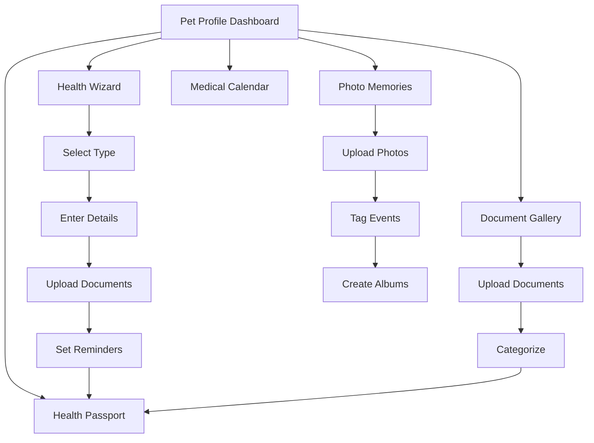

## 1. Product Overview
A comprehensive pet profile system that serves as a digital health passport and memory keeper for pets. Pet owners can manage all pet information, health records, vaccinations, treatments, and precious memories in one centralized location.

The product solves the problem of scattered pet information by providing a unified platform for tracking health history, upcoming medical needs, and storing important documents and photos securely.

## 2. Core Features

### 2.1 User Roles
| Role | Registration Method | Core Permissions |
|------|---------------------|------------------|
| Pet Owner | Email/Social registration | Full access to pet profiles, health records, document uploads |
| Family Member | Invitation from owner | View and limited edit access to shared pets |
| Veterinarian | Professional verification | View health records, add medical entries |

### 2.2 Feature Module
Our pet profile system consists of the following main pages:
1. **Pet Profile Dashboard**: Overview of pet information, quick stats, recent activities
2. **Health Passport**: Complete medical history, vaccination records, treatments timeline
3. **Health Wizard**: Step-by-step guided process for adding health records
4. **Document Gallery**: Upload and organize vet documents, certificates, passports
5. **Photo Memories**: Photo gallery with event tagging and timeline view
6. **Medical Calendar**: Upcoming appointments, vaccination deadlines, treatment reminders

### 2.3 Page Details
| Page Name | Module Name | Feature description |
|-----------|-------------|---------------------|
| Pet Profile Dashboard | Pet Info Card | Display name, breed, age, gender, weight, microchip number, profile photo |
| Pet Profile Dashboard | Quick Stats | Show upcoming vaccinations, recent treatments, document count, photo count |
| Pet Profile Dashboard | Recent Activity | Timeline of recent health entries, document uploads, photo additions |
| Health Passport | Vaccination Records | List all vaccinations with dates, types, next due dates, validity status |
| Health Passport | Treatment History | Complete treatment timeline with medications, procedures, outcomes |
| Health Passport | Medical Notes | Veterinarian notes, diagnoses, recommendations, follow-up requirements |
| Health Wizard | Step 1 - Type Selection | Choose between vaccination, treatment, check-up, emergency visit |
| Health Wizard | Step 2 - Details Entry | Dynamic form fields based on type selection with smart prefills |
| Health Wizard | Step 3 - Document Upload | Attach vet certificates, receipts, prescriptions, photos |
| Health Wizard | Step 4 - Reminder Setup | Set automatic reminders for next doses, follow-ups, renewals |
| Document Gallery | Document Categories | Organize by type: passport, certificates, prescriptions, lab results |
| Document Gallery | Upload Interface | Drag-and-drop multiple files, automatic date detection, OCR for text extraction |
| Document Gallery | Document Viewer | Zoom, rotate, download, share with veterinarian |
| Photo Memories | Photo Timeline | Chronological display with event tagging (birthday, adoption day, etc.) |
| Photo Memories | Album Creation | Create custom albums for different life stages, events, seasons |
| Photo Memories | Photo Upload | Batch upload, automatic date sorting, face detection for pet recognition |
| Medical Calendar | Calendar View | Monthly/weekly view with color-coded events |
| Medical Calendar | Reminder System | Push notifications, email alerts for upcoming medical needs |

## 3. Core Process
**Pet Owner Flow:**
1. User navigates to Pet Profile Dashboard from main navigation
2. Views comprehensive pet overview with all key information
3. Accesses Health Passport to review complete medical history
4. Uses Health Wizard to add new vaccination or treatment
5. Uploads supporting documents and photos through the wizard
6. Sets up automatic reminders for future medical needs
7. Browses photo memories and document gallery
8. Shares specific records with veterinarian when needed

**Veterinarian Flow:**
1. Receives shared link from pet owner
2. Accesses relevant health records with read-only permissions
3. Can suggest updates or request additional information
4. Owner reviews and approves any suggested changes

## 4. User Interface Design

### 4.1 Design Style
- **Primary Colors**: Warm pet-friendly palette with primary blue (#4A90E2), secondary green (#7ED321), accent orange (#F5A623)
- **Button Style**: Rounded corners with soft shadows, hover effects with color transitions
- **Font**: Modern sans-serif (Inter/Roboto), 16px base size with clear hierarchy
- **Layout Style**: Card-based design with intuitive navigation, mobile-first responsive approach
- **Icons**: Friendly rounded icons using pet-themed illustrations, consistent line weights

### 4.2 Page Design Overview
| Page Name | Module Name | UI Elements |
|-----------|-------------|-------------|
| Pet Profile Dashboard | Pet Info Card | Circular profile photo, prominent name display, breed and age badges, microchip number with copy button |
| Health Passport | Vaccination Timeline | Vertical timeline with color-coded status indicators, expandable cards for details, filter by type/date |
| Health Wizard | Step Progress | Clear step indicators at top, progress bar, back/next navigation, save draft option |
| Document Gallery | Grid Layout | Thumbnail grid with document type icons, upload date, preview on hover, bulk selection actions |
| Photo Memories | Masonry Grid | Pinterest-style photo layout, event tags overlay, heart/comment interactions, slideshow mode |

### 4.3 Responsiveness
Desktop-first design with full mobile adaptation. Touch-optimized interactions for mobile users, including swipe gestures for photo gallery, tap-to-expand for health records, and simplified wizard steps for smaller screens.

### 4.4 Accessibility Features
High contrast mode support, screen reader compatibility, keyboard navigation support, large text options for senior users, and clear visual indicators for all interactive elements.