# Waggli Social Network - Complete Solution Document

## 📋 Executive Summary

This document provides a comprehensive solution for implementing a full-featured social network for pets and pet owners within the Waggli app. The social network will enable pet owners to share moments, connect with other pet parents, discover pet-friendly places, join communities, and engage in meaningful interactions centered around their beloved companions.

**Key Features:**
- Pet-centric profiles and posts
- Photo and video sharing with advanced media handling
- News feed with intelligent algorithm
- Comments, reactions, and social engagement
- Following/followers system
- Groups and communities
- Events and meetups
- Stories/moments (24-hour ephemeral content)
- Private messaging already exists (leveraging current implementation)
- Location-based discovery
- Content moderation and safety

---

## 🎯 Vision & Objectives

### Vision
Create the premier social network for pets and pet owners that combines the best of Instagram (beautiful visual sharing), Facebook (community and groups), and location-based discovery to foster meaningful connections and improve pet wellness.

### Core Objectives
1. **Community Building**: Connect pet owners with shared interests, breeds, and local communities
2. **Engagement**: Provide engaging, pet-focused content that keeps users returning daily
3. **Discovery**: Help owners find pet-friendly places, events, and services
4. **Education**: Share knowledge, tips, and experiences among pet owners
5. **Safety**: Create a trusted, moderated environment free from spam and inappropriate content

---

## 👥 Target Users

### Primary User Personas

#### 1. **Social Pet Parent** (Primary Persona - 60% of users)
- **Demographics**: 25-45 years old, urban/suburban, tech-savvy
- **Behavior**: Actively shares pet photos/videos, follows other pets, engages with content daily
- **Goals**: Show off their pet, connect with other pet parents, discover new places and products
- **Pain Points**: Generic social media doesn't cater to pet content, hard to find local pet communities

#### 2. **Information Seeker** (Secondary - 25% of users)
- **Demographics**: 30-50 years old, new pet owner or specific breed owner
- **Beh**avior**: Reads posts, asks questions in groups, saves helpful content
- **Goals**: Learn from experienced owners, get health/training advice, find local resources
- **Pain Points**: Information overload, unreliable sources, hard to find breed-specific advice

#### 3. **Community Builder** (Influencers - 10% of users)
- **Demographics**: Varies, active in pet communities, may be professionals (trainers, vets)
- **Behavior**: Creates valuable content, organizes events, moderates groups
- **Goals**: Build following, establish authority, help others, promote services
- **Pain Points**: Limited reach on generic platforms, hard to monetize expertise

#### 4. **Casual Browser** (5% of users)
- **Demographics**: Pet owners who primarily use app for health tracking
- **Behavior**: Occasionally browses feed, rarely posts
- **Goals**: Light entertainment, see what others are doing
- **Pain Points**: Don't want spam or overwhelming notifications

---

## 🏗 Feature Architecture

### Feature Map

```mermaid
graph TD
    A[Social Network] --> B[Content Creation]
    A --> C[Content Discovery]
    A --> D[Social Engagement]
    A --> E[Community Features]
    A --> F[Messaging]
    
    B --> B1[Posts: Text, Photo, Video]
    B --> B2[Stories 24h ephemeral]
    B --> B3[Live Streaming future]
    B --> B4[Polls & Questions]
    
    C --> C1[News Feed Algorithm]
    C --> C2[Explore Page]
    C --> C3[Trending Topics/Tags]
    C4[Search: Users, Pets, Tags]
    C --> C5[Location-based Discovery]
    
    D --> D1[Likes & Reactions]
    D --> D2[Comments & Replies]
    D --> D3[Shares & Reposts]
    D --> D4[Bookmarks/Saves]
    D --> D5[Follow/Unfollow]
    
    E --> E1[Groups & Communities]
    E --> E2[Events & Meetups]
    E --> E3[Challenges & Contests]
    E --> E4[Breed-specific Communities]
    
    F --> F1[Direct Messages existing]
    F --> F2[Group Chats]
    F --> F3[Media Sharing in Chat]
```



---

## 📱 Core Features Specification

### 1. Pet-Centric Profiles

#### 1.1 Pet Profile Social Features

**Existing** (from current Waggli):
- Pet basic info (name, species, breed, age, photos)
- Health passport (vaccinations, medical records)
- Owner information

**New Social Additions**:
- **Bio/Description**: 500-character bio telling pet's story
- **Social Stats**: Followers count, following count, total posts
- **Highlights**: Featured story collections (e.g., "First Year", "Adventures")
- **Featured Posts**: Pinned posts at top of profile
- **Profile Tags**: Interests/traits (#AdventureP up, #RescueDog, #SeniorCat)
- **Activity Status**: Last active, posting frequency
- **Verification Badge**: For notable pets, rescue organizations, verified breeders

#### 1.2 Owner Profile Social Features

**Enhanced Public Profile**:
- Multiple pets displayed
- Aggregate social stats across all pets
- Collections of favorite posts
- Groups and communities joined
- Badges and achievements (e.g., "Active Community Member", "Helpful Contributor")

---

### 2. Content Creation & Posts

#### 2.1 Post Types

##### A. Photo Posts
- **Multiple photos** (1-10 per post, swipeable carousel)
- **Filters & Editing**: Built-in photo editor with pet-focused filters
- **Pet Tagging**: Tag which pets are in the photo
- **Location Tagging**: Tag pet-friendly places (integrates with Places feature)
- **Caption**: Up to 2,200 characters
- **Hashtags**: Up to 30 hashtags for discovery
- **Mentions**: Tag other pets/users in caption

##### B. Video Posts
- **Duration**: Up to 3 minutes (MVP), 10 minutes (future)
- **Video Editing**: Trim, filters, captions
- **Thumbnails**: Auto-generated or custom
- **Sound**: Original audio or music library (royalty-free)
- **Captions**: Auto-generated captions for accessibility

##### C. Text Posts
- **Long-form content**: Up to 5,000 characters
- **Rich formatting**: Bold, italic, lists, links
- **Embedded media**: Images within text
- **Questions**: Mark as question for community help
- **Topics**: Select from predefined topics or create new

##### D. Poll Posts
- **Question** + 2-4 answer options
- **Duration**: 24 hours to 7 days
- **Anonymous voting option**
- **Results visibility**: After voting or after poll ends

##### E. Location Check-ins
- **Photo/video required**
- **Place automatically** linked
- **Rating**: Optional 1-5 star rating
- **Review text**: Describe experience
- **Tips**: Share helpful info (e.g., "Ask for water bowl at entrance")

#### 2.2 Post Composition Interface

**UI Components**:
```
┌─────────────────────────────────────┐
│  Create Post                    [X] │
├─────────────────────────────────────┤
│                                     │
│  [Pet Avatar + Name Selector ▼]    │
│                                     │
│  ┌─────────────────────────────┐   │
│  │ What's on Max's mind?       │   │
│  │                             │   │
│  │                             │   │
│  └─────────────────────────────┘   │
│                                     │
│  [📷 Photo] [🎥 Video] [📍Location] │
│  [😊 Feeling] [🏷️ Tag Pets]        │
│                                     │
│  Visibility: [Public ▼]             │
│  Comments: [Everyone ▼]             │
│                                     │
│  [Cancel]            [Post ✓]      │
└─────────────────────────────────────┘
```

#### 2.3 Draft System
- **Auto-save**: Save drafts automatically
- **Scheduled Posts**: Schedule for future posting (Pro feature)
- **Draft Management**: View, edit, delete drafts

---

### 3. News Feed Algorithm

#### 3.1 Feed Types

##### A. Home Feed (Primary Feed)
**Algorithm Factors** (in priority order):
1. **Recency** (40%): Newer content prioritized
2. **Engagement** (30%): Likes, comments, shares from connections
3. **Relevance** (20%): Based on user's interests, followed breeds, location
4. **Content Type** (10%): Mix of photos, videos, text to maintain variety

**Ranking Formula**:
```
Score = (Recency Weight × Time Decay) 
      + (Engagement Weight × (Likes + 2×Comments + 3×Shares))
      + (Relevance Weight × Interest Match)
      + (Diversity Bonus)
```

**Content Mix**:
- 60% from followed pets/users
- 25% from groups and communities joined
- 10% suggested content (similar interests)
- 5% promoted content (sponsored posts, featured shelters)

##### B. Following Feed
- **Chronological only**: Pure reverse-chronological feed
- **Filter options**: All, Photos only, Videos only
- **No algorithm**: Show everything from followed accounts

##### C. Explore Feed
- **For You**: Personalized recommendations
- **Trending**: Popular content in user's region
- **Categories**: Dogs, Cats, Birds, Small Pets, etc.
- **Hashtags**: Browse by hashtag
- **Places**: Content from specific locations

#### 3.2 Engagement Metrics

**Post Scoring Criteria**:
- **Like**: +1 point
- **Comment**: +3 points
- **Share**: +5 points
- **Save/Bookmark**: +2 points
- **Profile visit from post**: +1 point
- **Time spent viewing**: +0.1 point per second (capped at 30s)

**Time Decay**:
```
Score multiplier = 1 / (1 + hours_since_post / 24)^1.5
```

---

### 4. Social Interactions

#### 4.1 Reactions & Likes

**Reaction Types**:
- ❤️ **Love** (default/primary)
- 🐾 **Paws** (pet-specific)
- 😂 **Hilarious**
- 😍 **Adorable**
- 😢 **Care** (for sad stories, rescues)
- 🎉 **Celebrate** (birthdays, adoptions)

**Interaction States**:
- Tap to react (long-press for reaction picker on mobile)
- Double-tap photo for quick Love reaction
- View who reacted (tap reaction count)
- Sortable by reaction type

#### 4.2 Comments

**Features**:
- **Nested replies**: Up to 3 levels deep
- **Mentions**: @ mention users/pets
- **Emojis**: Full emoji support
- **Media**: Add photos to comments
- **Reactions**: React to comments with emojis
- **Pin comments**: Post owner can pin helpful/important comments
- **Sort by**: Newest, Oldest, Top (most liked)
- **Comment notifications**: Post owner gets notified, commenters on replies they're involved in

**Moderation**:
- Post owner can delete any comment on their post
- Users can delete their own comments
- Report inappropriate comments
- Hide/mute commenters

#### 4.3 Sharing

**Share Options**:
- **Share to Story**: Reshare post to own 24h story (with attribution)
- **Share to Message**: Send directly in DM
- **Copy Link**: Get shareable URL
- **Share to External**: Instagram, Facebook, Twitter, WhatsApp (via native share sheet)
- **Embed**: Get embed code for websites (future)

**Share Attribution**:
- Original poster gets notification
- Shared content shows "Originally posted by [User/Pet]"
- Click attribution to view original

#### 4.4 Saves/Bookmarks

**Collections**:
- Save posts to private collections
- Create custom collections (e.g., "Training Tips", "Recipes", "Places to Visit")
- Quick-save to "Saved" or choose collection
- Search within saved posts
- Share collections with friends (future)

---

### 5. Following System

#### 5.1 Follow Mechanics

**Follow Types**:
- **Follow Pet Profile**: See posts from that specific pet
- **Follow User**: See posts from all their pets
- **Mutual Follows**: Both parties follow each other ("Pet Friends")

**Discovery**:
- **Suggested Follows**:
  - Based on location (local pets)
  - Based on breed (similar breeds)
  - Based on mutual followers
  - Based on groups joined
  - Popular accounts in region
- **Find Friends**:
  - Contacts integration (opt-in)
  - Facebook friends who use app
  - Nearby pet owners (location-based)

**Privacy Options**:
- **Public Profile**: Anyone can follow
- **Private Profile**: Require approval for each follower
- **Block**: Prevent specific users from seeing content or following

#### 5.2 Followers Management

**Features**:
- View followers list (sortable by recent, alphabetical, mutual)
- View following list
- Remove followers
- Mute users (still following, don't see their content)
- Favorite users (see their content first)
- Follow requests (for private accounts)

---

### 6. Stories (24-Hour Ephemeral Content)

#### 6.1 Story Features

**Content Types**:
- **Photo Stories**: Upload photos with text, stickers, drawings
- **Video Stories**: Up to 15 seconds per clip, chain multiple clips
- **Live Stories:** Live video streaming future
- **Boomerangs**: Auto-looping short videos
- **Polls**: Quick yes/no or multiple choice polls
- **Questions**: Ask followers questions, they reply

**Creation Tools**:
- **Text overlay**: Multiple fonts, colors, sizes, alignment
- **Stickers**: Emojis, GIFs, location tags, pet tags, polls, questions
- **Drawings**: Freehand drawing, highlighter, eraser
- **Filters**: Pet-themed AR filters (dog ears, cat whiskers, etc.)
- **Music**: Add background music from library

**Privacy Settings**:
- Post to: All Followers, Close Friends only, Custom list
- Hide from: Select specific followers
- Allow replies: Everyone, Followers, Off

#### 6.2 Story Viewing

**Viewer Experience**:
- **Story Ring**: Colorful ring around profile photo indicates new story
- **Stories Bar**: Horizontal scrollable bar at top of feed
- **Tap to Advance**: Tap right to skip, left to go back, hold to pause
- **Swipe between Stories**: Swipe left/right to navigate between different accounts

**Viewer Insights** (for poster):
- See who viewed (list of viewers)
- View count
- Reactions to story
- Replies to story (delivered as DMs)

#### 6.3 Story Highlights

- **Permanent Collections**: Save stories to profile in themed highlights
- **Cover Image**: Custom cover photo for each highlight
- **Naming**: Name each highlight collection
- **Reorder**: Drag to reorder highlights
- **Edit**: Add/remove stories from highlights

---

### 7. Groups & Communities

#### 7.1 Group Types

##### A. Public Groups
- Anyone can join
- Searchable and discoverable
- Posts visible to all (even non-members if posts are shared)
- Examples: "Golden Retriever Owners", "NYC Dog Parks"

##### B. Private Groups
- Request to join (admin approval required)
- Not searchable, invite-only discovery
- Posts only visible to members
- Examples: "Lab Rescue Alumni", "Professional Dog Trainers Network"

##### C. Secret Groups
- Completely hidden from search
- Invitation-only
- Ultra-private discussions
- Examples: "Breed-Specific Health Support"

#### 7.2 Group Features

**Core Functionality**:
- **Group Feed**: Dedicated feed for group posts only
- **Member List**: See all members, search members
- **Group Rules**: Pinned rules post
- **Admin Tools**:
  - Approve/reject join requests
  - Remove members
  - Delete posts
  - Pin posts announcements
  - Mute members temporarily
  - Assign moderators/co-admins

**Content Types**:
- All standard post types (photos, videos, text, polls)
- **Group-exclusive content**: Mark content as only for group
- **Announcements**: Admin-only posts pinned at top
- **Files**: Share documents (PDFs, training guides)
- **Events**: Create events for group members

**Discovery**:
- Browse by category (breed, location, topic)
- Suggested groups based on interests
- See groups your friends are in
- Trending groups

#### 7.3 Community Features

**Breed Specific Communities**:
- Auto-generated for major breeds
- Verified information from vets/breeders
- Health topic threads
- Breeder directory
- Adoption listings for breed rescues

**Location-Based Communities**:
- City/neighborhood groups
- Dog park groups
- Pet-friendly establishment reviews

**Interest-Based Communities**:
- Training & Behavior
- Pet Photography
- DIY Pet Projects
- Pet Fashion
- Agility & Sports
- Senior Pet Care
- Special Needs Pets

---

### 8. Events & Meetups

#### 8.1 Event Types

**Categories**:
- **Playdates**: Informal meetups at parks
- **Group Walks**: Organized walking groups
- **Training Classes**: Obedience, agility, tricks
- **Adoption Events**: Shelter/rescue adoption days
- **Fundraisers**: Charity events for animal welfare
- **Competitions**: Dog shows, agility trials, photo contests
- **Social Gatherings**: Pet-friendly happy hours, parties
- **Educational**: Seminars, workshops, vet Q&A sessions

#### 8.2 Event Creation

**Event Details**:
- **Title** and **Description**
- **Date & Time** (with timezone support)
- **Location**: Map integration with directions
- **Host**: User, pet, or organization
- **Capacity**: Optional max attendees
- **Ticket Price**: Free or paid (Stripe integration)
- **Age/Size Restrictions**: E.g., "Small dogs only", "Puppies under 1 year"
- **Photos**: Event cover photo and gallery
- **Requirements**: E.g., "Proof of vaccination required"

**RSVP Options**:
- Going
- Maybe
- Can't Go
- Invite-only events (custom guest list)

**Event Updates**:
- Post updates to all attendees
- Send notifications for changes
- Weather cancellation notifications
- Photo album from event (crowdsourced)

#### 8.3 Event Discovery

**Find Events**:
- **Map View**: See events on map by location
- **List View**: Chronological or by popularity
- **Filters**:
  - Date range
  - Distance
  - Event type
  - Free vs paid
  - Pet species (dog events, cat events, etc.)
- **Recommendations**: Based on location, pet type, past attendance

**Calendar Integration**:
- Add to device calendar
- In-app calendar view
- Reminders before event

---

## 💾 Database Schema

### New Tables for Social Network

```sql
-- ============================================
-- SOCIAL NETWORK TABLES
-- ============================================

-- Posts Table (enhanced from existing pet_posts)
CREATE TABLE social_posts (
  id UUID PRIMARY KEY DEFAULT uuid_generate_v4(),
  author_user_id UUID REFERENCES auth.users(id) ON DELETE CASCADE NOT NULL,
  author_pet_id UUID REFERENCES pets(id) ON DELETE CASCADE, -- NULL if posted by user about multiple pets
  
  -- Post Content
  post_type VARCHAR(50) NOT NULL, -- photo, video, text, poll, location_checkin
  content_text TEXT, -- Caption or text content (max 5000 chars in app)
  
  -- Media
  media JSONB DEFAULT '[]'::jsonb, -- [{type: 'photo'|'video', url: '', thumbnail: '', width: number, height: number, duration: number}]
  media_count INTEGER DEFAULT 0,
  
  -- Tags & Mentions
  tagged_pet_ids UUID[], -- Pets tagged in post
  mentioned_user_ids UUID[], -- Users @mentioned in caption
  hashtags TEXT[], -- Extracted hashtags
  
  -- Location
  location_place_id UUID REFERENCES pet_places(id),
  location_name TEXT,
  location_lat DECIMAL(10,8),
  location_lng DECIMAL(11,8),
  
  -- Poll Data (if post_type = 'poll')
  poll_question TEXT,
  poll_options JSONB, -- [{option: 'Yes', votes: number, voted_user_ids: UUID[]}]
  poll_ends_at TIMESTAMP WITH TIME ZONE,
  poll_allow_multiple BOOLEAN DEFAULT FALSE,
  
  -- Engagement Counts (denormalized for performance)
  reaction_count INTEGER DEFAULT 0,
  comment_count INTEGER DEFAULT 0,
  share_count INTEGER DEFAULT 0,
  bookmark_count INTEGER DEFAULT 0,
  view_count INTEGER DEFAULT 0,
  
  -- Engagement Score (for ranking/algorithm)
  engagement_score DECIMAL(10,2) DEFAULT 0,
  
  -- Visibility & Privacy
  visibility VARCHAR(20) DEFAULT 'public', -- public, followers, friends, private, group
  group_id UUID REFERENCES groups(id), -- If posted in group
  allow_comments BOOLEAN DEFAULT TRUE,
  
  -- Moderation
  is_flagged BOOLEAN DEFAULT FALSE,
  is_hidden BOOLEAN DEFAULT FALSE,
  flagged_reason TEXT,
  moderated_at TIMESTAMP WITH TIME ZONE,
  moderated_by UUID REFERENCES auth.users(id),
  
  -- Status
  is_pinned BOOLEAN DEFAULT FALSE, -- Pinned to profile
  is_featured BOOLEAN DEFAULT FALSE, -- Featured by admins
  status VARCHAR(20) DEFAULT 'active', -- active, deleted, archived
  
  -- Timestamps
  created_at TIMESTAMP WITH TIME ZONE DEFAULT NOW(),
  updated_at TIMESTAMP WITH TIME ZONE DEFAULT NOW(),
  deleted_at TIMESTAMP WITH TIME ZONE
);

CREATE INDEX idx_social_posts_author_user ON social_posts(author_user_id, created_at DESC) WHERE deleted_at IS NULL;
CREATE INDEX idx_social_posts_author_pet ON social_posts(author_pet_id, created_at DESC) WHERE deleted_at IS NULL AND author_pet_id IS NOT NULL;
CREATE INDEX idx_social_posts_visibility ON social_posts(visibility, created_at DESC) WHERE deleted_at IS NULL AND status = 'active';
CREATE INDEX idx_social_posts_location ON social_posts(location_lat, location_lng) WHERE location_lat IS NOT NULL AND deleted_at IS NULL;
CREATE INDEX idx_social_posts_engagement ON social_posts(engagement_score DESC, created_at DESC) WHERE deleted_at IS NULL AND status = 'active';
CREATE INDEX idx_social_posts_hashtags ON social_posts USING GIN(hashtags) WHERE deleted_at IS NULL;
CREATE INDEX idx_social_posts_group ON social_posts(group_id, created_at DESC) WHERE group_id IS NOT NULL AND deleted_at IS NULL;

COMMENT ON TABLE social_posts IS 'All social media posts (photos, videos, text, polls)';


-- Reactions Table
CREATE TABLE post_reactions (
  id UUID PRIMARY KEY DEFAULT uuid_generate_v4(),
  post_id UUID REFERENCES social_posts(id) ON DELETE CASCADE NOT NULL,
  user_id UUID REFERENCES auth.users(id) ON DELETE CASCADE NOT NULL,
  
  reaction_type VARCHAR(20) NOT NULL, -- love, paws, hilarious, adorable, care, celebrate
  
  created_at TIMESTAMP WITH TIME ZONE DEFAULT NOW(),
  
  UNIQUE(post_id, user_id) -- One reaction per user per post
);

CREATE INDEX idx_reactions_post ON post_reactions(post_id, reaction_type);
CREATE INDEX idx_reactions_user ON post_reactions(user_id, created_at DESC);

COMMENT ON TABLE post_reactions IS 'User reactions to posts (replaces simple likes)';


-- Comments Table
CREATE TABLE post_comments (
  id UUID PRIMARY KEY DEFAULT uuid_generate_v4(),
  post_id UUID REFERENCES social_posts(id) ON DELETE CASCADE NOT NULL,
  user_id UUID REFERENCES auth.users(id) ON DELETE CASCADE NOT NULL,
  parent_comment_id UUID REFERENCES post_comments(id), -- For nested replies
  
  content TEXT NOT NULL, -- Max 500 chars in app
  
  -- Media in comment
  media_urls TEXT[], -- Photos attached to comment
  
  -- Mentions
  mentioned_user_ids UUID[],
  
  -- Engagement
  reaction_count INTEGER DEFAULT 0,
  reply_count INTEGER DEFAULT 0,
  
  -- Moderation
  is_pinned BOOLEAN DEFAULT FALSE, -- Post owner can pin comments
  is_flagged BOOLEAN DEFAULT FALSE,
  is_hidden BOOLEAN DEFAULT FALSE,
  
  created_at TIMESTAMP WITH TIME ZONE DEFAULT NOW(),
  updated_at TIMESTAMP WITH TIME ZONE DEFAULT NOW(),
  deleted_at TIMESTAMP WITH TIME ZONE
);

CREATE INDEX idx_comments_post ON post_comments(post_id, created_at DESC) WHERE deleted_at IS NULL;
CREATE INDEX idx_comments_user ON post_comments(user_id, created_at DESC) WHERE deleted_at IS NULL;
CREATE INDEX idx_comments_parent ON post_comments(parent_comment_id, created_at) WHERE parent_comment_id IS NOT NULL AND deleted_at IS NULL;

COMMENT ON TABLE post_comments IS 'Comments and replies on posts';


-- Comment Reactions (separate from post reactions)
CREATE TABLE comment_reactions (
  id UUID PRIMARY KEY DEFAULT uuid_generate_v4(),
  comment_id UUID REFERENCES post_comments(id) ON DELETE CASCADE NOT NULL,
  user_id UUID REFERENCES auth.users(id) ON DELETE CASCADE NOT NULL,
  
  reaction_type VARCHAR(20) NOT NULL,
  
  created_at TIMESTAMP WITH TIME ZONE DEFAULT NOW(),
  
  UNIQUE(comment_id, user_id)
);

CREATE INDEX idx_comment_reactions_comment ON comment_reactions(comment_id);


-- Shares/Reposts Table
CREATE TABLE post_shares (
  id UUID PRIMARY KEY DEFAULT uuid_generate_v4(),
  original_post_id UUID REFERENCES social_posts(id) ON DELETE CASCADE NOT NULL,
  sharer_user_id UUID REFERENCES auth.users(id) ON DELETE CASCADE NOT NULL,
  
  share_type VARCHAR(20) NOT NULL, -- story_reshare, feed_repost, message, external
  added_content TEXT, -- Text added when sharing
  
  created_at TIMESTAMP WITH TIME ZONE DEFAULT NOW(),
  
  UNIQUE(original_post_id, sharer_user_id, share_type, created_at) -- Prevent duplicate shares
);

CREATE INDEX idx_shares_post ON post_shares(original_post_id, created_at DESC);
CREATE INDEX idx_shares_user ON post_shares(sharer_user_id, created_at DESC);


-- Bookmarks/Saves Table
CREATE TABLE post_bookmarks (
  id UUID PRIMARY KEY DEFAULT uuid_generate_v4(),
  post_id UUID REFERENCES social_posts(id) ON DELETE CASCADE NOT NULL,
  user_id UUID REFERENCES auth.users(id) ON DELETE CASCADE NOT NULL,
  
  collection_name VARCHAR(100) DEFAULT 'Saved', -- User can organize into collections
  
  created_at TIMESTAMP WITH TIME ZONE DEFAULT NOW(),
  
  UNIQUE(post_id, user_id, collection_name)
);

CREATE INDEX idx_bookmarks_user ON post_bookmarks(user_id, collection_name, created_at DESC);
CREATE INDEX idx_bookmarks_post ON post_bookmarks(post_id);


-- Following/Followers Table
CREATE TABLE social_follows (
  id UUID PRIMARY KEY DEFAULT uuid_generate_v4(),
  follower_user_id UUID REFERENCES auth.users(id) ON DELETE CASCADE NOT NULL,
  followed_user_id UUID REFERENCES auth.users(id) ON DELETE CASCADE,
  followed_pet_id UUID REFERENCES pets(id) ON DELETE CASCADE,
  
  -- Status
  status VARCHAR(20) DEFAULT 'active', -- active, pending (for private accounts), blocked
  
  -- Preferences
  show_in_feed BOOLEAN DEFAULT TRUE, -- Muting: still following but don't show in feed
  enable_notifications BOOLEAN DEFAULT TRUE,
  is_close_friend BOOLEAN DEFAULT FALSE, -- For stories
  is_favorite BOOLEAN DEFAULT FALSE, -- Show first in feed
  
  created_at TIMESTAMP WITH TIME ZONE DEFAULT NOW(),
  
  CONSTRAINT follow_target_check CHECK (
    (followed_user_id IS NOT NULL AND followed_pet_id IS NULL) OR
    (followed_user_id IS NULL AND followed_pet_id IS NOT NULL)
  ),
  UNIQUE(follower_user_id, followed_user_id),
  UNIQUE(follower_user_id, followed_pet_id)
);

CREATE INDEX idx_follows_follower ON social_follows(follower_user_id, status);
CREATE INDEX idx_follows_user ON social_follows(followed_user_id, status) WHERE followed_user_id IS NOT NULL;
CREATE INDEX idx_follows_pet ON social_follows(followed_pet_id, status) WHERE followed_pet_id IS NOT NULL;

COMMENT ON TABLE social_follows IS 'Following relationships between users and pets';


-- Stories Table (24-hour ephemeral content)
CREATE TABLE stories (
  id UUID PRIMARY KEY DEFAULT uuid_generate_v4(),
  author_user_id UUID REFERENCES auth.users(id) ON DELETE CASCADE NOT NULL,
  author_pet_id UUID REFERENCES pets(id) ON DELETE CASCADE,
  
  -- Content
  story_type VARCHAR(20) NOT NULL, -- photo, video, boomerang, text
  media_url TEXT, -- Photo or video URL
  media_thumbnail_url TEXT,
  duration_seconds INTEGER DEFAULT 5, -- Display duration
  
  -- Overlays
  text_overlays JSONB, -- [{text: 'Hello!', x: 0.5, y: 0.3, fontSize: 24, color: '#fff'}]
  stickers JSONB, -- [{type: 'emoji', value: '❤️', x: 0.2, y: 0.4}]
  
  -- Interactive Elements
  poll_question TEXT,
  poll_options JSONB,
  question_prompt TEXT, -- "Ask me anything" sticker
  
  -- Music
  music_title TEXT,
  music_artist TEXT,
  music_start_time INTEGER, -- Seconds
  
  -- Privacy
  visibility VARCHAR(20) DEFAULT 'followers', -- followers, close_friends, custom, public
  visible_to_user_ids UUID[], -- Custom list
  hidden_from_user_ids UUID[],
  allow_replies BOOLEAN DEFAULT TRUE,
  allow_shares BOOLEAN default TRUE,
  
  -- Engagement
  view_count INTEGER DEFAULT 0,
  reaction_count INTEGER DEFAULT 0,
  reply_count INTEGER DEFAULT 0,
  
  -- Highlight
  highlight_id UUID REFERENCES story_highlights(id), -- If saved to highlight
  
  -- Status
  is_active BOOLEAN DEFAULT TRUE,
  
  created_at TIMESTAMP WITH TIME ZONE DEFAULT NOW(),
  expires_at TIMESTAMP WITH TIME ZONE DEFAULT (NOW() + INTERVAL '24 hours')
);

CREATE INDEX idx_stories_author ON stories(author_user_id, created_at DESC) WHERE is_active = TRUE;
CREATE INDEX idx_stories_expiry ON stories(expires_at) WHERE is_active = TRUE;
CREATE INDEX idx_stories_highlight ON stories(highlight_id) WHERE highlight_id IS NOT NULL;

COMMENT ON TABLE stories IS '24-hour ephemeral stories';


-- Story Highlights Table (permanent story collections)
CREATE TABLE story_highlights (
  id UUID PRIMARY KEY DEFAULT uuid_generate_v4(),
  user_id UUID REFERENCES auth.users(id) ON DELETE CASCADE NOT NULL,
  
  title VARCHAR(50) NOT NULL,
  cover_photo_url TEXT, -- Custom cover image
  display_order INTEGER DEFAULT 0,
  
  story_count INTEGER DEFAULT 0,
  
  created_at TIMESTAMP WITH TIME ZONE DEFAULT NOW(),
  updated_at TIMESTAMP WITH TIME ZONE DEFAULT NOW()
);

CREATE INDEX idx_highlights_user ON story_highlights(user_id, display_order);


-- Story Views Table
CREATE TABLE story_views (
  id UUID PRIMARY KEY DEFAULT uuid_generate_v4(),
  story_id UUID REFERENCES stories(id) ON DELETE CASCADE NOT NULL,
  viewer_user_id UUID REFERENCES auth.users(id) ON DELETE CASCADE NOT NULL,
  
  view_duration_seconds INTEGER,
  
  created_at TIMESTAMP WITH TIME ZONE DEFAULT NOW(),
  
  UNIQUE(story_id, viewer_user_id)
);

CREATE INDEX idx_story_views_story ON story_views(story_id, created_at DESC);
CREATE INDEX idx_story_views_user ON story_views(viewer_user_id, created_at DESC);


-- Groups Table
CREATE TABLE social_groups (
  id UUID PRIMARY KEY DEFAULT uuid_generate_v4(),
  owner_user_id UUID REFERENCES auth.users(id) ON DELETE SET NULL,
  
  -- Basic Info
  name VARCHAR(100) NOT NULL,
  slug VARCHAR(100) UNIQUE NOT NULL,
  description TEXT,
  rules TEXT,
  cover_photo_url TEXT,
  
  -- Type & Privacy
  group_type VARCHAR(20) NOT NULL, -- public, private, secret
  category VARCHAR(50), -- breed, location, topic, organization
  
  -- Tags
  breed_tags TEXT[], -- For breed-specific groups
  location_city TEXT,
  location_country VARCHAR(2),
  interest_tags TEXT[],
  
  -- Settings
  require_approval BOOLEAN DEFAULT TRUE, -- For private/secret groups
  allow_member_posts BOOLEAN DEFAULT TRUE,
  allow_member_invites BOOLEAN DEFAULT TRUE,
  
  -- Stats
  member_count INTEGER DEFAULT 0,
  post_count INTEGER DEFAULT 0,
  activity_score DECIMAL(10,2) DEFAULT 0,
  
  -- Status
  is_verified BOOLEAN DEFAULT FALSE, -- Official groups
  is_featured BOOLEAN DEFAULT FALSE,
  status VARCHAR(20) DEFAULT 'active', -- active, archived, suspended
  
  created_at TIMESTAMP WITH TIME ZONE DEFAULT NOW(),
  updated_at TIMESTAMP WITH TIME ZONE DEFAULT NOW()
);

CREATE INDEX idx_groups_category ON social_groups(category, status) WHERE status = 'active';
CREATE INDEX idx_groups_type ON social_groups(group_type, member_count DESC) WHERE status = 'active';
CREATE INDEX idx_groups_location ON social_groups(location_country, location_city) WHERE status = 'active';
CREATE INDEX idx_groups_slug ON social_groups(slug);
CREATE INDEX idx_groups_breed_tags ON social_groups USING GIN(breed_tags) WHERE status = 'active';

COMMENT ON TABLE social_groups IS 'Pet owner communities and groups';


-- Group Members Table
CREATE TABLE group_members (
  id UUID PRIMARY KEY DEFAULT uuid_generate_v4(),
  group_id UUID REFERENCES social_groups(id) ON DELETE CASCADE NOT NULL,
  user_id UUID REFERENCES auth.users(id) ON DELETE CASCADE NOT NULL,
  
  -- Role
  role VARCHAR(20) DEFAULT 'member', -- owner, admin, moderator, member
  permissions JSONB, -- Custom permissions override
  
  -- Status
  status VARCHAR(20) DEFAULT 'pending', -- pending, active, banned, left
  approved_by UUID REFERENCES auth.users(id),
  approved_at TIMESTAMP WITH TIME ZONE,
  
  -- Preferences
  enable_notifications BOOLEAN DEFAULT TRUE,
  notification_frequency VARCHAR(20) DEFAULT 'all', -- all, important, none
  
  -- Engagement
  post_count INTEGER DEFAULT 0,
  last_active_at TIMESTAMP WITH TIME ZONE,
  
  joined_at TIMESTAMP WITH TIME ZONE DEFAULT NOW(),
  left_at TIMESTAMP WITH TIME ZONE,
  
  UNIQUE(group_id, user_id)
);

CREATE INDEX idx_group_members_group ON group_members(group_id, status);
CREATE INDEX idx_group_members_user ON group_members(user_id, status);

COMMENT ON TABLE group_members IS 'Group membership and roles';


-- Events Table
CREATE TABLE events (
  id UUID PRIMARY KEY DEFAULT uuid_generate_v4(),
  organizer_user_id UUID REFERENCES auth.users(id) ON DELETE CASCADE NOT NULL,
  organizer_pet_id UUID REFERENCES pets(id) ON DELETE SET NULL,
  organizer_org_id UUID REFERENCES organizations(id) ON DELETE SET NULL,
  group_id UUID REFERENCES social_groups(id) ON DELETE SET NULL, -- If group event
  
  -- Event Details
  title VARCHAR(200) NOT NULL,
  slug VARCHAR(200) UNIQUE NOT NULL,
  description TEXT NOT NULL,
  event_type VARCHAR(50) NOT NULL, -- playdate, walk, training, adoption, fundraiser, competition, social, educational
  
  -- Date & Time
  start_datetime TIMESTAMP WITH TIME ZONE NOT NULL,
  end_datetime TIMESTAMP WITH TIME ZONE NOT NULL,
  timezone VARCHAR(50) DEFAULT 'UTC',
  is_all_day BOOLEAN DEFAULT FALSE,
  
  -- Location
  location_name TEXT NOT NULL,
  location_address TEXT,
  location_city VARCHAR(100),
  location_country VARCHAR(2),
  location_lat DECIMAL(10,8),
  location_lng DECIMAL(11,8),
  location_place_id UUID REFERENCES pet_places(id),
  
  -- Media
  cover_photo_url TEXT,
  photos TEXT[],
  
  -- Capacity & Requirements
  max_attendees INTEGER, -- NULL = unlimited
  current_attendees INTEGER DEFAULT 0,
  waitlist_count INTEGER DEFAULT 0,
  
  pet_species_allowed TEXT[], -- NULL = all species
  pet_size_restrictions TEXT[], -- small, medium, large
  min_pet_age_months INTEGER,
  max_pet_age_months INTEGER,
  vaccination_required BOOLEAN DEFAULT FALSE,
  requirements_text TEXT,
  
  -- Pricing
  is_free BOOLEAN DEFAULT TRUE,
  ticket_price DECIMAL(10,2),
  currency VARCHAR(3) DEFAULT 'USD',
  
  -- RSVP Settings
  rsvp_deadline TIMESTAMP WITH TIME ZONE,
  allow_guests BOOLEAN DEFAULT TRUE,
  max_guests_per_attendee INTEGER DEFAULT 1,
  requires_approval BOOLEAN DEFAULT FALSE, -- Manual approval of attendees
  
  -- Status
  status VARCHAR(20) DEFAULT 'draft', -- draft, published, live, past, cancelled
  published_at TIMESTAMP WITH TIME ZONE,
  cancelled_at TIMESTAMP WITH TIME ZONE,
  cancellation_reason TEXT,
  
  -- Engagement
  view_count INTEGER DEFAULT 0,
  interested_count INTEGER DEFAULT 0,
  going_count INTEGER DEFAULT 0,
  share_count INTEGER DEFAULT 0,
  
  created_at TIMESTAMP WITH TIME ZONE DEFAULT NOW(),
  updated_at TIMESTAMP WITH TIME ZONE DEFAULT NOW()
);

CREATE INDEX idx_events_start_date ON events(start_datetime, status) WHERE status = 'published';
CREATE INDEX idx_events_location ON events(location_lat, location_lng, start_datetime) WHERE status = 'published';
CREATE INDEX idx_events_organizer ON events(organizer_user_id, start_datetime DESC);
CREATE INDEX idx_events_type ON events(event_type, start_datetime) WHERE status = 'published';
CREATE INDEX idx_events_group ON events(group_id, start_datetime) WHERE group_id IS NOT NULL;

COMMENT ON TABLE events IS 'Pet owner events and meetups';


-- Event Attendees/RSVPs Table
CREATE TABLE event_attendees (
  id UUID PRIMARY KEY DEFAULT uuid_generate_v4(),
  event_id UUID REFERENCES events(id) ON DELETE CASCADE NOT NULL,
  user_id UUID REFERENCES auth.users(id) ON DELETE CASCADE NOT NULL,
  
  rsvp_status VARCHAR(20) NOT NULL, -- going, maybe, interested, not_going, waitlist
  
  -- Guest Info
  num_guests INTEGER DEFAULT 0,
  pet_ids UUID[], -- Which pets user is bringing
  
  -- Approval (if event requires it)
  approval_status VARCHAR(20) DEFAULT 'approved', -- pending, approved, rejected
  approved_by UUID REFERENCES auth.users(id),
  approved_at TIMESTAMP WITH TIME ZONE,
  
  -- Check-in
  checked_in BOOLEAN DEFAULT FALSE,
  checked_in_at TIMESTAMP WITH TIME ZONE,
  
  -- Notes
  special_requests TEXT,
  
  created_at TIMESTAMP WITH TIME ZONE DEFAULT NOW(),
  updated_at TIMESTAMP WITH TIME ZONE DEFAULT NOW(),
  
  UNIQUE(event_id, user_id)
);

CREATE INDEX idx_event_attendees_event ON event_attendees(event_id, rsvp_status);
CREATE INDEX idx_event_attendees_user ON event_attendees(user_id, created_at DESC);

COMMENT ON TABLE event_attendees IS 'Event RSVP and attendance tracking';


-- Notifications Table (enhanced)
CREATE TABLE social_notifications (
  id UUID PRIMARY KEY DEFAULT uuid_generate_v4(),
  recipient_user_id UUID REFERENCES auth.users(id) ON DELETE CASCADE NOT NULL,
  
  notification_type VARCHAR(50) NOT NULL,
  -- Types: new_follower, post_like, post_comment, comment_reply, post_share, story_reaction, 
  --        story_reply, mention, group_invite, group_post, event_invite, event_update
  
  -- Related Entities
  sender_user_id UUID REFERENCES auth.users(id) ON DELETE SET NULL,
  post_id UUID REFERENCES social_posts(id) ON DELETE CASCADE,
  comment_id UUID REFERENCES post_comments(id) ON DELETE CASCADE,
  story_id UUID REFERENCES stories(id) ON DELETE CASCADE,
  group_id UUID REFERENCES social_groups(id) ON DELETE CASCADE,
  event_id UUID REFERENCES events(id) ON DELETE CASCADE,
  
  -- Content
  title TEXT NOT NULL,
  body TEXT,
  action_url TEXT, -- Deep link to relevant content
  
  -- Media
  thumbnail_url TEXT, -- Sender avatar or content thumbnail
  
  -- Status
  is_read BOOLEAN DEFAULT FALSE,
  read_at TIMESTAMP WITH TIME ZONE,
  is_deleted BOOLEAN DEFAULT FALSE,
  
  -- Grouping (for "John and 5 others liked your post")
  group_key TEXT, -- e.g., "post_123_like" to group similar notifications
  grouped_count INTEGER DEFAULT 1,
  
  created_at TIMESTAMP WITH TIME ZONE DEFAULT NOW()
);

CREATE INDEX idx_notifications_recipient ON social_notifications(recipient_user_id, created_at DESC) WHERE is_deleted = FALSE;
CREATE INDEX idx_notifications_unread ON social_notifications(recipient_user_id, is_read) WHERE is_read = FALSE AND is_deleted = FALSE;
CREATE INDEX idx_notifications_group ON social_notifications(recipient_user_id, group_key, created_at) WHERE group_key IS NOT NULL;

COMMENT ON TABLE social_notifications IS 'In-app notifications for social activities';


-- Feed Cache Table (for performance optimization)
CREATE TABLE feed_cache (
  id UUID PRIMARY KEY DEFAULT uuid_generate_v4(),
  user_id UUID REFERENCES auth.users(id) ON DELETE CASCADE NOT NULL,
  
  post_id UUID REFERENCES social_posts(id) ON DELETE CASCADE NOT NULL,
  
  score DECIMAL(10,2) NOT NULL, -- Calculated ranking score
  reason TEXT[], -- Why this was shown: followed_user, group_post, trending, recommended
  
  position INTEGER, -- Position in feed
  
  seen BOOLEAN DEFAULT FALSE,
  seen_at TIMESTAMP WITH TIME ZONE,
  
  created_at TIMESTAMP WITH TIME ZONE DEFAULT NOW(),
  expires_at TIMESTAMP WITH TIME ZONE DEFAULT (NOW() + INTERVAL '7 days'),
  
  UNIQUE(user_id, post_id)
);

CREATE INDEX idx_feed_cache_user ON feed_cache(user_id, score DESC, created_at DESC) WHERE seen = FALSE AND expires_at > NOW();

COMMENT ON TABLE feed_cache IS 'Pre-calculated personalized feed for performance';
```

This is the first part of the comprehensive social network documentation. Would you like me to continue with the remaining sections?

