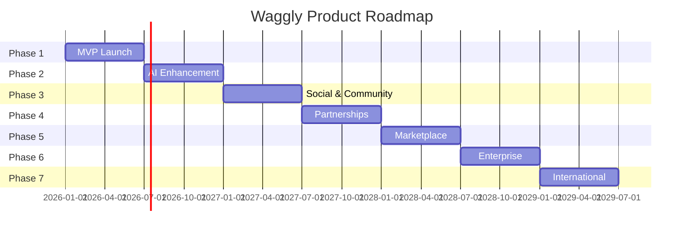

# Product Roadmap

## Overview

Waggly's product development follows a 7-phase roadmap spanning 36 months, progressing from MVP to full ecosystem with marketplace and international expansion.

---

## Roadmap Summary

---

## Phase 1: MVP Foundation (Months 1-6)
**Focus**: Core digital pet passport with AI data entry

### Features

| Feature | Priority | Status |
|---------|----------|--------|
| User registration & authentication | P0 | ✅ Built |
| Pet profile creation (4-step wizard) | P0 | ✅ Built |
| Vaccination tracking & reminders | P0 | ✅ Built |
| Treatment/medication management | P0 | ✅ Built |
| Health metrics (weight, BCS) | P0 | ✅ Built |
| Veterinary visit logging | P0 | ✅ Built |
| Document upload & storage | P0 | ✅ Built |
| Basic reminders & notifications | P0 | ✅ Built |
| Multi-pet support | P0 | ✅ Built |
| Co-owner sharing | P1 | ✅ Built |
| QR pet tag integration | P1 | 🔄 In Progress |

### Milestones
- **Month 3**: Beta launch to 500 users
- **Month 6**: Public launch, 5,000 users, 2,000 paid

### Success Metrics
- 50% trial-to-paid conversion
- NPS > 40
- < 5% monthly churn

---

## Phase 2: AI Enhancement (Months 7-12)
**Focus**: Conversational AI and intelligent features

### Features

| Feature | Priority | Description |
|---------|----------|-------------|
| OCR Document Scanning | P0 | Auto-extract data from vet documents |
| AI Health Assistant | P0 | Conversational data entry and Q&A |
| Natural Language Input | P1 | "Add vaccine from yesterday" parsing |
| Smart Reminders | P1 | AI-optimized reminder timing |
| Breed Risk Assessments | P2 | Breed-specific health predictions |
| Health Score Algorithm | P2 | 0-100 pet health score |

### Technical Requirements
- Google Cloud Vision API integration
- OpenAI/Claude LLM integration
- Edge Functions for AI processing
- Conversation history storage

### Milestones
- **Month 9**: OCR beta with 80% accuracy
- **Month 12**: AI Assistant launch, 15,000 users

### Success Metrics
- 70% of documents processed via OCR
- 50% of entries via AI conversation
- 20% reduction in data entry time

---

## Phase 3: Social & Community (Months 13-18)
**Focus**: Pet social network and community features

### Features

| Feature | Priority | Description |
|---------|----------|-------------|
| Pet Posts (photo, video, text) | P0 | Social content sharing |
| Stories (24-hour content) | P1 | Ephemeral content |
| Groups & Communities | P1 | Breed-based, location-based |
| Events & Meetups | P2 | Local pet gatherings |
| Feed Algorithm | P1 | Personalized content discovery |
| Reactions & Comments | P0 | Engagement features |
| Follow System | P0 | Pet-to-pet following |
| Lost Pet Network | P1 | Community alerts |

### Technical Requirements
- 17+ new database tables
- Real-time subscriptions (Supabase Realtime)
- Media processing pipeline
- Content moderation system

### Milestones
- **Month 15**: Social MVP (posts, follows)
- **Month 18**: Full social suite, 40,000 users

### Success Metrics
- 60% DAU/MAU ratio
- 10+ posts per user/month
- 500+ active groups

---

## Phase 4: Partnerships (Months 19-24)
**Focus**: B2B integrations and affiliate monetization

### Features

| Feature | Priority | Description |
|---------|----------|-------------|
| Affiliate Product Integration | P0 | Zooplus, Fressnapf embedded shopping |
| Pet Insurance Referrals | P0 | Commission-based insurance leads |
| Vet Clinic Partnerships | P1 | Shared access, appointment booking |
| Pet Food Subscriptions | P1 | Fresh food partner integrations |
| Pet Tech Wearables | P2 | FitBark, Whistle data sync |
| Telehealth Integration | P2 | Vet video consultations |

### Partner Pipeline
- **Tier 1**: Zooplus (4% commission), Fressnapf
- **Tier 2**: Pet insurance (€25/lead)
- **Tier 3**: Fresh food subscriptions (35% commission)

### Milestones
- **Month 21**: 5 active affiliate partners
- **Month 24**: €500K affiliate revenue run rate

### Success Metrics
- 40% users engage with affiliate products
- €20 average affiliate revenue per user/year
- 10 insurance partnerships signed

---

## Phase 5: Marketplace (Months 25-30)
**Focus**: Service provider marketplace

### Features

| Feature | Priority | Description |
|---------|----------|-------------|
| Service Provider Profiles | P0 | Verified pet service listings |
| Booking System | P0 | Appointment scheduling |
| Provider Subscriptions | P1 | €19.99-€49.99/month plans |
| Reviews & Ratings | P0 | Trust and quality signals |
| Payment Processing | P0 | Commission-based transactions |
| Provider Dashboard | P1 | Business analytics |

### Service Categories
- Pet sitting & boarding
- Dog walking
- Grooming
- Training
- Pet transportation

### Milestones
- **Month 27**: Marketplace pilot in Netherlands
- **Month 30**: 1,000 active providers

### Success Metrics
- 15-25% commission on transactions
- €1M GMV run rate
- 4.5+ average provider rating

---

## Phase 6: Enterprise (Months 31-36)
**Focus**: B2B solutions for veterinary practices and insurance

### Features

| Feature | Priority | Description |
|---------|----------|-------------|
| Vet Practice Dashboard | P0 | Patient management interface |
| EMR Integration APIs | P1 | IDEXX, ProvetCloud connections |
| Insurance Data Export | P0 | Standardized health data sharing |
| Multi-Location Support | P1 | Clinic chain management |
| Bulk Pet Import | P2 | Shelter/rescue onboarding |
| White-Label Options | P2 | Branded solutions for partners |

### Target Customers
- Veterinary clinic chains
- Pet insurance companies
- Animal shelters and rescues
- Pet retail chains

### Pricing
- **Vet Basic**: €99/month (up to 500 patients)
- **Vet Pro**: €199/month (unlimited + analytics)
- **Enterprise**: €999/month (multi-location + API)

### Milestones
- **Month 33**: 50 vet clinics onboarded
- **Month 36**: 2 insurance company integrations

---

## Phase 7: International Expansion (Months 37+)
**Focus**: Global market entry

### Expansion Markets

| Wave | Markets | Timeline |
|------|---------|----------|
| Wave 1 | France, Spain, UK | Month 37-42 |
| Wave 2 | Italy, Sweden, Norway | Month 43-48 |
| Wave 3 | US, Canada, Australia | Month 49-60 |

### Localization Requirements
- AI-powered translation (already built)
- Local payment methods
- Country-specific veterinary regulations
- Local partnership development

### Success Metrics (Per Market)
- 50,000 users within 12 months of launch
- 10 vet clinic partnerships
- 5 affiliate partner integrations

---

## Resource Requirements

### Team Scaling

| Phase | Team Size | Key Hires |
|-------|-----------|-----------|
| Phase 1-2 | 3-5 | Full-stack devs, AI engineer |
| Phase 3-4 | 8-12 | Product designer, partnerships |
| Phase 5-6 | 15-20 | Sales, customer success |
| Phase 7 | 25-35 | Regional managers |

### Funding Milestones

| Round | Amount | Timing | Purpose |
|-------|--------|--------|---------|
| Pre-Seed | €500K-€1M | Complete | MVP + launch |
| Seed | €2-5M | Month 18 | AI + Social |
| Series A | €8-15M | Month 36 | Marketplace + Enterprise |
| Series B | €30-50M | Month 48 | International |

---

## Risk Mitigation

| Risk | Mitigation |
|------|------------|
| AI accuracy issues | Fallback to manual entry, continuous training |
| Slow user adoption | Vet partnerships for warm introductions |
| Regulatory changes | Legal advisory board, compliance-first design |
| Competitive response | Speed of execution, data moat building |
| Funding gaps | Phased feature releases, profitability focus |
