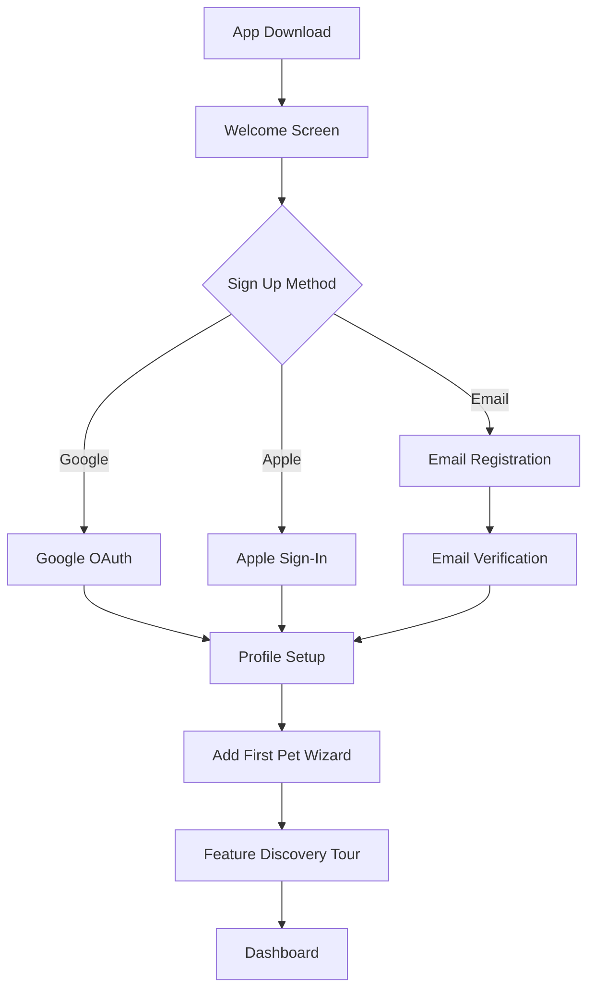

# Onboarding Flow Specification

## Overview

This document specifies the complete new user onboarding journey, from app download through first pet creation and feature discovery.

---

## Onboarding Stages



---

## Stage 1: Welcome Screen

**Purpose**: Communicate value proposition and capture user intent

### Screen Elements

| Element | Description |
|---------|-------------|
| Hero image | Happy pet with owner using app |
| Tagline | "Europe's AI-First Digital Pet Passport" |
| Value bullets | 3 key benefits with icons |
| CTA buttons | "Get Started", "I already have an account" |
| Social proof | "Trusted by 10,000+ pet owners" |

### User Actions
- Tap "Get Started" → Sign Up flow
- Tap "Login" → Login screen
- Swipe through value carousel (optional)

---

## Stage 2: Sign Up

### Email Registration Form

| Field | Type | Validation | Required |
|-------|------|------------|----------|
| Full Name | Text | 2-50 chars | Yes |
| Email | Email | Valid format, unique | Yes |
| Password | Password | 8+ chars, complexity | Yes |
| Confirm Password | Password | Must match | Yes |
| Terms checkbox | Boolean | Must be checked | Yes |

### Social Login Options

**Google OAuth**:
1. User taps "Continue with Google"
2. Google OAuth popup
3. User selects/confirms Google account
4. Redirect back with auth token
5. Skip to Profile Setup

**Apple Sign-In**:
1. User taps "Continue with Apple"
2. Native iOS Face ID/Touch ID
3. User approves permissions
4. Receive identity token
5. Skip to Profile Setup

---

## Stage 3: Email Verification

**Trigger**: User signs up with email

### Email Content

```
Subject: Verify your Waggly account 🐾

Hi [Name],

Welcome to Waggly! Please verify your email to start managing your pet's health.

[Verify Email Button]

This link expires in 24 hours.

If you didn't create this account, you can safely ignore this email.

Paws & Love,
The Waggly Team
```

### Verification States

| State | UI Display |
|-------|------------|
| Pending | "Check your inbox for verification email" |
| Resend available | "Didn't get the email? Resend" (after 60s) |
| Verified | Auto-redirect to Profile Setup |
| Expired | "Link expired. Request new verification email" |

---

## Stage 4: Profile Setup

**Purpose**: Capture essential user information for personalization

### Profile Form

| Field | Type | Options | Required |
|-------|------|---------|----------|
| Profile Photo | Image | Camera, Gallery, Skip | No |
| Display Name | Text | Pre-filled from signup | Yes |
| Country | Dropdown | EU countries | Yes |
| City | Autocomplete | Google Places | No |
| Phone (optional) | Phone | With country code | No |

### UI Design

- Single scrollable form
- Progress indicator (Step 2 of 4)
- "Skip for now" option for optional fields
- Auto-save on field completion

---

## Stage 5: Add First Pet Wizard

**Purpose**: Create the user's first pet profile with guided experience

### Wizard Steps

#### Step 1: Pet Type
- Large icon buttons: Dog, Cat, Other
- Animated selection feedback
- "Other" expands to: Rabbit, Bird, Hamster, Fish, etc.

#### Step 2: Basic Info
| Field | Type | Required |
|-------|------|----------|
| Pet Name | Text | Yes |
| Breed | Autocomplete + "Mixed" | Yes |
| Date of Birth | Date picker | Yes (can be approximate) |
| Gender | Toggle: Male/Female | Yes |
| Neutered/Spayed | Toggle | No |

#### Step 3: Photo
- Camera capture
- Gallery selection
- AI breed suggestion from photo (Phase 2)
- Skip option with placeholder avatar

#### Step 4: Health Basics (Optional)
| Field | Type | Notes |
|-------|------|-------|
| Current Weight | Number + unit | kg or lbs |
| Known Allergies | Multi-select + custom | Optional |
| Microchip Number | Text | Optional |

### Wizard UX

- Full-screen modal on mobile
- Side panel on desktop
- Step progress indicator
- Back button to previous step
- "Add later" for optional steps

---

## Stage 6: Feature Discovery Tour

**Purpose**: Introduce key features through interactive tooltips

### Tour Stops

| Stop | Target | Message |
|------|--------|---------|
| 1 | Pet Passport Card | "This is your pet's digital passport. Tap to see their complete health profile." |
| 2 | Add Button | "Quickly add vaccinations, visits, and more." |
| 3 | AI Assistant | "Ask Waggly anything about your pet's health." |
| 4 | Share Button | "Share your pet's profile with family, vets, or pet sitters." |
| 5 | Reminders | "We'll remind you when vaccinations or treatments are due." |

### Tour Behavior

- Skippable at any point
- Resumes if user exits app mid-tour
- "Show tips again" in settings
- Tooltips highlight target with overlay backdrop

---

## Completion Metrics

### Onboarding Funnel

| Stage | Target Completion |
|-------|-------------------|
| Welcome → Sign Up | 60% |
| Sign Up → Email Verified | 85% |
| Verified → Profile Complete | 90% |
| Profile → First Pet Added | 95% |
| Pet Added → Tour Completed | 70% |
| **Total Funnel** | **32% of downloads** |

### Time Targets

| Metric | Target |
|--------|--------|
| Welcome to Pet Created | < 5 minutes |
| Social login to dashboard | < 2 minutes |
| Email to first login | < 24 hours |

---

## Error Handling

| Error | User Message | Recovery |
|-------|--------------|----------|
| Email already exists | "This email is already registered. Try logging in." | Link to login |
| Weak password | "Password must be at least 8 characters with letters and numbers." | Inline validation |
| Email verification timeout | "Verification link expired. Request a new one." | Resend button |
| Network error | "Connection lost. Your progress is saved." | Retry button |

---

## A/B Testing Opportunities

1. **Welcome screen**: Test different value propositions
2. **Social login prominence**: Single button vs. multiple buttons
3. **Pet wizard length**: 3 steps vs. 4 steps
4. **Feature tour**: Interactive vs. video tutorial
5. **Optional fields**: Request during onboarding vs. post-setup prompt
