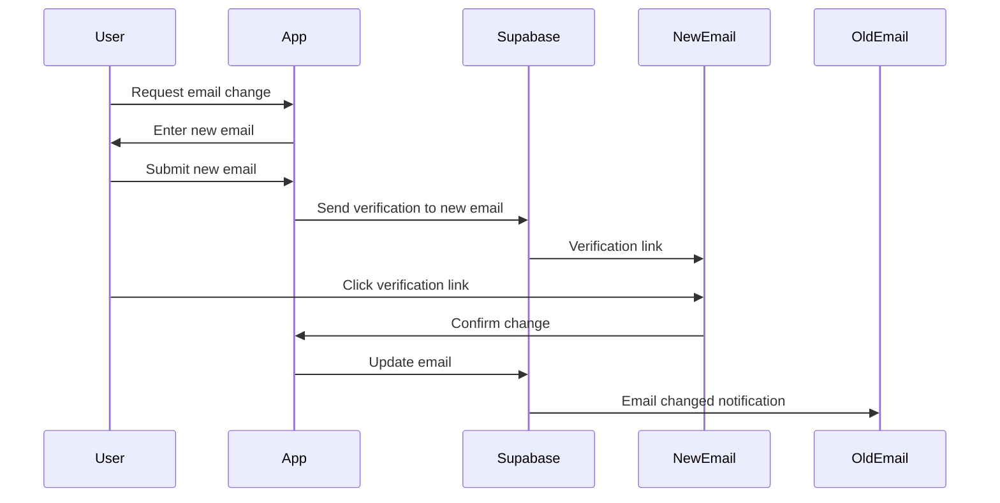
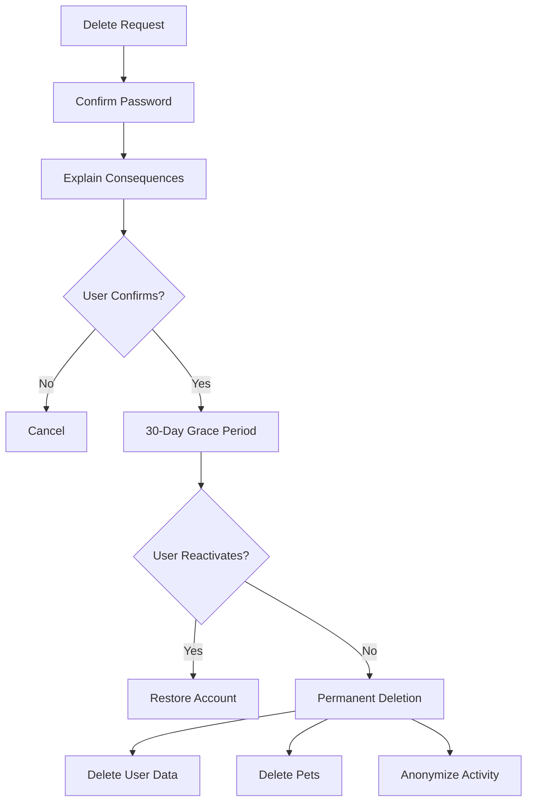

# Profile Management Specification

## Overview

This document specifies user profile management features including settings, preferences, account management, and data export.

---

## User Profile Data Model

### Core Profile Fields

| Field | Type | Editable | Display |
|-------|------|----------|---------|
| `id` | UUID | No | Hidden |
| `email` | String | Yes* | Settings only |
| `full_name` | String | Yes | Public |
| `display_name` | String | Yes | Public (if set) |
| `avatar_url` | String | Yes | Public |
| `phone` | String | Yes | Private |
| `country` | String | Yes | Public |
| `city` | String | Yes | Optional |
| `language` | String | Yes | System |
| `timezone` | String | Yes | System |
| `created_at` | Timestamp | No | Hidden |
| `updated_at` | Timestamp | No | Hidden |

*Email change requires verification

---

## Settings Categories

### 1. Account Settings

| Setting | Type | Options | Default |
|---------|------|---------|---------|
| Email | Email | Verified email | Registration email |
| Password | Password | Change password flow | - |
| Phone Number | Phone | With country code | Optional |
| Two-Factor Auth | Toggle | Enable/Disable | Disabled |
| Delete Account | Action | Permanent deletion | - |

### 2. Profile Settings

| Setting | Type | Options | Default |
|---------|------|---------|---------|
| Full Name | Text | 2-50 characters | Required |
| Display Name | Text | Optional public name | Full name |
| Profile Photo | Image | Upload or remove | Initials avatar |
| Bio | Text | Optional, 160 chars | Empty |
| Location | Autocomplete | City, Country | Optional |

### 3. Notification Preferences

| Setting | Type | Options | Default |
|---------|------|---------|---------|
| Push Notifications | Toggle | On/Off | On |
| Email Notifications | Toggle | On/Off | On |
| SMS Notifications | Toggle | On/Off | Off |
| Vaccination Reminders | Toggle | On/Off | On |
| Treatment Reminders | Toggle | On/Off | On |
| Appointment Reminders | Toggle | On/Off | On |
| Social Activity | Toggle | On/Off | On |
| Marketing Emails | Toggle | On/Off | Off |

### 4. Privacy Settings

| Setting | Type | Options | Default |
|---------|------|---------|---------|
| Profile Visibility | Select | Public/Private | Public |
| Show Location | Toggle | On/Off | Off |
| Allow Discovery | Toggle | On/Off | On |
| Share Activity | Toggle | On/Off | On |
| Data Analytics | Toggle | On/Off | On |

### 5. Appearance Settings

| Setting | Type | Options | Default |
|---------|------|---------|---------|
| Theme | Select | Light/Dark/System | System |
| Language | Select | Supported languages | Device language |
| Date Format | Select | DD/MM/YYYY, MM/DD/YYYY | Regional |
| Weight Unit | Select | kg, lbs | Regional |
| Temperature Unit | Select | °C, °F | Regional |

---

## Profile Management Features

### Email Change Flow



### Password Change Flow

**Requirements**:
- Current password required
- New password must meet complexity rules
- Confirmation password must match
- All sessions invalidated after change

### Avatar Upload

**Specifications**:
- Formats: JPEG, PNG, WebP
- Max size: 5MB
- Auto-resize to 400x400px
- Stored in Supabase Storage
- CDN delivered with cache headers

---

## Account Deletion

### GDPR-Compliant Deletion Process



### Deletion Consequences

**Immediate**:
- Account inaccessible
- Logout from all devices
- Subscriptions cancelled

**After 30 Days**:
- User record deleted
- All pets deleted
- Health records deleted
- Documents permanently removed
- Social posts anonymized ("Deleted User")
- Co-owner relationships removed

### Data Export (GDPR)

**Export Contents**:
- User profile data
- All pet profiles
- Health records
- Documents
- Activity history
- Sharing history

**Format**: JSON + ZIP with media files
**Delivery**: Download link via email (expires 7 days)

---

## Settings UI Structure

### Mobile Layout

```
Settings Screen
├── Profile Section
│   ├── Profile Photo
│   ├── Name
│   └── Edit Profile →
├── Account Section
│   ├── Email →
│   ├── Password →
│   └── Phone →
├── Notifications Section
│   ├── Push Notifications Toggle
│   ├── Email Notifications Toggle
│   └── Notification Preferences →
├── Privacy Section
│   ├── Profile Visibility →
│   └── Data & Privacy →
├── Preferences Section
│   ├── Appearance →
│   ├── Language →
│   └── Units →
├── Subscription Section
│   ├── Current Plan
│   └── Manage Subscription →
├── Support Section
│   ├── Help Center →
│   ├── Contact Support →
│   └── About →
└── Account Actions
    ├── Export Data
    ├── Logout
    └── Delete Account
```

---

## API Endpoints

### Get Profile
```
GET /api/v1/profile
Authorization: Bearer <token>

Response:
{
  "id": "uuid",
  "email": "user@example.com",
  "full_name": "John Doe",
  "avatar_url": "https://...",
  "country": "NL",
  "city": "Amsterdam",
  "preferences": {...},
  "subscription": {...}
}
```

### Update Profile
```
PATCH /api/v1/profile
Authorization: Bearer <token>
Content-Type: application/json

{
  "full_name": "John Smith",
  "city": "Rotterdam"
}
```

### Update Preferences
```
PUT /api/v1/profile/preferences
Authorization: Bearer <token>
Content-Type: application/json

{
  "theme": "dark",
  "language": "nl",
  "notifications": {
    "push": true,
    "email": true,
    "vaccination_reminders": true
  }
}
```

### Request Data Export
```
POST /api/v1/profile/export
Authorization: Bearer <token>

Response:
{
  "export_id": "uuid",
  "status": "processing",
  "estimated_time": "5 minutes"
}
```

### Delete Account
```
DELETE /api/v1/profile
Authorization: Bearer <token>
Content-Type: application/json

{
  "password": "current_password",
  "confirmation": "DELETE MY ACCOUNT"
}
```
