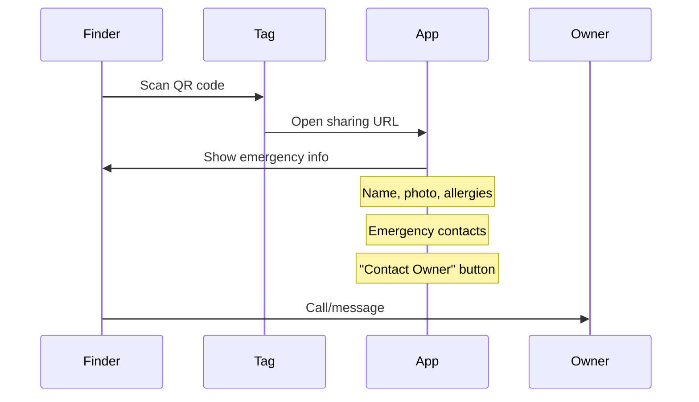

# Pet Identification Specification

## Overview

This document specifies all pet identification methods supported by Waggly, including microchips, tattoos, registration numbers, and EU pet passport compliance.

---

## Microchip Identification

### Supported Formats

| Format | Length | Standard | Region |
|--------|--------|----------|--------|
| ISO 11784/11785 | 15 digits | International | Global |
| AVID | 9 digits | Legacy | US |
| HomeAgain | 10 digits | Legacy | US |
| Trovan | 10 digits | Legacy | EU |

### Microchip Data Fields

| Field | Type | Validation | Required |
|-------|------|------------|----------|
| `microchip_number` | String | 9-15 digits | No |
| `microchip_date` | Date | After DOB, before today | No |
| `microchip_location` | Enum | neck, shoulder, back, other | No |
| `microchip_brand` | String | Free text | No |
| `microchip_registry` | String | Registry name | No |
| `is_registered` | Boolean | true/false | No |

### Microchip Registries (EU)

| Country | Registry | Website |
|---------|----------|---------|
| Netherlands | Chipnummer.nl | chipnummer.nl |
| Germany | TASSO | tasso.net |
| Belgium | DogID | dogid.be |
| Austria | Animal Data | animaldata.com |
| France | I-CAD | i-cad.fr |
| UK | Petlog | petlog.org.uk |

### UI Components

**Microchip Entry Field**:
- Auto-format with spaces every 5 digits
- Validation feedback (green check / red error)
- "Look up" button to verify in registry (future)
- Scanner integration (Phase 3)

---

## Tattoo Identification

### Tattoo Data Fields

| Field | Type | Validation | Required |
|-------|------|------------|----------|
| `tattoo_id` | String | 3-15 alphanumeric | No |
| `tattoo_location` | Enum | ear, inner_thigh, abdomen | No |
| `tattoo_date` | Date | After DOB | No |
| `tattoo_registry` | String | Registry name | No |

### Common Tattoo Formats

| Country | Format | Example |
|---------|--------|---------|
| France | 3 letters + 3 numbers | ABC123 |
| Germany | Club code + number | VDH12345 |
| Belgium | 3 letters + 4 numbers | AAA1234 |

---

## Registration Numbers

### Breed Registry Data

| Field | Type | Validation | Required |
|-------|------|------------|----------|
| `registration_number` | String | Registry format | No |
| `registration_type` | Enum | kennel_club, breed_club, other | No |
| `registration_name` | String | Registered name | No |
| `breeder_prefix` | String | Kennel prefix | No |
| `registration_date` | Date | After DOB | No |
| `registry_name` | String | FCI, AKC, KC, etc. | No |

### Major Registries

| Registry | Abbreviation | Region |
|----------|--------------|--------|
| Fédération Cynologique Internationale | FCI | International |
| The Kennel Club | KC | UK |
| American Kennel Club | AKC | USA |
| Nederlandse Rasshonden Code | NHSB | Netherlands |
| Verband für das Deutsche Hundewesen | VDH | Germany |
| Cat Fanciers' Association | CFA | International |
| The International Cat Association | TICA | International |

---

## EU Pet Passport

### Overview

The EU Pet Passport is a legal document required for travel with pets (dogs, cats, ferrets) within the European Union.

### Passport Data Fields

| Field | Type | Validation | Required |
|-------|------|------------|----------|
| `passport_number` | String | Country code + numbers | Travel |
| `passport_issue_date` | Date | Past date | Travel |
| `passport_issue_country` | String | EU country code | Travel |
| `issuing_vet` | String | Vet name and license | Travel |
| `issuing_clinic` | String | Clinic name and address | Travel |

### Passport Number Formats

| Country | Format | Example |
|---------|--------|---------|
| Netherlands | NL + 8 digits | NL12345678 |
| Germany | DE + 15 digits | DE123456789012345 |
| Belgium | BE + 15 digits | BE123456789012345 |
| France | FR + 15 digits | FR123456789012345 |

### Passport Sections

1. **Owner Information**: Name, address, contact
2. **Pet Description**: Species, breed, sex, color, markings
3. **Identification**: Microchip number, date, location
4. **Rabies Vaccination**: Required, must be valid for travel
5. **Other Vaccinations**: Optional documentation
6. **Parasite Treatment**: Required for some destinations
7. **Clinical Examination**: Health certificate section
8. **Veterinary Notes**: Additional entries

---

## Digital ID Card

### QR Code Content

```json
{
  "version": 1,
  "pet_id": "uuid",
  "name": "Max",
  "species": "dog",
  "breed": "Golden Retriever",
  "microchip": "123456789012345",
  "emergency_contacts": [
    {"name": "Sarah", "phone": "+31612345678"}
  ],
  "allergies": ["Chicken"],
  "owner_name": "Sarah Smith",
  "sharing_url": "https://wag.gl/p/abc123"
}
```

### Physical QR Tag

**Product Specifications**:
| Attribute | Value |
|-----------|-------|
| Material | Anodized aluminum |
| Diameter | 30mm |
| Thickness | 2mm |
| Weight | 8g |
| QR Code | Laser engraved |
| Price | €14.99 |

### Emergency Access Flow



---

## Validation Rules

### Microchip Validation

```typescript
function validateMicrochip(number: string): ValidationResult {
  // Remove spaces and dashes
  const clean = number.replace(/[\s-]/g, '');
  
  // Check length
  if (![9, 10, 15].includes(clean.length)) {
    return { valid: false, error: 'Invalid microchip length' };
  }
  
  // Check digits only
  if (!/^\d+$/.test(clean)) {
    return { valid: false, error: 'Microchip must contain only numbers' };
  }
  
  // ISO 15-digit checksum validation
  if (clean.length === 15) {
    // Country code check (first 3 digits)
    const countryCode = clean.substring(0, 3);
    // Additional validation...
  }
  
  return { valid: true };
}
```

### Passport Number Validation

```typescript
function validatePassportNumber(number: string, country: string): ValidationResult {
  const formats: Record<string, RegExp> = {
    'NL': /^NL\d{8}$/,
    'DE': /^DE\d{15}$/,
    'BE': /^BE\d{15}$/,
    'FR': /^FR\d{15}$/,
    'AT': /^AT\d{15}$/,
  };
  
  const pattern = formats[country];
  if (!pattern) {
    return { valid: false, error: 'Unknown country code' };
  }
  
  if (!pattern.test(number)) {
    return { valid: false, error: 'Invalid passport number format' };
  }
  
  return { valid: true };
}
```
