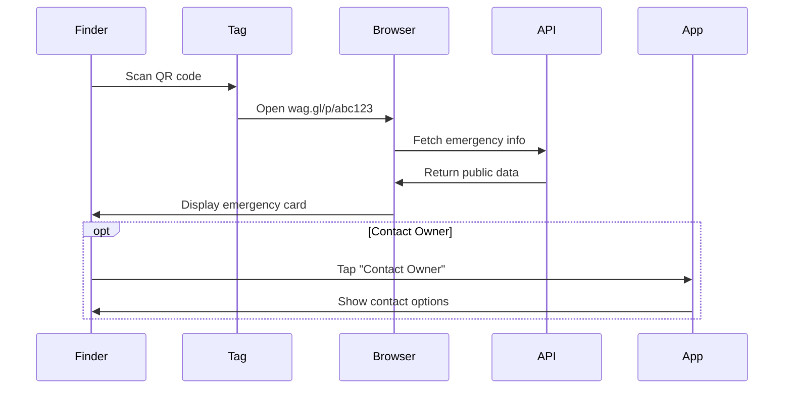

# Pet Card Specification

## Overview

Digital and physical pet cards provide portable pet identification with QR codes for emergency access.

---

## Digital Pet Card

### Card Elements

| Element | Content | Position |
|---------|---------|----------|
| Pet Photo | Circular avatar | Top left |
| Pet Name | Large text | Top center |
| Breed | Subtitle | Below name |
| Age | Calculated | Below breed |
| Microchip | Icon + number | Middle |
| QR Code | Sharing link | Right side |
| Owner Name | Small text | Bottom |

### Card Sizes

| Size | Dimensions | Use Case |
|------|------------|----------|
| Mini | 160x80px | Dashboard widget |
| Standard | 300x180px | Profile header |
| Full | 400x250px | Sharing/export |
| Print | 85.6x54mm | Physical card |

### Export Formats
- PNG (high-res)
- PDF (print-ready)
- Apple Wallet (future)
- Google Wallet (future)

---

## Physical QR Pet Tag

### Product Specifications

| Attribute | Value |
|-----------|-------|
| Material | Anodized aluminum |
| Shape | Circle |
| Diameter | 30mm |
| Thickness | 2mm |
| Weight | 8g |
| QR Code | Laser engraved |
| Ring | Stainless steel, 15mm |
| Price | €14.99 |
| Margin | 70% |

### Customization Options

| Option | Choices | Extra Cost |
|--------|---------|------------|
| Color | Silver, Black, Gold, Rose Gold, Blue | Included |
| Engraving | Pet name (back) | Free |
| Size | Small (25mm), Standard (30mm), Large (35mm) | Included |

---

## QR Code Functionality

### Encoded Data

```json
{
  "v": 1,
  "t": "pet",
  "id": "abc123",
  "url": "https://wag.gl/p/abc123"
}
```

### Scan Flow



### Emergency Card Display

| Section | Content |
|---------|---------|
| Header | "Lost Pet Found!" |
| Photo | Large pet photo |
| Name | Pet name in large text |
| Breed/Age | Basic info |
| Allergies | ⚠️ Allergy warnings |
| Medical | Critical conditions |
| Contact | "Contact Owner" button |
| Vet | "Call Vet" button |

---

## Database Schema

```sql
CREATE TABLE pet_cards (
  id UUID PRIMARY KEY DEFAULT gen_random_uuid(),
  pet_id UUID REFERENCES pets(id) ON DELETE CASCADE,
  card_type TEXT NOT NULL CHECK (card_type IN ('digital', 'physical')),
  token TEXT UNIQUE NOT NULL DEFAULT gen_random_uuid()::text,
  
  -- Physical tag details
  tag_id TEXT UNIQUE, -- Manufacturer serial
  tag_color TEXT,
  tag_size TEXT,
  tag_ordered_at TIMESTAMP,
  tag_shipped_at TIMESTAMP,
  tag_tracking_number TEXT,
  
  -- URLs
  short_url TEXT UNIQUE, -- wag.gl/p/abc123
  qr_code_url TEXT,
  
  -- Settings
  show_allergies BOOLEAN DEFAULT true,
  show_medical BOOLEAN DEFAULT true,
  show_contact BOOLEAN DEFAULT true,
  show_vet BOOLEAN DEFAULT true,
  
  -- Status
  is_active BOOLEAN DEFAULT true,
  created_at TIMESTAMP DEFAULT NOW(),
  updated_at TIMESTAMP DEFAULT NOW()
);

CREATE TABLE pet_card_scans (
  id UUID PRIMARY KEY DEFAULT gen_random_uuid(),
  card_id UUID REFERENCES pet_cards(id) ON DELETE CASCADE,
  scanned_at TIMESTAMP DEFAULT NOW(),
  ip_address INET,
  user_agent TEXT,
  location_lat DECIMAL(9,6),
  location_lng DECIMAL(9,6),
  location_city TEXT,
  location_country TEXT
);
```
