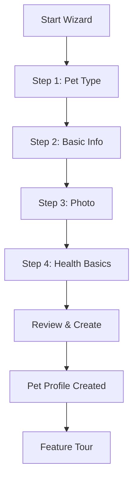

# Pet Registration - Product Requirements Document

## Overview

This PRD defines the pet registration wizard, a 4-step guided flow for creating a new pet profile in the Waggly platform.

---

## User Stories

```gherkin
Feature: Pet Registration

Scenario: Add first pet
  As a new user
  I want to add my first pet through a guided wizard
  So that I can start building their health passport

Scenario: Add additional pet
  As an existing user with pets
  I want to add another pet to my account
  So that I can manage all my pets in one place

Scenario: Quick pet creation
  As a busy user
  I want to add a pet with minimal required information
  So that I can complete registration quickly and add details later

Scenario: Complete pet profile
  As a thorough user
  I want to enter all available pet information during registration
  So that my pet's profile is complete from the start

Scenario: Skip optional steps
  As a user
  I want to skip optional information during registration
  So that I can complete the process faster
```

---

## Wizard Flow



---

## Step 1: Pet Type Selection

### UI Elements

| Element | Type | Description |
|---------|------|-------------|
| Header | Text | "What type of pet do you have?" |
| Pet type buttons | Large icons | Dog, Cat, Rabbit, Bird, Other |
| Selection feedback | Animation | Bounce/highlight on selection |
| Other expansion | Dropdown | Additional pet types |

### Pet Types

| Type | Icon | Status | Notes |
|------|------|--------|-------|
| Dog 🐕 | Large button | Active | Most common |
| Cat 🐱 | Large button | Active | Second most common |
| Rabbit 🐰 | Large button | Active | Popular in EU |
| Bird 🐦 | Dropdown | Active | Limited features |
| Hamster 🐹 | Dropdown | Active | Limited features |
| Fish 🐟 | Dropdown | Planned | Basic tracking only |
| Reptile 🦎 | Dropdown | Planned | Basic tracking only |
| Other | Dropdown | Active | Custom entry |

### Validation
- One pet type must be selected
- "Other" requires species specification

---

## Step 2: Basic Information

### Required Fields

| Field | Type | Validation | Notes |
|-------|------|------------|-------|
| Name | Text | 1-50 chars, no special chars | Pet's name |
| Breed | Autocomplete | From breed database | "Mixed/Unknown" option |
| Date of Birth | Date picker | Past date, max 50 years ago | Can mark as "approximate" |
| Gender | Toggle | Male/Female | Required |

### Optional Fields (Collapsed by Default)

| Field | Type | Validation | Notes |
|-------|------|------------|-------|
| Secondary Breed | Autocomplete | From breed database | For mixed breeds |
| Neutered/Spayed | Toggle | Yes/No | Defaults to null |
| Color | Dropdown | Color options | Primary color |
| Microchip Number | Text | 15-digit format | Optional |

### Breed Autocomplete

```typescript
// Breed search behavior
interface BreedSearch {
  query: string;           // User input
  petType: 'dog' | 'cat' | 'rabbit' | 'other';
  results: Breed[];        // Filtered breeds
  showMixed: boolean;      // Always include "Mixed" option
  maxResults: 10;          // Limit for performance
}
```

### Date of Birth Options
- **Full date**: Exact birthday known
- **Month/Year**: Approximate, day unknown
- **Year only**: Very approximate
- **"I don't know"**: Calculate from age estimate

---

## Step 3: Photo Upload

### UI Elements

| Element | Action | Notes |
|---------|--------|-------|
| Camera button | Open device camera | Primary action |
| Gallery button | Open photo picker | Secondary action |
| Skip button | Continue without photo | Shows placeholder |
| Photo preview | Circular crop | 300x300px display |
| Retake button | Replace photo | Available after upload |

### Photo Specifications

| Attribute | Requirement |
|-----------|-------------|
| Formats | JPEG, PNG, HEIC, WebP |
| Max size | 10MB upload |
| Processing | Auto-resize to 800x800 |
| Storage | Supabase Storage bucket |
| CDN | Auto-cached delivery |

### AI Features (Phase 2)
- Breed detection from photo
- Age estimation
- Color identification
- "Is this a [breed]?" confirmation

---

## Step 4: Health Basics (Optional)

### Fields

| Field | Type | Validation | Required |
|-------|------|------------|----------|
| Current Weight | Number | 0.1-200 kg | Optional |
| Weight Unit | Toggle | kg/lbs | Default: regional |
| Known Allergies | Multi-select | Predefined + custom | Optional |
| Known Conditions | Multi-select | Predefined + custom | Optional |
| Vet Clinic | Autocomplete | Google Places | Optional |

### Allergy Options

```typescript
const allergyOptions = [
  // Food allergies
  'Chicken', 'Beef', 'Pork', 'Fish', 'Dairy', 'Wheat', 'Corn', 'Soy',
  // Environmental
  'Pollen', 'Dust mites', 'Mold', 'Grass',
  // Medication
  'Penicillin', 'NSAIDs',
  // Other
  'Other (specify)'
];
```

### Condition Options

```typescript
const conditionOptions = [
  'Diabetes', 'Heart disease', 'Epilepsy', 'Arthritis',
  'Hip dysplasia', 'Kidney disease', 'Cancer', 'Blindness',
  'Deafness', 'Anxiety', 'Other (specify)'
];
```

---

## Review & Create

### Summary Display

| Section | Content |
|---------|---------|
| Photo | Circular photo or placeholder |
| Basic Info | Name, breed, age, gender |
| Health | Weight, allergies, conditions (if entered) |
| Edit links | Per-section edit buttons |

### Actions
- **Create Pet**: Submit and create profile
- **Go Back**: Return to previous step
- **Edit [Section]**: Jump to specific step

### Post-Creation
1. Show success animation
2. Navigate to new pet profile
3. Start feature discovery tour (first pet only)

---

## Technical Specifications

### Form State Management

```typescript
interface PetRegistrationState {
  step: 1 | 2 | 3 | 4;
  petType: PetType | null;
  basicInfo: {
    name: string;
    breedId: string | null;
    breedName: string;
    secondaryBreedId: string | null;
    dateOfBirth: Date | null;
    dateOfBirthApproximate: boolean;
    gender: 'male' | 'female' | null;
    isNeutered: boolean | null;
    color: string | null;
    microchipNumber: string | null;
  };
  photo: {
    uri: string | null;
    uploaded: boolean;
  };
  healthBasics: {
    weight: number | null;
    weightUnit: 'kg' | 'lbs';
    allergies: string[];
    conditions: string[];
    vetClinic: VetClinic | null;
  };
}
```

### API Endpoint

```
POST /api/v1/pets
Authorization: Bearer <token>
Content-Type: multipart/form-data

{
  "pet_type": "dog",
  "name": "Max",
  "breed_id": "uuid",
  "date_of_birth": "2020-05-15",
  "date_of_birth_approximate": false,
  "gender": "male",
  "is_neutered": true,
  "color": "golden",
  "microchip_number": "123456789012345",
  "photo": <file>,
  "weight_kg": 28.5,
  "allergies": ["Chicken", "Wheat"],
  "conditions": [],
  "vet_clinic_id": "google-place-id"
}

Response: 201 Created
{
  "id": "pet-uuid",
  "name": "Max",
  "profile_url": "/pets/pet-uuid",
  ...
}
```

---

## Acceptance Criteria

### Step 1: Pet Type
- [ ] All pet type buttons are tappable
- [ ] Clear visual feedback on selection
- [ ] "Other" expands to show additional options
- [ ] Cannot proceed without selection

### Step 2: Basic Info
- [ ] Name field validates on blur
- [ ] Breed autocomplete shows results within 300ms
- [ ] Date picker prevents future dates
- [ ] Gender toggle is required
- [ ] Optional fields are collapsible

### Step 3: Photo
- [ ] Camera opens on button tap
- [ ] Gallery picker allows image selection
- [ ] Photo is cropped to square
- [ ] Skip option is clearly available
- [ ] Photo uploads in background

### Step 4: Health Basics
- [ ] Weight field accepts decimal
- [ ] Unit toggle works correctly
- [ ] Multi-select allows custom entries
- [ ] Entire step is skippable

### Overall Wizard
- [ ] Progress indicator shows current step
- [ ] Back button returns to previous step
- [ ] Form state persists across steps
- [ ] Form state survives app background
- [ ] Wizard completes in < 3 minutes

---

## Metrics

| Metric | Target |
|--------|--------|
| Wizard completion rate | > 90% |
| Average completion time | < 3 minutes |
| Photo upload rate | > 70% |
| Health basics completion | > 40% |
| Error rate | < 2% |
