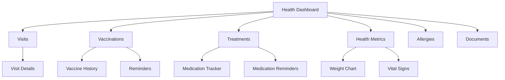

# Health Management System - Product Requirements Document

## Overview

The health management system is the core feature of Waggly, enabling comprehensive tracking of veterinary care, vaccinations, treatments, and health metrics.

---

## User Stories

```gherkin
Feature: Health Management

Scenario: Log vet visit
  As a pet owner
  I want to log details of my pet's vet visit
  So that I have a complete record of their care history

Scenario: Track vaccinations
  As a pet owner
  I want to record my pet's vaccinations with due dates
  So that I never miss a booster

Scenario: Manage medications
  As a pet owner
  I want to track my pet's medications and dosages
  So that I can ensure proper treatment adherence

Scenario: Monitor health metrics
  As a pet owner
  I want to track my pet's weight and vital signs
  So that I can detect health changes early

Scenario: Document allergies
  As a pet owner
  I want to document my pet's allergies
  So that vets and caregivers are aware of them

Scenario: Receive reminders
  As a pet owner
  I want to receive notifications for upcoming vaccinations and medications
  So that I don't miss important health tasks
```

---

## System Components



---

## Health Records Types

| Record Type | Purpose | Frequency |
|-------------|---------|-----------|
| Veterinary Visit | Document vet consultations | Per visit |
| Vaccination | Track immunizations | Per vaccine |
| Treatment | Medications, therapies | Ongoing |
| Health Metric | Weight, vitals | Weekly-monthly |
| Allergy | Document sensitivities | As discovered |
| Condition | Chronic conditions | As diagnosed |
| Surgery | Surgical procedures | Per event |

---

## Data Entry Methods

### Manual Entry
- Form-based input with validation
- Quick-add buttons for common actions
- Templates for recurring entries

### AI-Powered Entry (Phase 2)
- **OCR Scanning**: Extract data from vet documents
- **Conversational AI**: "Add Max's rabies vaccine from yesterday"
- **Voice Input**: Dictate health notes

### Integration (Phase 4+)
- **Vet Clinic Sync**: Direct record import
- **Wearable Devices**: Activity, heart rate data
- **Lab Imports**: Test result integration

---

## Health Score Algorithm

### Score Components (0-100)

| Component | Weight | Factors |
|-----------|--------|---------|
| Vaccination Status | 30% | Up-to-date, overdue, missing |
| Body Condition | 20% | BCS score, weight trend |
| Recent Vet Visits | 15% | Regular checkups |
| Medication Adherence | 15% | Active treatments followed |
| Age Factor | 10% | Life stage adjustments |
| Breed Risks | 10% | Predisposition management |

### Score Calculation

```typescript
function calculateHealthScore(pet: Pet): number {
  const vaccinationScore = getVaccinationScore(pet); // 0-100
  const bodyConditionScore = getBodyConditionScore(pet); // 0-100
  const vetVisitScore = getVetVisitScore(pet); // 0-100
  const medicationScore = getMedicationAdherenceScore(pet); // 0-100
  const ageFactorScore = getAgeFactorScore(pet); // 0-100
  const breedRiskScore = getBreedRiskScore(pet); // 0-100
  
  return Math.round(
    vaccinationScore * 0.30 +
    bodyConditionScore * 0.20 +
    vetVisitScore * 0.15 +
    medicationScore * 0.15 +
    ageFactorScore * 0.10 +
    breedRiskScore * 0.10
  );
}
```

### Score Display

| Range | Label | Color | Icon |
|-------|-------|-------|------|
| 90-100 | Excellent | Green | ✅ |
| 75-89 | Good | Light Green | 👍 |
| 60-74 | Fair | Yellow | ⚠️ |
| 40-59 | Needs Attention | Orange | ⚡ |
| 0-39 | Critical | Red | 🚨 |

---

## Timeline & Activity Feed

### Event Types

| Event | Icon | Color |
|-------|------|-------|
| Vet Visit | 🏥 | Blue |
| Vaccination | 💉 | Green |
| Medication Started | 💊 | Purple |
| Medication Ended | ✓ | Gray |
| Weight Recorded | ⚖️ | Teal |
| Allergy Added | ⚠️ | Orange |
| Document Uploaded | 📄 | Gray |
| Note Added | 📝 | Light Blue |

### Timeline Display

```typescript
interface TimelineEvent {
  id: string;
  type: EventType;
  title: string;
  description?: string;
  date: Date;
  pet: PetSummary;
  metadata?: Record<string, any>;
  attachments?: Attachment[];
}
```

---

## Quick Actions

| Action | Button | Dialog |
|--------|--------|--------|
| Add Vaccination | 💉 | VaccinationFormModal |
| Log Visit | 🏥 | VisitFormModal |
| Add Treatment | 💊 | TreatmentFormModal |
| Record Weight | ⚖️ | WeightFormModal |
| Upload Document | 📄 | DocumentUploadModal |
| Add Note | 📝 | NoteFormModal |

---

## Notifications & Reminders

### Reminder Types

| Type | Timing | Channel |
|------|--------|---------|
| Vaccination Due | 2 weeks, 1 week, 1 day before | Push, Email |
| Vaccination Overdue | Day of, 1 week after | Push, Email |
| Medication Time | User-set times | Push |
| Vet Checkup | 6 months, 1 year since last | Email |
| Weight Check | Monthly | Push |

### Smart Reminder Features
- Snooze options (1 hour, tomorrow, 1 week)
- Bulk actions for multi-pet households
- Calendar integration
- Co-owner notifications

---

## Success Metrics

| Metric | Target | Measurement |
|--------|--------|-------------|
| Records per pet/year | 12+ | Database count |
| Vaccination compliance | 90%+ | Due vs completed |
| Reminder engagement | 70%+ | Open rate |
| Data entry completion | 85%+ | Required fields |
| Health score accuracy | User satisfaction | Surveys |
