# Travel Compliance - Product Requirements Document

## Overview

This document specifies EU pet travel requirements, document compliance checking, and travel preparation features.

---

## EU Pet Travel Regulations

### REGULATION (EU) No 576/2013

Pets (dogs, cats, ferrets) traveling within the EU must have:

| Requirement | Details | Waggly Feature |
|-------------|---------|----------------|
| **Microchip** | ISO 11784/11785 compliant, 15-digit | Microchip tracking |
| **Rabies Vaccination** | Valid before travel, 21-day wait | Vaccination tracking |
| **EU Pet Passport** | Issued by authorized vet | Passport document |
| **Anti-Parasite Treatment** | For certain countries (UK, Ireland) | Treatment reminder |

---

## Country-Specific Requirements

### Group 1: Standard EU Rules
*Germany, France, Belgium, Netherlands, Austria, Spain, Italy, etc.*

| Requirement | Status |
|-------------|--------|
| Microchip | Required |
| Rabies vaccine | 21+ days before travel |
| EU Pet Passport | Required |
| Parasite treatment | Not required |

### Group 2: Enhanced Requirements
*UK, Ireland, Malta, Finland, Norway*

| Requirement | Details |
|-------------|---------|
| All Group 1 requirements | ✓ |
| Tapeworm treatment | 1-5 days before entry |
| Veterinary attestation | For non-EU countries |

### Group 3: High-Risk Countries
*Countries with high rabies incidence*

| Requirement | Details |
|-------------|---------|
| Rabies titer test | Blood test showing 0.5 IU/ml+ |
| 3-month waiting period | After successful titer test |
| Import permit | Country-specific |

---

## Non-EU Countries

### United Kingdom (Post-Brexit)

```typescript
interface UKTravelRequirements {
  microchip: {
    required: true;
    standard: 'ISO 11784/11785';
    implantedBefore: 'rabies_vaccination';
  };
  rabiesVaccination: {
    required: true;
    minimumAge: 12; // weeks
    waitPeriod: 21; // days after primary vaccination
  };
  tapewormTreatment: {
    required: true;
    timing: '1-5 days before UK entry';
    vetAdministered: true;
    productType: 'praziquantel';
  };
  animalHealthCertificate: {
    required: true;
    validFor: 10; // days
    issuedBy: 'authorized_vet';
  };
}
```

### United States

| Requirement | Details |
|-------------|---------|
| Rabies vaccination | Varies by state |
| Health certificate | Within 10 days of travel |
| Import permit | Some states require |
| CDC requirements | Valid for dogs |

### Australia / New Zealand

| Requirement | Details |
|-------------|---------|
| Import permit | Mandatory |
| Quarantine | 10+ days required |
| Titer test | Required |
| Tick/flea treatment | Required |
| Extensive waiting period | 6+ months advance planning |

---

## Travel Compliance Checker

### Feature Flow

```mermaid
flowchart TD
    A[Select Pet] --> B[Enter Destination]
    B --> C[Enter Travel Date]
    C --> D[Check Requirements]
    D --> E{All Met?}
    E -->|Yes| F[Travel Ready ✅]
    E -->|No| G[Show Missing Items]
    G --> H[Create Action Plan]
    H --> I[Set Reminders]
```



### Compliance Check API

```typescript
interface TravelCheckRequest {
  pet_id: string;
  destination_country: string;
  travel_date: Date;
  return_date?: Date;
  travel_type: 'temporary' | 'permanent';
}

interface TravelCheckResponse {
  status: 'ready' | 'action_required' | 'not_possible';
  requirements: Requirement[];
  missing: MissingRequirement[];
  timeline: TimelineAction[];
  estimated_preparation: number; // days
  warnings: Warning[];
}

interface Requirement {
  id: string;
  name: string;
  status: 'met' | 'pending' | 'missing' | 'expired';
  details: string;
  completion_date?: Date;
  expiry_date?: Date;
}

interface MissingRequirement {
  requirement_id: string;
  name: string;
  description: string;
  action_needed: string;
  earliest_completion: Date;
  deadline: Date;
  blocking: boolean;
}

interface TimelineAction {
  date: Date;
  action: string;
  requirement_id: string;
  notes?: string;
}
```

---

## UI Components

### Travel Compliance Dashboard

```
┌─────────────────────────────────────────┐
│ 🛫 Travel Planning for Max              │
├─────────────────────────────────────────┤
│ Destination: United Kingdom 🇬🇧          │
│ Travel Date: March 15, 2024             │
│ Status: ⚠️ Action Required               │
├─────────────────────────────────────────┤
│ ┌─ Requirements ──────────────────────┐ │
│ │ ✅ Microchip (123456789012345)      │ │
│ │    Implanted: Jan 5, 2022           │ │
│ │                                     │ │
│ │ ✅ Rabies Vaccination               │ │
│ │    Given: Feb 1, 2024               │ │
│ │    Valid for travel: Feb 22, 2024   │ │
│ │                                     │ │
│ │ ⚠️ Tapeworm Treatment               │ │
│ │    Required 1-5 days before entry   │ │
│ │    Schedule: March 10-14, 2024      │ │
│ │    [Schedule Treatment]             │ │
│ │                                     │ │
│ │ ❌ Health Certificate               │ │
│ │    Not yet obtained                 │ │
│ │    Valid from: March 5, 2024        │ │
│ │    [Find Authorized Vet]            │ │
│ └─────────────────────────────────────┘ │
├─────────────────────────────────────────┤
│ 📅 Your Travel Preparation Timeline    │
│ ─────────────────────────────────────── │
│ Mar 5  : Get health certificate        │
│ Mar 10 : Window opens for tapeworm tx  │
│ Mar 14 : Latest date for tapeworm tx   │
│ Mar 15 : Travel date ✈️                 │
├─────────────────────────────────────────┤
│ [Export Checklist]  [Set All Reminders] │
└─────────────────────────────────────────┘
```

---

## Vaccine Requirements Matrix

| Destination | Rabies | Wait | Titer | Tapeworm | Certificate |
|-------------|:------:|:----:|:-----:|:--------:|:-----------:|
| EU Standard | ✓ | 21d | - | - | Passport |
| UK | ✓ | 21d | - | ✓ | AHC |
| Ireland | ✓ | 21d | - | ✓ | AHC |
| Finland | ✓ | 21d | - | ✓ | Passport |
| Norway | ✓ | 21d | - | ✓ | Certificate |
| USA | ✓ | Varies | - | - | Health cert |
| Australia | ✓ | - | ✓ | ✓ | Import permit |

---

## Database Schema

```sql
CREATE TABLE travel_requirements (
  id UUID PRIMARY KEY DEFAULT gen_random_uuid(),
  country_code CHAR(2) NOT NULL,
  country_name VARCHAR(100) NOT NULL,
  requirement_group VARCHAR(50), -- 'standard_eu', 'enhanced', 'high_risk'
  
  -- Core requirements
  microchip_required BOOLEAN DEFAULT true,
  rabies_required BOOLEAN DEFAULT true,
  rabies_wait_days INTEGER DEFAULT 21,
  titer_test_required BOOLEAN DEFAULT false,
  titer_wait_months INTEGER,
  tapeworm_required BOOLEAN DEFAULT false,
  tapeworm_timing VARCHAR(100),
  
  -- Documentation
  passport_accepted BOOLEAN,
  health_cert_required BOOLEAN,
  health_cert_validity_days INTEGER,
  import_permit_required BOOLEAN,
  quarantine_required BOOLEAN,
  quarantine_days INTEGER,
  
  -- Additional
  pet_types TEXT[] DEFAULT ARRAY['dog', 'cat', 'ferret'],
  max_pets_per_person INTEGER DEFAULT 5,
  additional_requirements JSONB,
  notes TEXT,
  
  last_updated DATE DEFAULT CURRENT_DATE,
  source_url TEXT
);

CREATE TABLE travel_plans (
  id UUID PRIMARY KEY DEFAULT gen_random_uuid(),
  pet_id UUID REFERENCES pets(id) ON DELETE CASCADE,
  user_id UUID REFERENCES users(id),
  destination_country CHAR(2) NOT NULL,
  travel_date DATE NOT NULL,
  return_date DATE,
  travel_type VARCHAR(20) CHECK (travel_type IN ('temporary', 'permanent', 'transit')),
  status VARCHAR(20) CHECK (status IN ('planning', 'ready', 'completed', 'cancelled')),
  compliance_check_result JSONB,
  created_at TIMESTAMP DEFAULT NOW(),
  updated_at TIMESTAMP DEFAULT NOW()
);
```

---

## Reminders & Notifications

| Timing | Notification |
|--------|--------------|
| 3 months before | Start travel planning if titer needed |
| 6 weeks before | Schedule rabies vaccine if needed |
| 3 weeks before | Rabies wait period check |
| 2 weeks before | Schedule health certificate appointment |
| 1 week before | Tapeworm treatment window opens |
| 1 day before | Final checklist review |

---

## Success Metrics

| Metric | Target |
|--------|--------|
| Compliance check accuracy | 100% |
| User travel plans created | 20% of users |
| Successful travel completion | 95% |
| Requirements database coverage | 50+ countries |
