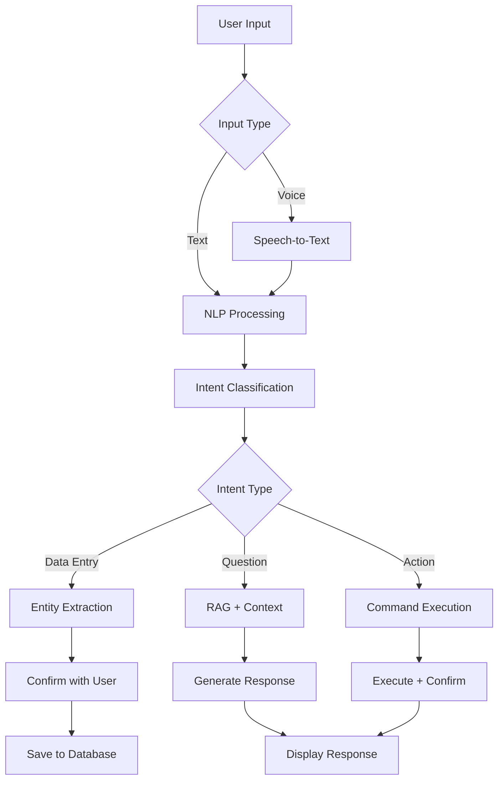

# AI Health Assistant - Product Requirements Document

## Vision

A conversational AI that makes pet health management effortless through natural conversation.

---

## User Stories

```gherkin
Feature: AI Health Assistant

Scenario: Log via conversation
  As a pet owner
  I want to tell the AI about my vet visit
  So that records are created without manual form filling

Scenario: Ask health questions
  As a pet owner
  I want to ask questions about my pet's health
  So that I get informed guidance

Scenario: Voice input
  As a pet owner
  I want to dictate health notes while walking
  So that I can record information hands-free

Scenario: Get reminders context
  As a pet owner
  I want to ask "when is Max's next vaccine?"
  So that I get a quick answer
```

---

## Conversation Examples

### Logging a Vet Visit

**User**: "We just got back from the vet. Max had his annual checkup and got his rabies vaccine."

**AI**: I'll log that for you! 📝

✅ **Vet Visit** - Annual Checkup
📅 Today, [Current Date]
💉 **Vaccination** - Rabies

A few quick questions:
1. Which clinic did you visit?
2. Was everything okay with the checkup?

**User**: "AniCura Amsterdam. Everything was great, healthy weight."

**AI**: Perfect! I've added:

✅ **Vet Visit** logged
- Clinic: AniCura Amsterdam
- Type: Annual checkup
- Notes: Healthy weight

✅ **Rabies Vaccination** logged
- Next due: [Date + 1 year]

Anything else to add?

---

### Health Question

**User**: "Max has been scratching a lot lately. What could it be?"

**AI**: I can see Max is a Golden Retriever. Excessive scratching in dogs can have several causes:

**Common possibilities:**
🦟 **Parasites** - Fleas, mites, or ticks
🌿 **Allergies** - Environmental or food
🦠 **Skin infection** - Bacterial or yeast
🏥 **Dry skin** - Especially in winter

**I notice from Max's records:**
- Last flea prevention: 2 months ago (might be due for renewal)
- Known sensitive to grass pollen

**Recommended actions:**
1. Check for fleas (look for black specks in fur)
2. Check if flea prevention is current
3. If persisting more than a few days, schedule a vet visit

Would you like me to:
- Set a reminder to apply flea prevention?
- Help you schedule a vet appointment?

---

## AI Capabilities

### Data Extraction

```typescript
interface AIExtraction {
  entities: {
    visit_type?: string;
    date?: Date;
    clinic?: string;
    veterinarian?: string;
    vaccinations?: string[];
    diagnosis?: string;
    medications?: Medication[];
    cost?: number;
  };
  confidence: number;
  clarifications_needed?: string[];
}
```

### Supported Actions

| Action | Trigger Phrases |
|--------|-----------------|
| Log visit | "went to the vet", "visited the clinic" |
| Add vaccine | "got [vaccine]", "[vaccine] shot" |
| Add medication | "prescribed", "started taking" |
| Log weight | "weighs", "weight is" |
| Ask question | "what could", "why is", "should I" |
| Get info | "when is", "what's next", "remind me" |

---

## Technical Architecture



### API Integration

```typescript
// AI Assistant Edge Function
async function processConversation(
  message: string,
  petContext: PetContext,
  conversationHistory: Message[]
): Promise<AIResponse> {
  // 1. Get pet health context
  const healthContext = await getHealthContext(petContext.petId);
  
  // 2. Build prompt with context
  const prompt = buildPrompt(message, healthContext, conversationHistory);
  
  // 3. Call LLM
  const llmResponse = await callLLM(prompt);
  
  // 4. Extract structured data
  const extracted = extractEntities(llmResponse);
  
  // 5. Determine actions
  const actions = determineActions(extracted);
  
  return {
    message: llmResponse.text,
    extracted,
    actions,
    suggestedFollowup: llmResponse.suggestions
  };
}
```

---

## Guardrails & Safety

### Medical Disclaimers

**Always include when giving health advice:**
> ⚠️ I'm an AI assistant, not a veterinarian. For medical concerns, please consult your vet.

### Topics to Avoid
- Specific dosage recommendations
- Definitive diagnoses
- Emergency treatment instructions
- Medication interactions

### Escalation Triggers
- Symptoms indicating emergency
- Repeated concerns without improvement
- User expressing distress

**Escalation response:**
> 🚨 Based on what you've described, I recommend contacting your vet or emergency animal hospital right away.
> 
> **[Call Regular Vet]** **[Find Emergency Vet]**

---

## UI Design

### Conversation Interface

```
┌─────────────────────────────────────────┐
│ 🤖 Waggly AI                       [─]  │
├─────────────────────────────────────────┤
│                                         │
│ ┌─────────────────────────────────────┐ │
│ │ 🤖 Hi! How can I help with Max     │ │
│ │    today?                          │ │
│ └─────────────────────────────────────┘ │
│                                         │
│         ┌───────────────────────────┐   │
│         │ We just got back from     │   │
│         │ the vet...                │   │
│         └───────────────────────────┘   │
│                                         │
│ ┌─────────────────────────────────────┐ │
│ │ 🤖 Great! I'll log that for you!   │ │
│ │                                    │ │
│ │ ✅ Vet Visit - Annual Checkup      │ │
│ │ ✅ Rabies Vaccination              │ │
│ │                                    │ │
│ │ Which clinic did you visit?        │ │
│ └─────────────────────────────────────┘ │
│                                         │
├─────────────────────────────────────────┤
│ [Type a message...]        [🎤] [Send]  │
└─────────────────────────────────────────┘
```

---

## Success Metrics

| Metric | Target |
|--------|--------|
| Extraction accuracy | 90% |
| User satisfaction | 4.5/5 |
| Conversation completion | 80% |
| Records created via AI | 50% |
| Response time | <3 seconds |
