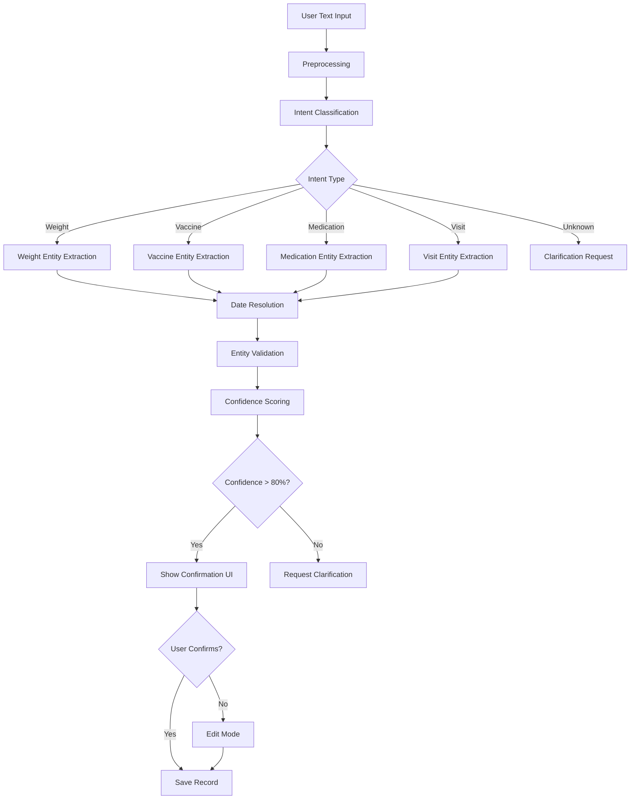

# Natural Language Data Entry - Product Requirements Document

## Overview

Natural Language Processing (NLP) enables users to enter health data through conversational text input, reducing friction and improving data capture rates.

---

## User Stories

```gherkin
Feature: Natural Language Data Entry

Scenario: Quick text input
  As a pet owner
  I want to type "Max weighed 28kg at the vet today"
  So that a weight record is created without opening a form

Scenario: Multi-item input
  As a pet owner
  I want to type "Got rabies and DHPP vaccines at AniCura"
  So that both vaccination records are created

Scenario: Date variation handling
  As a pet owner
  I want to say "last Tuesday" or "yesterday"
  So that the system understands relative dates

Scenario: Confirm before saving
  As a pet owner
  I want to review extracted data before it saves
  So that I can correct any mistakes
```

---

## Supported Input Patterns

### Weight Entries

| Natural Input | Extracted Data |
|---------------|----------------|
| "Max is 28.5 kg" | weight: 28.5, unit: kg |
| "Weighed 62 lbs today" | weight: 62, unit: lbs, date: today |
| "Vet said she's 8.2 kilos now" | weight: 8.2, unit: kg, source: vet |
| "Down to 25kg from 27" | weight: 25, unit: kg, note: down from 27 |

### Vaccination Entries

| Natural Input | Extracted Data |
|---------------|----------------|
| "Got rabies vaccine today" | vaccine: rabies, date: today |
| "DHPP booster at the vet last week" | vaccine: DHPP, date: -7 days, source: vet |
| "Rabies and bordetella yesterday" | vaccines: [rabies, bordetella], date: yesterday |
| "Annual vaccines done 3/15" | vaccines: [annual], date: March 15 |

### Medication Entries

| Natural Input | Extracted Data |
|---------------|----------------|
| "Started apoquel 16mg daily" | drug: apoquel, dose: 16mg, frequency: daily |
| "Taking 2 pills twice a day" | dose: 2 tablets, frequency: twice daily |
| "Finished antibiotics today" | status: completed, date: today |
| "Rimadyl 75mg for 2 weeks" | drug: rimadyl, dose: 75mg, duration: 14 days |

### Visit Entries

| Natural Input | Extracted Data |
|---------------|----------------|
| "Vet visit today, everything OK" | type: checkup, date: today, outcome: healthy |
| "Emergency visit last night - vomiting" | type: emergency, date: yesterday, symptom: vomiting |
| "Annual checkup at AniCura" | type: annual, clinic: AniCura |
| "Saw Dr. Smith for skin issues" | vet: Dr. Smith, reason: skin issues |

---

## NLP Processing Pipeline



---

## Intent Classification

```typescript
type Intent = 
  | 'log_weight'
  | 'log_vaccine'
  | 'log_medication'
  | 'log_visit'
  | 'log_symptom'
  | 'ask_question'
  | 'set_reminder'
  | 'unknown';

interface IntentClassification {
  intent: Intent;
  confidence: number;
  entities: Entity[];
  requires_clarification: boolean;
}

// Classification examples
const examples = [
  { text: "28kg today", intent: "log_weight", confidence: 0.95 },
  { text: "rabies shot", intent: "log_vaccine", confidence: 0.92 },
  { text: "started new meds", intent: "log_medication", confidence: 0.88 },
  { text: "went to the vet", intent: "log_visit", confidence: 0.85 },
];
```

---

## Entity Extraction

### Entity Types

```typescript
interface ExtractedEntities {
  // Common
  date?: DateEntity;
  pet_name?: string;
  
  // Weight
  weight_value?: number;
  weight_unit?: 'kg' | 'lbs';
  
  // Vaccine
  vaccine_names?: string[];
  batch_number?: string;
  
  // Medication
  medication_name?: string;
  dosage_amount?: number;
  dosage_unit?: string;
  frequency?: string;
  duration?: string;
  
  // Visit
  visit_type?: string;
  clinic_name?: string;
  vet_name?: string;
  reason?: string;
  diagnosis?: string;
  
  // General
  notes?: string;
}

interface DateEntity {
  value: Date;
  original_text: string;
  type: 'absolute' | 'relative' | 'inferred';
  confidence: number;
}
```

### Date Parsing

```typescript
const datePatterns = [
  // Absolute dates
  { pattern: /(\d{1,2})[\/\-\.](\d{1,2})[\/\-\.](\d{2,4})/, type: 'absolute' },
  { pattern: /(\d{1,2})\s+(jan|feb|mar|apr|may|jun|jul|aug|sep|oct|nov|dec)/i, type: 'absolute' },
  
  // Relative dates
  { pattern: /today/i, resolve: () => new Date() },
  { pattern: /yesterday/i, resolve: () => addDays(new Date(), -1) },
  { pattern: /last\s+week/i, resolve: () => addDays(new Date(), -7) },
  { pattern: /(\d+)\s+days?\s+ago/i, resolve: (m) => addDays(new Date(), -parseInt(m[1])) },
  { pattern: /last\s+(monday|tuesday|...)/i, resolve: (m) => getLastDayOfWeek(m[1]) },
  
  // Inferred (no date mentioned = today)
  { pattern: null, type: 'inferred', default: new Date() }
];
```

---

## Confirmation UI

### Single Record Confirmation

```
┌─────────────────────────────────────────┐
│ ✨ Got it! Here's what I understood:    │
├─────────────────────────────────────────┤
│ ┌─────────────────────────────────────┐ │
│ │ 💊 New Medication                   │ │
│ │                                     │ │
│ │ Medication: Apoquel                 │ │
│ │ Dose: 16 mg                         │ │
│ │ Frequency: Once daily               │ │
│ │ Start Date: Today                   │ │
│ │ Duration: Ongoing                   │ │
│ └─────────────────────────────────────┘ │
│                                         │
│ Does this look right?                   │
│                                         │
│   [Edit]   [Cancel]   [✓ Save]          │
└─────────────────────────────────────────┘
```

### Multi-Record Confirmation

```
┌─────────────────────────────────────────┐
│ ✨ I'll create 2 records:               │
├─────────────────────────────────────────┤
│ ☑ 💉 Rabies Vaccination                │
│   Date: January 15, 2024                │
│   Clinic: AniCura Amsterdam             │
│                                         │
│ ☑ 💉 DHPP Vaccination                  │
│   Date: January 15, 2024                │
│   Clinic: AniCura Amsterdam             │
├─────────────────────────────────────────┤
│   [Edit]   [Cancel]   [✓ Save All]      │
└─────────────────────────────────────────┘
```

---

## API Specification

### Parse Natural Text
```
POST /api/v1/nlp/parse
{
  "text": "Max got his rabies vaccine at AniCura today",
  "pet_id": "pet-uuid",
  "context": {
    "recent_visits": [...],
    "active_medications": [...]
  }
}

Response:
{
  "intent": "log_vaccine",
  "confidence": 0.94,
  "entities": {
    "pet_name": "Max",
    "vaccine_names": ["rabies"],
    "clinic_name": "AniCura",
    "date": {
      "value": "2024-01-15",
      "type": "relative",
      "original": "today"
    }
  },
  "suggested_records": [
    {
      "type": "vaccination",
      "data": {
        "vaccine_name": "Rabies",
        "date_given": "2024-01-15",
        "clinic_name": "AniCura Amsterdam"
      },
      "confidence": 0.94
    }
  ],
  "clarifications_needed": []
}
```

---

## Clarification Flows

### Ambiguous Input

**User**: "Got the vaccine yesterday"

**System**: 
> Which vaccine did Max receive?
> - 💉 Rabies
> - 💉 DHPP
> - 💉 Bordetella
> - Other: [________]

### Missing Information

**User**: "Started new medication"

**System**:
> What medication did Max start?
> [_______________________________]
>
> Recent prescriptions:
> - Apoquel (from Dr. Smith)
> - Rimadyl (from last visit)

---

## Language Support

### Phase 1 Languages
- English (primary)
- Dutch
- German

### Localization Examples

| English | Dutch | German |
|---------|-------|--------|
| "28 kg today" | "28 kg vandaag" | "28 kg heute" |
| "rabies vaccine" | "rabiës vaccin" | "Tollwut-Impfung" |
| "last week" | "vorige week" | "letzte Woche" |
| "started medication" | "medicijn gestart" | "Medikament begonnen" |

---

## Success Metrics

| Metric | Target |
|--------|--------|
| Intent classification accuracy | 90% |
| Entity extraction accuracy | 85% |
| User confirmation rate | 80% |
| Records created via NLP | 40% |
| Average save time vs forms | 60% faster |
