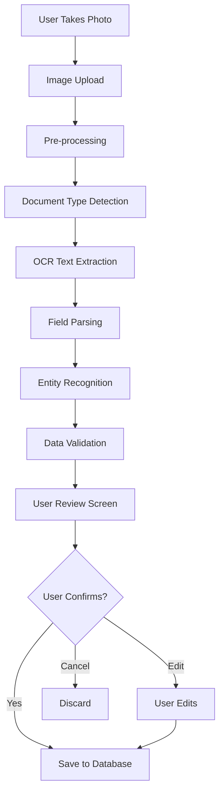

# OCR Document Recognition - Product Requirements Document

## Vision

Automatically extract health data from photos of vet documents, eliminating manual data entry.

---

## User Stories

```gherkin
Feature: OCR Document Scanning

Scenario: Scan vaccine certificate
  As a pet owner
  I want to photograph my pet's vaccine certificate
  So that vaccination records are automatically created

Scenario: Scan prescription
  As a pet owner
  I want to photograph a prescription
  So that medication details are captured

Scenario: Scan invoice
  As a pet owner
  I want to photograph a vet invoice
  So that visit details are extracted

Scenario: Review and confirm
  As a pet owner
  I want to review extracted data before saving
  So that I can correct any errors
```

---

## Supported Document Types

| Document Type | Fields Extracted | Confidence Target |
|---------------|------------------|-------------------|
| Vaccine Certificate | Vaccine name, date, vet, batch | 90% |
| Prescription | Drug name, dosage, frequency | 85% |
| Vet Invoice | Clinic, date, items, cost | 85% |
| Lab Results | Test type, values, reference | 80% |
| Health Certificate | Status, date, conditions | 85% |
| Microchip Registration | Number, date, registry | 95% |

---

## OCR Flow



---

## Technical Specification

### Image Pre-processing

```typescript
interface ImageProcessing {
  operations: [
    'auto_rotate',      // Correct orientation
    'deskew',           // Straighten tilted scans
    'enhance_contrast', // Improve text visibility
    'denoise',          // Reduce noise
    'binarize'          // Black/white for OCR
  ];
  maxDimension: 2048;   // Resize large images
  format: 'jpeg';
  quality: 85;
}
```

### Google Cloud Vision Integration

```typescript
async function extractText(imageUrl: string): Promise<OCRResult> {
  const vision = new ImageAnnotatorClient();
  
  const [result] = await vision.documentTextDetection(imageUrl);
  
  return {
    fullText: result.fullTextAnnotation?.text || '',
    blocks: result.fullTextAnnotation?.pages?.flatMap(p => 
      p.blocks?.map(b => ({
        text: b.paragraphs?.map(p => 
          p.words?.map(w => w.symbols?.map(s => s.text).join('')).join(' ')
        ).join('\n'),
        confidence: b.confidence,
        boundingBox: b.boundingBox
      }))
    ) || [],
    confidence: calculateOverallConfidence(result)
  };
}
```

### Field Extraction Patterns

```typescript
const extractionPatterns = {
  vaccine: {
    name: /(?:vaccine|vaccination|vaccin):\s*(.+)/i,
    date: /(?:date|datum|given|administered):\s*(\d{1,2}[\/\-\.]\d{1,2}[\/\-\.]\d{2,4})/i,
    batch: /(?:batch|lot|charge)(?:\s*#?|:)\s*([A-Z0-9]+)/i,
    nextDue: /(?:next|due|booster):\s*(\d{1,2}[\/\-\.]\d{1,2}[\/\-\.]\d{2,4})/i
  },
  medication: {
    name: /(?:medication|drug|medicine|medicament):\s*(.+)/i,
    dosage: /(\d+(?:\.\d+)?)\s*(mg|ml|g|tablet|capsule)/i,
    frequency: /(\d+)\s*(?:times?|x)\s*(?:per|a|\/)\s*(day|week|month)/i
  },
  microchip: {
    number: /\b\d{15}\b|\b\d{9,10}\b/
  }
};
```

---

## UI Components

### Scan Document Screen

```
┌─────────────────────────────────────────┐
│ ← Scan Document                    [?]  │
├─────────────────────────────────────────┤
│                                         │
│   ┌─────────────────────────────────┐   │
│   │                                 │   │
│   │         📷 Camera View          │   │
│   │                                 │   │
│   │   ┌───────────────────────┐     │   │
│   │   │     Document Area     │     │   │
│   │   └───────────────────────┘     │   │
│   │                                 │   │
│   └─────────────────────────────────┘   │
│                                         │
│   Align document within the frame       │
│                                         │
│          [Take Photo] [Gallery]         │
│                                         │
├─────────────────────────────────────────┤
│ 💡 Tips:                                │
│ • Ensure good lighting                  │
│ • Avoid shadows and glare               │
│ • Keep document flat                    │
└─────────────────────────────────────────┘
```

### Review Extracted Data

```
┌─────────────────────────────────────────┐
│ ← Review Extracted Data           [✓]  │
├─────────────────────────────────────────┤
│ Document Type: Vaccine Certificate      │
│ Confidence: 92% ████████████░░          │
├─────────────────────────────────────────┤
│ ┌─ Extracted Data ────────────────────┐ │
│ │                                     │ │
│ │ Vaccine *                           │ │
│ │ [Rabies                        ] ✓  │ │
│ │                                     │ │
│ │ Date Given *                        │ │
│ │ [15/01/2024                    ] ✓  │ │
│ │                                     │ │
│ │ Batch Number                        │ │
│ │ [ABC123456                     ] ⚠  │ │
│ │ Low confidence - please verify      │ │
│ │                                     │ │
│ │ Next Due                            │ │
│ │ [15/01/2027                    ] ✓  │ │
│ │                                     │ │
│ │ Clinic                              │ │
│ │ [AniCura Amsterdam             ] ✓  │ │
│ └─────────────────────────────────────┘ │
├─────────────────────────────────────────┤
│ ┌─ Original Document ─────────────────┐ │
│ │ [Thumbnail of scanned document]     │ │
│ └─────────────────────────────────────┘ │
├─────────────────────────────────────────┤
│        [Cancel]     [Save Record]       │
└─────────────────────────────────────────┘
```

---

## Database Schema

```sql
CREATE TABLE document_scans (
  id UUID PRIMARY KEY DEFAULT gen_random_uuid(),
  pet_id UUID REFERENCES pets(id) ON DELETE CASCADE,
  document_type VARCHAR(50) NOT NULL,
  original_image_url TEXT NOT NULL,
  processed_image_url TEXT,
  ocr_raw_text TEXT,
  ocr_confidence DECIMAL(5,2),
  extracted_data JSONB,
  validation_status VARCHAR(20) CHECK (validation_status IN (
    'pending', 'confirmed', 'rejected', 'needs_review'
  )),
  linked_record_type VARCHAR(50), -- 'vaccination', 'treatment', 'visit'
  linked_record_id UUID,
  created_at TIMESTAMP DEFAULT NOW(),
  confirmed_at TIMESTAMP
);
```

---

## Success Metrics

| Metric | Target |
|--------|--------|
| Field extraction accuracy | 90% |
| Document type detection | 95% |
| User confirmation rate | 85% |
| Processing time | <5 seconds |
| Adoption rate | 40% of uploads |
