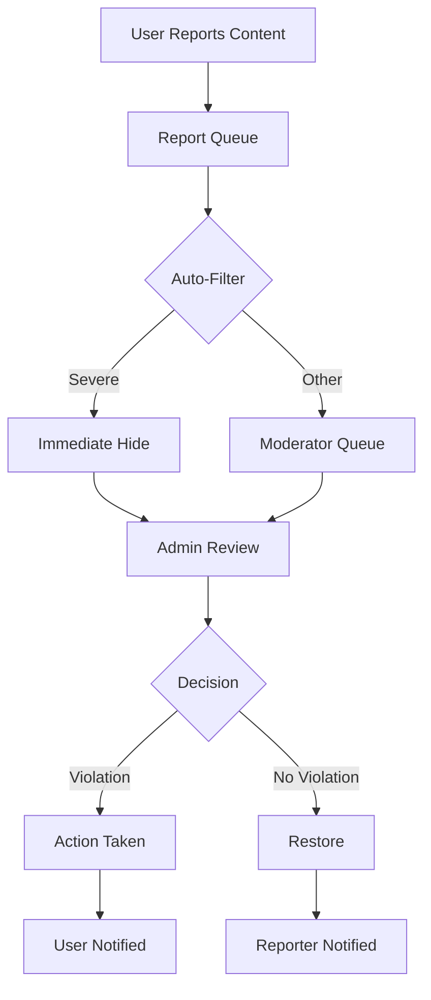

# Content Moderation Specification

## Overview

Content moderation ensures the social network remains safe, trustworthy, and free from spam and inappropriate content.

---

## Moderation Approach

| Layer | Type | Coverage |
|-------|------|----------|
| Automated | AI text filtering | 100% of text content |
| Automated | NSFW image detection | 100% of images |
| Community | User reports | Reactive |
| Manual | Admin review | Flagged content |

---

## Content Violations

### Severe (Immediate Removal)

| Violation | Action | Appeal |
|-----------|--------|--------|
| Illegal content | Remove + ban | Review only |
| Child endangerment | Remove + ban + report | No |
| Violence/gore | Remove | Yes |
| Animal cruelty | Remove + ban | Review only |
| Harassment/threats | Remove | Yes |

### Moderate (Warning + Removal)

| Violation | Action |
|-----------|--------|
| Spam | Remove, 3 strikes = ban |
| Misleading info | Remove + warning |
| Hate speech | Remove + warning |
| Impersonation | Remove |

### Minor (Warning)

| Violation | Action |
|-----------|--------|
| Off-topic | Warning |
| Self-promotion | Warning |
| Duplicate content | Warning |

---

## User Reporting

### Report Types

| Type | Description |
|------|-------------|
| Spam | Unwanted promotion |
| Inappropriate | NSFW, offensive |
| Misinformation | False pet health info |
| Harassment | Bullying, threats |
| Impersonation | Fake accounts |
| Self-harm | Concerning content |
| Other | Free text |

### Report Flow



---

## Automated Detection

### Text Filtering

```typescript
interface TextFilter {
  profanity: boolean;
  spam_keywords: string[];
  dangerous_health_advice: string[];
  scam_patterns: RegExp[];
  url_allowlist: string[];
}

const flaggedPatterns = [
  /buy.*followers/i,
  /free.*giveaway.*click/i,
  /cure.*cancer/i,
  /my vet said .* is dangerous/i, // Flag for review
];
```

### Image Analysis

| Check | API | Action if Flagged |
|-------|-----|-------------------|
| NSFW | Google Cloud Vision | Auto-hide, queue review |
| Violence | Google Cloud Vision | Auto-hide, queue review |
| Spam text in image | OCR + text filter | Queue review |
| Animal cruelty | Custom ML model | Auto-hide, priority review |

---

## Moderation Actions

| Action | Effect |
|--------|--------|
| Approve | Content visible |
| Hide | Removed from feeds, visible to author |
| Remove | Deleted, author notified |
| Warning | Content stays, user warned |
| Mute | User can't post for X days |
| Ban | Account suspended |

---

## User Consequences

### Strike System

| Strikes | Duration | Consequence |
|---------|----------|-------------|
| 1 | 30 days | Warning email |
| 2 | 30 days | 24h posting restriction |
| 3 | 30 days | 7-day suspension |
| 4+ | Permanent | Account review for ban |

### Appeal Process

1. User receives action notification
2. Appeal button (within 14 days)
3. User provides explanation
4. Different moderator reviews
5. Decision within 3 business days
6. Final decision notification

---

## Moderator Tools

### Admin Dashboard

```
┌─────────────────────────────────────────┐
│ Moderation Queue                        │
│ [All] [Reported] [Auto-Flagged] [Urgent]│
├─────────────────────────────────────────┤
│ ⚠️ 3 Urgent | 12 Pending | 145 Today    │
├─────────────────────────────────────────┤
│ ┌─────────────────────────────────────┐ │
│ │ [NSFW] Image Post                   │ │
│ │ Reported by: 3 users                │ │
│ │ Auto-flagged: NSFW detection 89%    │ │
│ │ [View] [Approve] [Remove] [Ban]     │ │
│ └─────────────────────────────────────┘ │
│                                         │
│ ┌─────────────────────────────────────┐ │
│ │ [SPAM] Comment                      │ │
│ │ "Click here for free followers..."   │ │
│ │ Pattern match: spam_url             │ │
│ │ [View] [Approve] [Remove]           │ │
│ └─────────────────────────────────────┘ │
└─────────────────────────────────────────┘
```

### Quick Actions
- Ban user across all content
- Remove all content from user
- Whitelist trusted user
- Escalate to senior moderator

---

## Database Schema

```sql
CREATE TABLE moderation_reports (
  id UUID PRIMARY KEY DEFAULT gen_random_uuid(),
  
  reporter_user_id UUID REFERENCES auth.users(id),
  reported_user_id UUID REFERENCES auth.users(id),
  
  content_type VARCHAR(20) CHECK (
    content_type IN ('post', 'comment', 'story', 'profile', 'group', 'event')
  ),
  content_id UUID NOT NULL,
  
  report_type VARCHAR(50) NOT NULL,
  description TEXT,
  
  auto_detected BOOLEAN DEFAULT FALSE,
  detection_reason TEXT,
  detection_confidence DECIMAL(3,2),
  
  status VARCHAR(20) DEFAULT 'pending' CHECK (
    status IN ('pending', 'reviewing', 'resolved', 'dismissed')
  ),
  priority VARCHAR(20) DEFAULT 'normal' CHECK (
    priority IN ('low', 'normal', 'high', 'urgent')
  ),
  
  reviewed_by UUID REFERENCES auth.users(id),
  reviewed_at TIMESTAMP WITH TIME ZONE,
  resolution VARCHAR(50),
  resolution_notes TEXT,
  
  created_at TIMESTAMP WITH TIME ZONE DEFAULT NOW()
);

CREATE TABLE user_strikes (
  id UUID PRIMARY KEY DEFAULT gen_random_uuid(),
  user_id UUID REFERENCES auth.users(id) ON DELETE CASCADE NOT NULL,
  report_id UUID REFERENCES moderation_reports(id),
  
  violation_type VARCHAR(50) NOT NULL,
  strike_level INTEGER CHECK (strike_level BETWEEN 1 AND 4),
  
  action_taken VARCHAR(50) NOT NULL,
  expires_at TIMESTAMP WITH TIME ZONE,
  
  created_by UUID REFERENCES auth.users(id),
  created_at TIMESTAMP WITH TIME ZONE DEFAULT NOW()
);

CREATE INDEX idx_reports_status ON moderation_reports(status, priority, created_at);
CREATE INDEX idx_strikes_user ON user_strikes(user_id, created_at DESC);
```

---

## Response Time Targets

| Priority | First Response | Resolution |
|----------|----------------|------------|
| Urgent | 1 hour | 4 hours |
| High | 4 hours | 24 hours |
| Normal | 24 hours | 72 hours |
| Low | 48 hours | 1 week |

---

## Success Metrics

| Metric | Target |
|--------|--------|
| Spam rate | < 0.5% of posts |
| False positive rate | < 2% |
| Report response time | < 24 hours |
| User satisfaction | 90%+ |
