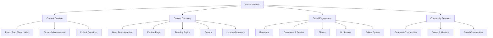

# Social Network - Product Requirements Document

## Vision

Create the premier social network for pets and pet owners, combining the best of Instagram (visual sharing), Facebook (community), and location-based discovery.

---

## Core Objectives

1. **Community Building**: Connect pet owners with shared interests, breeds, and local communities
2. **Engagement**: Provide engaging, pet-focused content that keeps users returning daily
3. **Discovery**: Help owners find pet-friendly places, events, and services
4. **Education**: Share knowledge, tips, and experiences among pet owners
5. **Safety**: Create a trusted, moderated environment free from spam

---

## Target User Personas

### 1. Social Pet Parent (60% of users)
- **Demographics**: 25-45 years old, urban/suburban, tech-savvy
- **Behavior**: Actively shares pet photos/videos, follows other pets, engages daily
- **Goals**: Show off their pet, connect with other pet parents, discover new places and products
- **Pain Points**: Generic social media doesn't cater to pet content

### 2. Information Seeker (25% of users)
- **Demographics**: 30-50 years old, new pet owner or specific breed owner
- **Behavior**: Reads posts, asks questions in groups, saves helpful content
- **Goals**: Learn from experienced owners, get health/training advice
- **Pain Points**: Information overload, unreliable sources

### 3. Community Builder (10% of users)
- **Demographics**: Varies, active in pet communities, may be professionals
- **Behavior**: Creates valuable content, organizes events, moderates groups
- **Goals**: Build following, establish authority, help others
- **Pain Points**: Limited reach on generic platforms

### 4. Casual Browser (5% of users)
- **Demographics**: Pet owners who primarily use app for health tracking
- **Behavior**: Occasionally browses feed, rarely posts
- **Goals**: Light entertainment
- **Pain Points**: Don't want spam or overwhelming notifications

---

## Feature Architecture

---

## Pet-Centric Profiles

### Existing (from Health Passport)
- Pet basic info (name, species, breed, age, photos)
- Health passport (vaccinations, medical records)
- Owner information

### New Social Additions

| Feature | Description |
|---------|-------------|
| Bio | 500-character pet story |
| Social Stats | Followers, following, total posts |
| Highlights | Featured story collections |
| Featured Posts | Pinned posts at top of profile |
| Profile Tags | Interests/traits (#AdventurePup, #RescueDog) |
| Activity Status | Last active, posting frequency |
| Verification | Badge for notable pets, rescues |

---

## Reaction Types

| Reaction | Emoji | Usage |
|----------|-------|-------|
| Love | ❤️ | Default/primary |
| Paws | 🐾 | Pet-specific |
| Hilarious | 😂 | Funny content |
| Adorable | 😍 | Cute content |
| Care | 😢 | Sad stories, rescues |
| Celebrate | 🎉 | Birthdays, adoptions |

---

## Success Metrics

### User Acquisition
- 80% of new signups create social profile
- < 5 minutes to first post

### Engagement (DAU/MAU)
- DAU: 40% of MAU
- Session frequency: 3+ sessions/week
- Session duration: 10+ minutes

### Content Creation
- 8-12 posts per user/month
- 3-5 stories per user/week
- 3+ comments per post

### Community
- 60% of users in at least 1 group
- 70% of groups have weekly activity
- 50% event check-in rate

### Retention
- Day 1: 60%
- Day 7: 40%
- Day 30: 25%
- Month 3: 15%
